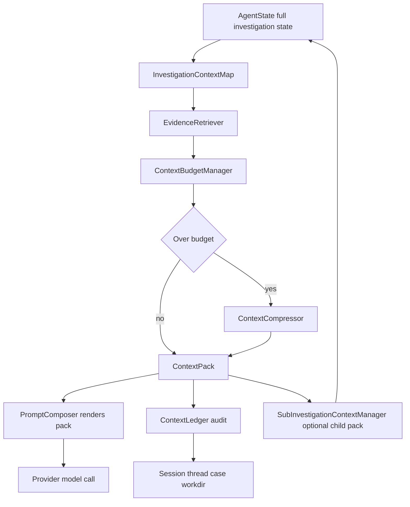

# AISA Context Orchestration Layer Plan

## Status, lane, scope

- Status: planning only; no runtime implementation in this task.
- Product name: AISA. Repository path remains [`CABTA/`](../) for compatibility.
- Primary lane: `agent-workflow`.
- Cross-lane dependency: `analysis-core`, because context selection must preserve deterministic evidence, scoring, and root-cause authority boundaries.
- Plan required: yes. This work crosses prompt assembly, reasoning state, evidence graph, query/retry, memory, session/thread/case sync, workdir artifacts, and tests.

## Scope

In scope:

- Add a new context orchestration package under [`src/agent/context/`](../src/agent/context/).
- Introduce six modules: `ContextBudgetManager`, `InvestigationContextMap`, `EvidenceRetriever`, `ContextCompressor`, `SubInvestigationContextManager`, and `ContextLedger`.
- Modify [`AgentLoop._think()`](../src/agent/agent_loop.py:2034) to request a selected context pack before prompt rendering.
- Reframe [`PromptComposer`](../src/agent/prompt_composer.py:140) from context selector and renderer into mostly a renderer of preselected context packs.
- Preserve current prompt behavior behind fallback and compatibility paths.
- Persist or mirror context packs and ledgers to session metadata, thread snapshots, case memory checkpoints, and workdir artifacts.
- Add focused tests for budget accounting, ledger records, context map ranking, retrieval, compression, sub-investigation contracts, and prompt plumbing.

Out of scope:

- Changing deterministic verdict, score, severity, or policy semantics in [`src/scoring/`](../src/scoring/).
- Replacing [`AgentLoop`](../src/agent/agent_loop.py), [`ToolRegistry`](../src/agent/tool_registry.py), MCP transport, analyzers, or playbook runtime.
- Introducing a vector database or graph database in the first implementation.
- Persisting hidden chain-of-thought.
- Letting LLM-generated summaries or compressed context become verdict authority.
- Building a UI redesign in the first slice.

## Working note

1. Chosen lane: `agent-workflow`, with `analysis-core` boundary checks.
2. Main files likely to change: [`agent_loop.py`](../src/agent/agent_loop.py), [`prompt_composer.py`](../src/agent/prompt_composer.py), [`session_response_builder.py`](../src/agent/session_response_builder.py), [`agent_state.py`](../src/agent/agent_state.py), [`thread_sync_service.py`](../src/agent/thread_sync_service.py), [`case_memory_service.py`](../src/agent/case_memory_service.py), [`session_context_service.py`](../src/agent/session_context_service.py), [`case_sync_service.py`](../src/agent/case_sync_service.py), [`investigation_workdir.py`](../src/agent/investigation_workdir.py), and new files under [`src/agent/context/`](../src/agent/context/).
3. Plan required: yes.
4. Tests and docs likely affected: [`test_prompt_composer.py`](../tests/test_prompt_composer.py), [`test_agent_loop_prompt_plumbing.py`](../tests/test_agent_loop_prompt_plumbing.py), [`test_thread_sync_service.py`](../tests/test_thread_sync_service.py), [`test_session_context_service.py`](../tests/test_session_context_service.py), [`test_case_memory_service.py`](../tests/test_case_memory_service.py), [`test_query_coverage_retry.py`](../tests/test_query_coverage_retry.py), [`test_agentic_reasoning.py`](../tests/test_agentic_reasoning.py), [`TEST-MANIFEST.md`](../TEST-MANIFEST.md), and architecture docs after implementation.

## Executive assessment

The proposed AISA Context Orchestration Layer is a strong fit for the current codebase, and it should be implemented incrementally.

Why it fits:

- AISA already has rich structured state in [`AgentState`](../src/agent/agent_state.py:40): findings, active observations, accepted facts, reasoning state, entity state, evidence state, deterministic decision, and agentic explanation.
- AISA already has evidence-governed reasoning in [`AgentLoop._refresh_reasoning_outputs()`](../src/agent/agent_loop.py:823), including observation normalization, entity resolution, evidence graph updates, hypothesis generation, coverage evaluation, query/retry tracking, deterministic decision extraction, root-cause assessment, and workdir mirroring.
- AISA already has compact prompt helpers in [`PromptComposer.build_findings_block()`](../src/agent/prompt_composer.py:260) and [`PromptComposer.build_reasoning_block()`](../src/agent/prompt_composer.py:295), but these are heuristic caps rather than objective-aware context orchestration.
- AISA already has memory layers through [`AgentStore`](../src/agent/agent_store.py:34), [`ThreadSyncService`](../src/agent/thread_sync_service.py), [`CaseMemoryService`](../src/agent/case_memory_service.py), [`SessionContextService`](../src/agent/session_context_service.py:11), and workdir mirroring in [`AgentLoop._mirror_reasoning_to_workdir()`](../src/agent/agent_loop.py:1265).

Benefits:

- Better prompt reliability under large investigations by budgeting context explicitly.
- Better SOC investigation quality by ranking entities, hypotheses, evidence refs, coverage gaps, contradictions, and missing evidence by objective.
- Better auditability through per-model-call `ContextLedger` records.
- Better backward compatibility because [`PromptComposer`](../src/agent/prompt_composer.py:140) can keep rendering existing blocks when no context pack is supplied.
- Better scaling path for future sub-investigations without rewriting the agent loop.

Risks:

- Over-compression could hide contradictory evidence or missing-evidence warnings.
- Retrieval scoring could accidentally prefer recent findings over authoritative deterministic evidence unless explicitly guarded.
- Context packs and ledgers could bloat session metadata if not capped.
- Sub-investigations could create recursive or duplicated tool usage without hard step/tool policies.
- Developers may confuse compressed agentic explanation with deterministic verdict authority unless every artifact carries authority metadata.

Priority:

- High priority for reliability and auditability because the current agent already has enough reasoning state that prompt selection is becoming the limiting factor.
- Implement Phase 1 first. Do not start with sub-investigations or heavy compression.

## Current-state diagnosis grounded in code

### Current prompt caps and selection

Current behavior:

- [`AgentLoop._think()`](../src/agent/agent_loop.py:2034) builds all prompt parts inline: tools, findings, response style, chat decision, reasoning, profile, workflow, and playbooks.
- [`PromptComposer.build_findings_block()`](../src/agent/prompt_composer.py:260) caps findings by recent item count: chat uses `chat_prompt_findings_limit`, non-chat uses `8`.
- [`PromptComposer.build_reasoning_block()`](../src/agent/prompt_composer.py:295) includes selected slices of plan, normalized observations count, evidence quality, coverage matrix, query attempts, retry state, root cause summary, tracked entities, open questions, hypotheses, candidates, and events.
- [`PromptComposer.build_summary_payload()`](../src/agent/prompt_composer.py:636) truncates `findings_json` to `4000` characters.
- [`AgentLoop.__init__()`](../src/agent/agent_loop.py:281) configures `chat_prompt_findings_limit`, but there is no model-aware token budget.

Gap:

- Prompt context is capped by item counts and string truncation, not token budgets, objective relevance, authority level, or evidence diversity.
- Selection logic is spread across [`AgentLoop._think()`](../src/agent/agent_loop.py:2034), [`PromptComposer.build_findings_block()`](../src/agent/prompt_composer.py:260), and [`PromptComposer.build_reasoning_block()`](../src/agent/prompt_composer.py:295).

### Current AgentLoop context assembly

Current behavior:

- [`AgentLoop._think()`](../src/agent/agent_loop.py:2034) selects tools, builds prompt blocks, calls [`PromptComposer.build_think_payload()`](../src/agent/prompt_composer.py:530), then sends messages to the provider.
- [`SessionResponseBuilder.build_think_request_metadata()`](../src/agent/session_response_builder.py:945) records prompt mode, provider context block, prompt envelope, model-only chat flag, native tooling flag, and planned next step summary.
- There is no durable record of why prompt context included or excluded specific evidence.

Gap:

- There is no `ContextPack` object between state and prompt rendering.
- There is no per-call ledger of included/excluded items, token estimates, compression actions, or retrieval scores.

### Current memory layers

Current behavior:

- [`InvestigationMemory`](../src/agent/memory.py:33) stores IOC cache and recurring patterns.
- [`AgentStore`](../src/agent/agent_store.py:34) stores sessions, findings, metadata, steps, MCP connections, playbooks, and specialist tasks.
- [`SessionContextService.restore_state_from_snapshot()`](../src/agent/session_context_service.py:133) restores investigation plan, reasoning state, entity state, evidence state, active observations, accepted facts, unresolved questions, evidence quality summary, and fact family schemas from thread/case/session snapshots.
- [`AgentLoop._persist_reasoning_metadata()`](../src/agent/agent_loop.py:1148) persists reasoning state, entity state, evidence state, deterministic decision, agentic explanation, candidate hypotheses, retry metadata, active observations, accepted facts, and memory scope details.
- [`AgentLoop._mirror_reasoning_to_workdir()`](../src/agent/agent_loop.py:1265) writes reasoning, coverage, query/retry, entity, evidence graph, deterministic decision, and agentic explanation artifacts.

Gap:

- Memory restoration does not restore a bounded prompt-ready context pack or ledger.
- Workdir mirrors evidence and reasoning state, but not the exact context shown to the model.
- There is no explicit distinction between full stored state, selected model context, compressed context, and excluded context.

### Current reasoning, evidence, query, and retry state

Current behavior:

- [`EvidenceGraph`](../src/agent/evidence_graph.py) stores evidence and reasoning links.
- [`EntityResolver`](../src/agent/entity_resolver.py) normalizes entities and relationships.
- [`HypothesisManager`](../src/agent/hypothesis_manager.py) and [`HypothesisGenerator`](../src/agent/hypothesis_generator.py) maintain hypotheses, candidates, evidence contracts, and events.
- [`CoverageEvaluator`](../src/agent/coverage/coverage_evaluator.py) evaluates required evidence coverage.
- [`RootCauseEngine`](../src/agent/root_cause_engine.py) keeps root cause separate from verdict and applies support, contradiction, and chain checks.
- [`query_planning/`](../src/agent/query_planning/) and [`retry/`](../src/agent/retry/) already produce query plans, result evaluations, retry state, and backtracking decisions.

Gap:

- This rich state is not yet unified into an objective-aware context map.
- Retrieval from evidence is still mostly implicit through recent findings, reasoning summaries, and prompt heuristics.

## Target architecture

Add AISA Context Orchestration Layer between current investigation state and prompt rendering.



Core data shapes:

```json
{
  "schema_version": "context-pack/v1",
  "pack_id": "ctx-session-step",
  "session_id": "...",
  "step_number": 3,
  "objective": "decide_next_tool|direct_answer|summary|sub_investigation",
  "authority_policy": "deterministic_evidence_and_scoring_remain_authoritative",
  "sections": {
    "goal": {},
    "selected_findings": [],
    "reasoning_summary": {},
    "evidence_briefs": [],
    "entities": [],
    "relationships": [],
    "hypotheses": [],
    "coverage_gaps": [],
    "root_cause": {},
    "tools": [],
    "workflow": {},
    "memory_contract": {}
  },
  "token_estimate": {"total": 0, "by_section": {}},
  "ledger_id": "ctx-ledger-..."
}
```

## Detailed design

### 1. ContextBudgetManager

New file: [`context/budget_manager.py`](../src/agent/context/budget_manager.py).

Responsibilities:

- Load context budget config from `config["agent"]["context"]`.
- Resolve active model from [`AgentLoop._active_model_name()`](../src/agent/agent_loop.py:618) or provider config.
- Estimate token usage without mandatory external dependencies.
- Assign section budgets by prompt objective.
- Detect over-budget and produce structured budget diagnostics.
- Enforce hard caps for metadata persistence.

Config proposal:

```yaml
agent:
  context:
    enabled: true
    default_model_window_tokens: 32000
    response_reserve_tokens: 4096
    safety_margin_tokens: 1024
    estimator: heuristic
    budgets:
      decide_next_tool:
        tools: 0.20
        findings: 0.18
        reasoning: 0.24
        evidence: 0.20
        memory: 0.08
        workflow: 0.06
        ledger_notice: 0.04
      direct_answer:
        findings: 0.26
        reasoning: 0.30
        evidence: 0.26
        memory: 0.12
        workflow: 0.02
        ledger_notice: 0.04
      summary:
        findings: 0.34
        reasoning: 0.22
        evidence: 0.28
        memory: 0.08
        workflow: 0.04
        ledger_notice: 0.04
    max_context_pack_bytes: 200000
    max_ledger_items: 120
```

Token estimator:

- Use a heuristic estimator first: `ceil(len(text) / 4)` for English-like content plus JSON structural overhead.
- Provide one function for strings and one for JSON-serializable sections.
- Keep dependency-free for local-first behavior.
- Later optional adapters can support provider tokenizer libraries if available.

Section budget output:

```json
{
  "schema_version": "context-budget/v1",
  "model": "cx/gpt-5.5",
  "window_tokens": 32000,
  "usable_tokens": 26880,
  "response_reserve_tokens": 4096,
  "safety_margin_tokens": 1024,
  "objective": "decide_next_tool",
  "section_budgets": {"reasoning": 6451, "evidence": 5376},
  "estimated_total": 18420,
  "over_budget": false
}
```

Guardrails:

- Budget diagnostics are orchestration metadata, not evidence.
- Budgeting may drop or compress prompt context, but must not delete stored evidence.
- Deterministic decision, contradiction summary, missing evidence, and authority notice are `do_not_drop` sections.

### 2. InvestigationContextMap

New file: [`context/context_map.py`](../src/agent/context/context_map.py).

Responsibilities:

- Build a SOC evidence map from [`AgentState`](../src/agent/agent_state.py:40), [`EvidenceGraph`](../src/agent/evidence_graph.py), [`EntityResolver`](../src/agent/entity_resolver.py), [`HypothesisManager`](../src/agent/hypothesis_manager.py), [`CoverageEvaluator`](../src/agent/coverage/coverage_evaluator.py), and [`RootCauseEngine`](../src/agent/root_cause_engine.py).
- Rank entities, relationships, hypotheses, evidence refs, contradictions, coverage gaps, and root-cause fragments.
- Provide a stable, compact input to `EvidenceRetriever`.

Map object:

```json
{
  "schema_version": "investigation-context-map/v1",
  "session_id": "...",
  "objective": "decide_next_tool",
  "authority_policy": "deterministic_core_authoritative",
  "ranked_entities": [],
  "ranked_relationships": [],
  "ranked_hypotheses": [],
  "ranked_evidence_refs": [],
  "contradictions": [],
  "missing_evidence": [],
  "coverage_gaps": [],
  "root_cause_state": {},
  "deterministic_decision": {},
  "memory_contract": {}
}
```

Ranking signals:

- Objective relevance: direct match to analyst request, latest focus, planned next tool, or active triage contract.
- Authority: deterministic tool output and accepted facts outrank LLM text.
- Evidence quality: use `evidence_quality_summary`, observation confidence, and graph support.
- Hypothesis priority: supported/open hypotheses with required evidence gaps outrank stale low-confidence candidates.
- Contradiction pressure: contradicting evidence is boosted, never suppressed.
- Coverage gaps: blocking gaps from coverage matrix are boosted for next-tool decisions.
- Recency: latest observations get a bounded boost but cannot outrank authoritative contradictions.
- Diversity: avoid packing five variants of the same entity or tool result.

Authority preservation:

- Every item carries `authority`: `deterministic`, `tool_observation`, `accepted_fact`, `agentic_explanation`, `candidate`, or `memory_snapshot`.
- Every item carries `authoritative_for_verdict: false` unless it is deterministic decision output copied from AISA tools/scoring.
- Memory-restored items carry lifecycle and authority from [`ThreadSyncService`](../src/agent/thread_sync_service.py).

### 3. EvidenceRetriever

New file: [`context/evidence_retriever.py`](../src/agent/context/evidence_retriever.py).

Responsibilities:

- Select evidence from the context map for the current prompt objective and budget.
- Produce concise evidence briefs instead of raw blobs when possible.
- Include contradictions and missing evidence explicitly.
- Return selected and excluded records for `ContextLedger`.

Objective-aware scoring formula:

```text
score =
  0.28 * objective_relevance +
  0.20 * authority_weight +
  0.16 * evidence_quality +
  0.12 * hypothesis_or_gap_relevance +
  0.10 * contradiction_or_uncertainty_boost +
  0.08 * recency +
  0.06 * diversity_bonus
```

Required evidence briefs:

```json
{
  "brief_id": "ebr-001",
  "evidence_ref": {"session_id": "...", "step_number": 2, "tool_name": "search_logs", "finding_index": 1},
  "summary": "FortiGate event links source host WS-12 to destination 185.220.101.45 over allowed outbound traffic.",
  "supports": ["hyp-c2-001"],
  "contradicts": [],
  "entities": ["host:WS-12", "ip:185.220.101.45"],
  "authority": "tool_observation",
  "authoritative_for_verdict": false,
  "quality": 0.82,
  "selected_reason": "fills blocking network attribution gap"
}
```

Contradictions:

- Always include top contradictions when present, even if they reduce room for supporting evidence.
- Contradictions must be labeled as contradiction evidence, not compressed into neutral summaries.

Missing evidence:

- Include top missing evidence from `reasoning_state.missing_evidence`, `open_questions`, `coverage_matrix.blocking_gaps`, and root-cause missing evidence.
- Missing evidence is required context for direct answers and summaries to prevent overclaiming.

### 4. ContextCompressor

New file: [`context/compressor.py`](../src/agent/context/compressor.py).

Responsibilities:

- Compress selected context when budget is exceeded.
- Drop noise before summarizing valuable evidence.
- Roll up phases and repeated observations.
- Preserve do-not-forget constraints.
- Preserve authority labels and evidence refs.

Compression stages:

1. Remove duplicate evidence refs and repeated tool failures.
2. Drop low-value stale findings that do not support/contradict active hypotheses and do not close coverage gaps.
3. Collapse repeated query attempts into latest coverage delta plus retry stop reason.
4. Compress raw tool result payloads into evidence briefs.
5. Roll up older phase history into `phase_rollups` with representative evidence refs.
6. If still over budget, trim low-rank candidate hypotheses before active hypotheses.
7. Never drop deterministic decision, top contradiction, top missing evidence, authority warning, or memory lifecycle contract.

Do-not-forget constraints:

```json
{
  "do_not_forget": [
    "deterministic_decision",
    "authority_policy",
    "top_contradictions",
    "blocking_coverage_gaps",
    "root_cause_status",
    "memory_contract",
    "approval_or_degraded_state"
  ]
}
```

Authority preservation:

- Compressed summaries must retain `source_refs` and `authority`.
- Compression output must never create new verdict, score, severity, root-cause support, or evidence refs.
- Compression actions are written into `ContextLedger`.

### 5. SubInvestigationContextManager

New file: [`context/sub_investigation.py`](../src/agent/context/sub_investigation.py).

Responsibilities:

- Build bounded child contexts for specialist or sub-investigation tasks.
- Define allowed tools, max steps, objective, inherited evidence, and return contract.
- Merge child results into parent context without treating child narrative as deterministic truth.

Initial implementation posture:

- Defer actual child loop orchestration until Phase 5.
- In earlier phases, define data contracts and helper methods only.
- Prefer reusing current specialist/playbook seams in [`AgentLoop`](../src/agent/agent_loop.py) and [`playbook_engine.py`](../src/agent/playbook_engine.py) rather than creating a second agent runtime.

Child context contract:

```json
{
  "schema_version": "sub-investigation-context/v1",
  "parent_session_id": "...",
  "child_objective": "verify source host for outbound beacon hypothesis",
  "allowed_tools": ["search_logs", "investigate_ioc"],
  "max_steps": 3,
  "inherited_evidence_refs": [],
  "blocked_claims": ["final verdict", "numeric score"],
  "return_contract": {
    "required_fields": ["summary", "new_evidence_refs", "missing_evidence", "confidence", "tool_results"],
    "authority": "non_authoritative_child_context"
  }
}
```

Parent merge semantics:

- Merge tool observations through normal [`AgentLoop._record_tool_observation()`](../src/agent/agent_loop.py:1982) or equivalent observation normalization path.
- Merge child summaries as `agentic_explanation` context only.
- Child deterministic tool results can contribute to parent deterministic decision only if they come from existing AISA deterministic tool outputs.
- Child LLM conclusions cannot overwrite parent deterministic decision.

### 6. ContextLedger

New file: [`context/ledger.py`](../src/agent/context/ledger.py).

Responsibilities:

- Record model-call context audit metadata for every [`AgentLoop._think()`](../src/agent/agent_loop.py:2034) call and summary call.
- Track included and excluded context items.
- Track token estimates, budgets, compression actions, evidence refs, authority labels, and prompt objective.
- Persist compact records to session metadata and workdir.

Ledger record:

```json
{
  "schema_version": "context-ledger/v1",
  "ledger_id": "ctx-ledger-session-step",
  "session_id": "...",
  "step_number": 4,
  "objective": "decide_next_tool",
  "model": "cx/gpt-5.5",
  "prompt_mode": "native_tooling",
  "token_estimate": {"total": 18420, "by_section": {}},
  "included": [
    {"item_id": "ebr-001", "kind": "evidence_brief", "authority": "tool_observation", "reason": "top blocking gap"}
  ],
  "excluded": [
    {"item_id": "finding-001", "kind": "finding", "reason": "low relevance and over budget"}
  ],
  "compression_actions": [],
  "evidence_refs": [],
  "authority_policy": "deterministic_core_authoritative",
  "created_at": "2026-04-28T00:00:00Z"
}
```

Storage policy:

- Store latest ledger summary in `agent_sessions.metadata.context_ledger_latest` through [`AgentStore.update_session_metadata()`](../src/agent/agent_store.py:161).
- Store a capped list in `agent_sessions.metadata.context_ledgers` with max configured count.
- Mirror full compact ledger JSON to workdir as `context_ledgers.json` and latest pack as `context_pack_latest.json`.
- Include only summaries in thread/case memory to avoid bloat.

## Integration plan

### Add package [`src/agent/context/`](../src/agent/context/)

Files:

- [`src/agent/context/__init__.py`](../src/agent/context/__init__.py): public exports.
- [`src/agent/context/models.py`](../src/agent/context/models.py): dataclasses or typed dict helpers for `ContextPack`, `ContextBudget`, `ContextLedgerRecord`, `ContextItem`, and `EvidenceBrief`.
- [`src/agent/context/budget_manager.py`](../src/agent/context/budget_manager.py): `ContextBudgetManager`.
- [`src/agent/context/context_map.py`](../src/agent/context/context_map.py): `InvestigationContextMap`.
- [`src/agent/context/evidence_retriever.py`](../src/agent/context/evidence_retriever.py): `EvidenceRetriever`.
- [`src/agent/context/compressor.py`](../src/agent/context/compressor.py): `ContextCompressor`.
- [`src/agent/context/ledger.py`](../src/agent/context/ledger.py): `ContextLedger`.
- [`src/agent/context/orchestrator.py`](../src/agent/context/orchestrator.py): `ContextOrchestrator` facade used by [`AgentLoop`](../src/agent/agent_loop.py).
- [`src/agent/context/sub_investigation.py`](../src/agent/context/sub_investigation.py): `SubInvestigationContextManager` contracts.

### Modify [`AgentLoop.__init__()`](../src/agent/agent_loop.py:186)

- Instantiate `ContextOrchestrator` after [`PromptComposer`](../src/agent/prompt_composer.py:140) or before; either is fine if no circular dependency exists.
- Pass config, model resolver, and maybe clock helper.
- Add feature flag `agent.context.enabled`, default `false` for Phase 1 compatibility or `true` only after tests pass.

### Modify [`AgentLoop._think()`](../src/agent/agent_loop.py:2034) without breaking current [`PromptComposer`](../src/agent/prompt_composer.py:140)

Current path:

1. Build blocks with `_build_tools_block`, `_build_findings_block`, `_build_reasoning_block`, and related helpers.
2. Build prompt payload with [`PromptComposer.build_think_payload()`](../src/agent/prompt_composer.py:530).
3. Build request metadata through [`SessionResponseBuilder.build_think_request_metadata()`](../src/agent/session_response_builder.py:945).
4. Call provider.

Proposed Phase 1-compatible path:

1. Build current blocks exactly as today.
2. If context orchestration is enabled, call `ContextOrchestrator.build_pack()` using current state, objective, tools JSON, current blocks as fallback sections, and prompt mode hints.
3. If pack build succeeds, replace `findings_block` and `reasoning_block` with rendered pack sections.
4. Add `context_pack` and `context_ledger` into `prompt_payload.prompt_envelope.investigation_context` and request metadata.
5. If pack build fails, log and continue with current prompt blocks.

### PromptComposer role change

Current role:

- Select recent findings in [`PromptComposer.build_findings_block()`](../src/agent/prompt_composer.py:260).
- Select reasoning excerpts in [`PromptComposer.build_reasoning_block()`](../src/agent/prompt_composer.py:295).
- Render final prompt in [`PromptComposer.build_think_payload()`](../src/agent/prompt_composer.py:530).

Target role:

- Continue to render final prompts.
- Add `build_findings_block_from_context_pack()` and `build_reasoning_block_from_context_pack()`.
- Add optional `context_pack` parameter to [`PromptComposer.build_think_payload()`](../src/agent/prompt_composer.py:530).
- When no pack is supplied, keep current behavior unchanged.
- When a pack is supplied, use selected pack sections as source of truth for model context rendering, not raw recent-first selection.

### Backward compatibility

- Feature flag controls orchestration activation.
- Existing tests should pass with flag disabled.
- With flag enabled, output remains additive: prompt envelope gets `context_pack_summary` and `context_ledger_id`; existing prompt fields remain.
- Do not remove `findings_block`, `reasoning_block`, `provider_context_block`, or current metadata keys.
- Persist context artifacts under new metadata keys only.

### Deterministic authority preservation

- `ContextPack.authority_policy` must state deterministic evidence/scoring/root-cause gates remain authoritative.
- `ContextCompressor` must not summarize away contradictions or missing evidence.
- `EvidenceRetriever` must boost deterministic evidence and contradictions.
- `SubInvestigationContextManager` must label child conclusions as non-authoritative unless backed by deterministic tool outputs.
- `ContextLedger` must record whether each included item is deterministic, tool observation, memory, candidate, or agentic explanation.

### Mirror context pack and ledger

Session metadata through [`AgentStore.update_session_metadata()`](../src/agent/agent_store.py:161):

- `context_pack_latest`
- `context_pack_summary_latest`
- `context_ledger_latest`
- `context_ledgers`

Thread snapshots through [`ThreadSyncService`](../src/agent/thread_sync_service.py):

- Include compact `context_pack_summary_latest` in working snapshots.
- Include only ledger summaries, not all included/excluded records, unless accepted memory needs them.

Case memory through [`CaseMemoryService`](../src/agent/case_memory_service.py):

- Record latest context ledger summary in reasoning checkpoints.
- Do not publish excluded raw context as case truth.

Session restore through [`SessionContextService.restore_state_from_snapshot()`](../src/agent/session_context_service.py:133):

- Restore context pack summaries only as non-authoritative memory hints.
- Rebuild fresh context packs on each model call rather than trusting restored packs.

Workdir through [`AgentLoop._mirror_reasoning_to_workdir()`](../src/agent/agent_loop.py:1265) or [`InvestigationWorkdirService`](../src/agent/investigation_workdir.py):

- Write `context_pack_latest.json`.
- Write `context_ledger_latest.json`.
- Write `context_ledgers.json` capped.
- Write `context_budget_latest.json`.
- Mark all context files as model-call audit artifacts, not evidence source of truth.

## Phased roadmap

### Phase 1: TokenBudget and ContextLedger

Goal:

- Add budget estimation and model-call context audit without changing selection behavior materially.

Tasks:

- Add [`context/models.py`](../src/agent/context/models.py), [`context/budget_manager.py`](../src/agent/context/budget_manager.py), [`context/ledger.py`](../src/agent/context/ledger.py), and minimal [`context/orchestrator.py`](../src/agent/context/orchestrator.py).
- Build a pack from existing blocks with token estimates.
- Record included sections as block-level items.
- Persist latest ledger and budget diagnostics.
- Keep current [`PromptComposer`](../src/agent/prompt_composer.py:140) selection behavior intact.

Acceptance criteria:

- Every enabled `_think` call produces budget diagnostics and a ledger record.
- Prompt content remains equivalent to current blocks except additive metadata.
- If budget estimation fails, current prompt path still works.
- No deterministic verdict behavior changes.

### Phase 2: InvestigationContextMap

Goal:

- Build a unified context map from current state without changing prompt selection yet.

Tasks:

- Add [`context/context_map.py`](../src/agent/context/context_map.py).
- Extract ranked entities, relationships, hypotheses, evidence refs, contradictions, missing evidence, coverage gaps, deterministic decision, and root-cause state.
- Add tests using synthetic [`AgentState`](../src/agent/agent_state.py:40) payloads.
- Persist context map summary only when enabled.

Acceptance criteria:

- Context map ranks deterministic evidence and contradictions above stale recent findings.
- Context map includes memory lifecycle and authority labels.
- Context map can be built from old sessions with missing new fields.

### Phase 3: EvidenceRetriever replacing recent findings and entity first-N

Goal:

- Replace recent-first prompt selection with objective-aware selected evidence briefs.

Tasks:

- Add [`context/evidence_retriever.py`](../src/agent/context/evidence_retriever.py).
- Generate evidence briefs from context map.
- Update [`PromptComposer`](../src/agent/prompt_composer.py:140) to render selected evidence briefs and selected reasoning pack.
- Use pack rendering only under feature flag until tests stabilize.

Acceptance criteria:

- Direct answer prompts include strongest evidence and missing evidence, not just most recent findings.
- Next-tool prompts include coverage gaps, hypotheses, and retrieval reasons.
- Ledger records included and excluded evidence refs with reasons.
- Current prompt tests pass after updating expected packed behavior.

### Phase 4: ContextCompressor

Goal:

- Add over-budget compression that preserves evidence authority and missing-evidence warnings.

Tasks:

- Add [`context/compressor.py`](../src/agent/context/compressor.py).
- Implement compression stages and do-not-forget rules.
- Add phase rollups and repeated query attempt rollups.
- Record compression actions in `ContextLedger`.

Acceptance criteria:

- Over-budget packs are compressed under target budget.
- Deterministic decision, contradictions, blocking gaps, root-cause status, memory contract, and authority policy are never dropped.
- Compression output retains evidence refs and authority labels.

### Phase 5: SubInvestigationContextManager

Goal:

- Add bounded child context/session design and merge semantics.

Tasks:

- Add [`context/sub_investigation.py`](../src/agent/context/sub_investigation.py).
- Define child context contracts and return contracts.
- Integrate with existing specialist/playbook seams only after core pack behavior is stable.
- Add parent merge helpers that route tool evidence through existing observation normalization.

Acceptance criteria:

- Child contexts have allowed tools, max steps, inherited refs, blocked claims, and return contract.
- Parent merge never lets child narrative override deterministic decision.
- Child tool outputs can become parent evidence only through normal AISA tool result paths.

## File-by-file implementation plan

### New files

- [`src/agent/context/__init__.py`](../src/agent/context/__init__.py): export context orchestrator and module classes.
- [`src/agent/context/models.py`](../src/agent/context/models.py): shared typed records and normalization helpers.
- [`src/agent/context/budget_manager.py`](../src/agent/context/budget_manager.py): config, model registry, heuristic estimator, section budgets, over-budget diagnostics.
- [`src/agent/context/ledger.py`](../src/agent/context/ledger.py): ledger construction, item summaries, capped history helpers.
- [`src/agent/context/context_map.py`](../src/agent/context/context_map.py): investigation state extraction and ranking.
- [`src/agent/context/evidence_retriever.py`](../src/agent/context/evidence_retriever.py): objective-aware retrieval and evidence brief construction.
- [`src/agent/context/compressor.py`](../src/agent/context/compressor.py): compression and do-not-forget enforcement.
- [`src/agent/context/orchestrator.py`](../src/agent/context/orchestrator.py): build map, retrieve evidence, budget, compress, ledger, and return pack.
- [`src/agent/context/sub_investigation.py`](../src/agent/context/sub_investigation.py): child context and parent merge contracts.

### Existing files

- [`agent_state.py`](../src/agent/agent_state.py): add optional `context_pack`, `context_ledger_latest`, and `context_budget_latest` fields only if needed. Prefer dynamic attributes or metadata in Phase 1 to reduce churn.
- [`agent_loop.py`](../src/agent/agent_loop.py): instantiate `ContextOrchestrator`, call it in [`AgentLoop._think()`](../src/agent/agent_loop.py:2034), persist context metadata in [`AgentLoop._persist_reasoning_metadata()`](../src/agent/agent_loop.py:1148), mirror context artifacts in [`AgentLoop._mirror_reasoning_to_workdir()`](../src/agent/agent_loop.py:1265), and include context metadata in summary generation later.
- [`prompt_composer.py`](../src/agent/prompt_composer.py): add context-pack rendering helpers and optional pack parameter while preserving current block-building behavior.
- [`session_response_builder.py`](../src/agent/session_response_builder.py): include `context_ledger_id`, `context_budget_summary`, and `context_pack_summary` in [`SessionResponseBuilder.build_think_request_metadata()`](../src/agent/session_response_builder.py:945).
- [`thread_sync_service.py`](../src/agent/thread_sync_service.py): include compact context summary and ledger summary in working snapshots; avoid publishing raw excluded context.
- [`case_memory_service.py`](../src/agent/case_memory_service.py): add context ledger summary to reasoning checkpoints only.
- [`session_context_service.py`](../src/agent/session_context_service.py): restore context summary as non-authoritative hint if present; rebuild packs fresh for model calls.
- [`case_sync_service.py`](../src/agent/case_sync_service.py): include latest context audit summary in case reasoning checkpoints if case memory uses it.
- [`investigation_workdir.py`](../src/agent/investigation_workdir.py): optionally formalize context artifact filenames and non-authoritative labels; first slice can write via [`AgentLoop._mirror_reasoning_to_workdir()`](../src/agent/agent_loop.py:1265).
- [`TEST-MANIFEST.md`](../TEST-MANIFEST.md): add focused context orchestration test commands after implementation.
- [`docs/system-design.md`](../docs/system-design.md): add Context Orchestration Layer under the investigation plane after implementation.
- [`docs/codebase-summary.md`](../docs/codebase-summary.md): add [`src/agent/context/`](../src/agent/context/) after implementation.

## Test plan

### New test file: [`tests/test_context_orchestration.py`](../tests/test_context_orchestration.py)

Add tests:

- `test_context_budget_manager_estimates_tokens_and_section_budgets`
- `test_context_budget_manager_detects_over_budget_with_response_reserve`
- `test_context_ledger_records_included_excluded_and_compression_actions`
- `test_context_map_ranks_deterministic_evidence_above_recent_low_value_finding`
- `test_context_map_includes_contradictions_and_missing_evidence`
- `test_evidence_retriever_selects_objective_relevant_evidence_briefs`
- `test_evidence_retriever_never_drops_top_contradiction_when_budgeted`
- `test_context_compressor_preserves_do_not_forget_sections`
- `test_context_compressor_keeps_evidence_refs_and_authority_labels`
- `test_sub_investigation_context_contract_blocks_verdict_claims`
- `test_context_pack_serializes_with_backward_compatible_defaults`

### Update [`test_prompt_composer.py`](../tests/test_prompt_composer.py)

Add tests:

- `test_prompt_composer_renders_context_pack_findings_block`
- `test_prompt_composer_renders_context_pack_reasoning_block_with_authority_notice`
- `test_prompt_composer_falls_back_to_legacy_blocks_without_context_pack`
- `test_prompt_composer_context_pack_labels_agentic_context_non_authoritative`

### Update [`test_agent_loop_prompt_plumbing.py`](../tests/test_agent_loop_prompt_plumbing.py)

Add tests:

- `test_think_records_context_ledger_when_context_orchestration_enabled`
- `test_think_falls_back_when_context_orchestrator_fails`
- `test_think_request_metadata_includes_context_pack_summary`
- `test_context_orchestration_does_not_change_allowed_tool_sanitization`

### Update memory and sync tests

In [`test_thread_sync_service.py`](../tests/test_thread_sync_service.py):

- `test_thread_snapshot_includes_context_pack_summary_as_working_memory`
- `test_thread_accepted_memory_excludes_raw_context_ledger_exclusions`

In [`test_session_context_service.py`](../tests/test_session_context_service.py):

- `test_restore_context_summary_as_non_authoritative_hint`
- `test_restore_rebuilds_context_pack_instead_of_trusting_stored_pack`

In [`test_case_memory_service.py`](../tests/test_case_memory_service.py):

- `test_case_memory_checkpoint_records_context_ledger_summary`
- `test_case_memory_does_not_publish_context_pack_as_verdict_authority`

### Update reasoning and query tests

In [`test_query_coverage_retry.py`](../tests/test_query_coverage_retry.py):

- `test_context_map_includes_query_attempts_retry_state_and_coverage_delta`
- `test_context_retriever_prioritizes_blocking_coverage_gaps_for_search_logs_objective`

In [`test_agentic_reasoning.py`](../tests/test_agentic_reasoning.py):

- `test_context_pack_preserves_hypothesis_candidates_as_non_authoritative`
- `test_context_pack_preserves_root_cause_missing_evidence`

### Windows cmd-compatible commands

Phase 1:

```cmd
cd CABTA && python -m pytest tests/test_context_orchestration.py tests/test_agent_loop_prompt_plumbing.py tests/test_prompt_composer.py -q
```

Phase 2 and 3:

```cmd
cd CABTA && python -m pytest tests/test_context_orchestration.py tests/test_agentic_reasoning.py tests/test_query_coverage_retry.py -q
cd CABTA && python -m pytest tests/test_prompt_composer.py tests/test_agent_loop_prompt_plumbing.py -q
```

Phase 4:

```cmd
cd CABTA && python -m pytest tests/test_context_orchestration.py -q
cd CABTA && python -m pytest tests/test_agent_loop_prompt_plumbing.py tests/test_prompt_composer.py -q
```

Phase 5:

```cmd
cd CABTA && python -m pytest tests/test_context_orchestration.py tests/test_agentic_reasoning.py -q
cd CABTA && python -m pytest tests/test_thread_sync_service.py tests/test_case_memory_service.py tests/test_session_context_service.py -q
```

Final focused regression:

```cmd
cd CABTA && python -m pytest tests/test_prompt_composer.py tests/test_agent_loop_prompt_plumbing.py tests/test_thread_sync_service.py tests/test_session_context_service.py tests/test_case_memory_service.py tests/test_query_coverage_retry.py tests/test_agentic_reasoning.py -q
```

Full regression after all phases:

```cmd
cd CABTA && python test_setup.py
cd CABTA && python -m pytest -q
```

## Risks, guardrails, migration, and backward compatibility

| Risk | Impact | Guardrail |
| --- | --- | --- |
| Prompt pack hides contradictory evidence | Analyst overtrusts one narrative | Contradictions are boosted and `do_not_drop`. |
| Compression invents unsupported facts | Agentic summary becomes misleading | Compressor only summarizes selected source refs and preserves authority labels. |
| LLM becomes verdict authority through context summaries | Violates AISA invariant | Every pack includes deterministic authority policy and labels agentic sections non-authoritative. |
| Ledger metadata grows too large | Session DB and workdir bloat | Cap ledgers, compact included/excluded lists, mirror full records only in workdir if configured. |
| Feature breaks current prompt tests | Regressions in agent loop | Feature flag plus legacy fallback. |
| Restored packs become stale truth | Old model context treated as evidence | Restore summaries only as non-authoritative hints; rebuild fresh packs every call. |
| Sub-investigations loop recursively | Excess tool calls and confusing state | Hard max steps, allowed tools, no recursive child spawn in first implementation. |
| Retrieval ranks recent low-quality evidence too high | Wrong prompt focus | Authority and evidence quality outrank recency. |
| Context selection excludes tool list or workflow guardrails | Model chooses invalid actions | Tools/workflow remain protected budget sections for decision prompts. |

Migration rules:

- Existing sessions without context fields load normally.
- Missing pack or ledger fields default to empty.
- Context pack schema starts at `context-pack/v1`.
- Ledger schema starts at `context-ledger/v1`.
- Existing prompt fields remain present.
- Old workdirs without context artifacts remain valid.
- Do not update required workdir JSON files in first slice unless tests and validation are updated.

Backward compatibility rules:

- [`PromptComposer.build_findings_block()`](../src/agent/prompt_composer.py:260) and [`PromptComposer.build_reasoning_block()`](../src/agent/prompt_composer.py:295) must keep current signatures initially.
- New rendering helpers must be optional.
- [`AgentLoop._think()`](../src/agent/agent_loop.py:2034) must continue if context orchestration raises.
- `request_metadata` remains additive.
- No current keys under `reasoning_state`, `entity_state`, `evidence_state`, or `agentic_explanation` are removed.

## Acceptance criteria per phase

### Phase 1 acceptance criteria

- `ContextBudgetManager` estimates total and per-section tokens for current prompt blocks.
- `ContextLedger` records block-level included sections for each enabled model call.
- [`AgentLoop._think()`](../src/agent/agent_loop.py:2034) adds context metadata without changing decisions when the feature is enabled.
- Context orchestration failure falls back to current prompt assembly.
- Tests prove deterministic decision output is unchanged.

### Phase 2 acceptance criteria

- `InvestigationContextMap` extracts ranked entities, relationships, hypotheses, evidence refs, contradictions, missing evidence, coverage gaps, deterministic decision, and root-cause status.
- Ranking explicitly labels authority and verdict boundaries.
- Context maps build successfully from old or sparse sessions.
- Tests cover ranking and authority labels.

### Phase 3 acceptance criteria

- `EvidenceRetriever` produces objective-aware evidence briefs.
- Prompt rendering uses selected context pack under feature flag.
- Recent-first findings are no longer the primary selection mechanism when enabled.
- Ledger records selected and excluded evidence refs with reasons.
- Missing evidence and contradictions remain visible.

### Phase 4 acceptance criteria

- `ContextCompressor` reduces over-budget context below budget.
- Compressor preserves deterministic decision, top contradiction, top missing evidence, root-cause status, memory contract, and authority policy.
- Compression actions appear in ledger records.
- Compressed summaries retain evidence refs and authority labels.

### Phase 5 acceptance criteria

- `SubInvestigationContextManager` can create bounded child context contracts.
- Child contexts include allowed tools, max steps, inherited refs, blocked claims, and return contract.
- Parent merge semantics prevent child LLM narrative from overriding deterministic decision.
- Tests prove sub-investigation outputs remain non-authoritative unless backed by deterministic AISA tool outputs.

## Immediate implementation checklist

- [ ] Add [`src/agent/context/`](../src/agent/context/) package with models, budget manager, ledger, and orchestrator facade.
- [ ] Integrate Phase 1 into [`AgentLoop._think()`](../src/agent/agent_loop.py:2034) behind `agent.context.enabled`.
- [ ] Add context pack and ledger metadata to [`SessionResponseBuilder.build_think_request_metadata()`](../src/agent/session_response_builder.py:945).
- [ ] Persist latest context budget and ledger in [`AgentLoop._persist_reasoning_metadata()`](../src/agent/agent_loop.py:1148).
- [ ] Mirror latest context artifacts in [`AgentLoop._mirror_reasoning_to_workdir()`](../src/agent/agent_loop.py:1265).
- [ ] Add [`tests/test_context_orchestration.py`](../tests/test_context_orchestration.py) and update prompt plumbing tests.
- [ ] Implement [`InvestigationContextMap`](../src/agent/context/context_map.py) after Phase 1 is green.
- [ ] Implement [`EvidenceRetriever`](../src/agent/context/evidence_retriever.py) and context-pack prompt rendering after context map tests pass.
- [ ] Implement [`ContextCompressor`](../src/agent/context/compressor.py) only after retrieval behavior is stable.
- [ ] Implement [`SubInvestigationContextManager`](../src/agent/context/sub_investigation.py) last.

## Unresolved questions

- Should `agent.context.enabled` default to `false` for one release slice, or enable Phase 1 immediately because it is metadata-only?
- Should full context ledgers be stored only in workdir to avoid bloating [`AgentStore`](../src/agent/agent_store.py:34), with session metadata keeping summaries only?
- Should context pack rendering become the default for summaries at the same time as `_think`, or should summary prompts adopt it after decision prompts stabilize?
