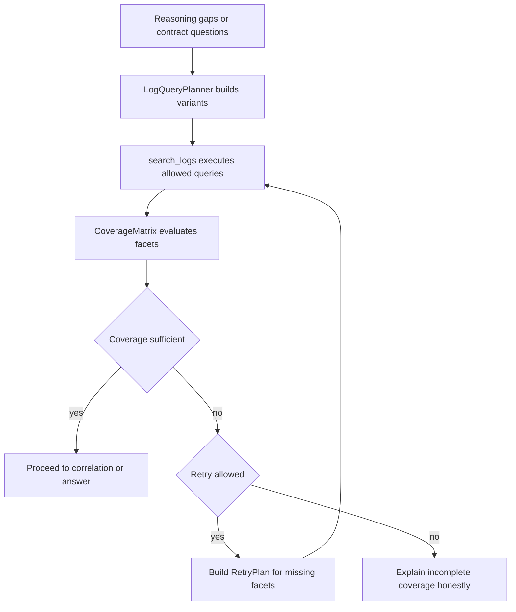

# Query Coverage and Retry Planning

**Date:** 2026-04-28
**Status:** Planning
**Type:** Feature

## Goal

Strengthen AISA log-hunting behavior so agent-driven investigations can explain which evidence questions a query attempted to answer, detect coverage gaps after each hunt, and retry with narrower or broader pivots without inventing unsupported findings. The change keeps deterministic tool results authoritative while improving agent orchestration around log queries, manual fallback, demo fixtures, and Splunk MCP execution.

## Routing Decision

- **Chosen lane:** `agent-workflow` with `integration-control` overlap for log backend contracts.
- **Main files likely to change:**
  - `src/agent/log_query_planner.py`
  - `src/agent/next_action_planner.py`
  - `src/agent/agent_loop.py`
  - `src/agent/tool_registry.py`
  - `src/agent/demo_log_backend.py`
  - `src/mcp_servers/splunk_tools.py`
  - `src/utils/log_hunting_policy.py`
  - `tests/test_agentic_reasoning.py`
  - `tests/test_agent.py`
  - `tests/test_playbook_log_demo.py`
- **Plan required:** yes, because this crosses agent planning, tool execution contracts, log backend behavior, and tests.
- **Likely docs affected:** `docs/system-design.md`, `docs/codebase-summary.md`, `TEST-MANIFEST.md` if the contract becomes user-visible or adds new test gates.

## Current Baseline Observed

- `LogQueryPlanner` builds focused `query_bundle`, `pivot_sequence`, and `next_entities`, but it does not expose an explicit per-question or per-entity coverage matrix.
- `AgentLoop._build_reasoning_search_request` stores `last_log_query_plan` and turns the plan into a generic query string for `search_logs`.
- `NextActionPlanner` can choose `search_logs` for plan signals, telemetry gaps, and contract gates, but it currently avoids repeated `search_logs` after any prior result.
- `ToolRegistry.search_logs` executes planner queries via demo fixture, manual fallback, or Splunk MCP, and returns `query_planner`, `executed_queries`, and result counts.
- `execute_demo_log_hunt` returns matched counts per query but not a structured coverage assessment.
- `splunk_tools.py` returns live rows and basic entities but not query-level coverage metadata beyond the executed query.

## Scope

### In scope

- Add a structured coverage contract for log-hunt plans and results.
- Add query variants and retry strategy metadata to the planner.
- Allow controlled retry/backtracking when prior `search_logs` output leaves required coverage gaps.
- Preserve honest degraded behavior for manual lookup and unavailable backends.
- Add focused tests for planner contracts, retry decisions, demo fixture behavior, and tool result metadata.

### Out of scope

- Changing deterministic verdict or score semantics.
- Replacing tool-backed findings with LLM-only conclusions.
- Adding a new live SIEM backend beyond existing Splunk MCP/demo/manual paths.
- Building a full UI redesign for coverage visualization.

## Proposed Data Contract

### CoverageMatrix

A query plan and result should expose a compact `coverage_matrix` shaped like:

```json
{
  "required_facets": ["user", "host", "session", "process", "network"],
  "covered_facets": ["user", "host"],
  "missing_facets": ["session", "process", "network"],
  "question_coverage": [
    {
      "question": "Which host and session are tied to the login?",
      "facets": ["host", "session"],
      "status": "partial",
      "covered_by_queries": [0],
      "evidence_refs": []
    }
  ],
  "entity_coverage": {
    "alice": {"type": "user", "status": "matched", "query_indexes": [0]},
    "host-a": {"type": "host", "status": "missing", "query_indexes": []}
  },
  "coverage_status": "partial",
  "retry_recommended": true,
  "retry_reason": "Session and process facets remain uncovered after focused identity hunt."
}
```

### RetryPlan

Retry metadata should remain bounded and explainable:

```json
{
  "attempt": 2,
  "max_attempts": 3,
  "strategy": "narrow_missing_facets",
  "focus": "alice",
  "target_facets": ["session", "process"],
  "query_bundle": {"splunk": ["..."]},
  "reason": "Prior hunt covered user and host but missed session and process linkage."
}
```

## Implementation Plan

### P0 — CoverageMatrix foundation

**Objective:** make every log-hunt plan/result able to state what it tried to cover and what remains missing.

- [ ] Add a small coverage model/helper in `src/agent/log_query_planner.py` or a dedicated `src/agent/log_query_coverage.py` module.
- [ ] Extend `LogQueryPlan` with `required_facets`, `question_facets`, `entity_targets`, and initial `coverage_matrix` metadata.
- [ ] Add facet extraction from unresolved questions, triage contract questions, focus kind, and entity state.
- [ ] Add result-side coverage evaluation for `search_logs` outputs based on returned rows, suspicious indicators, and `executed_queries.matched_count` where available.
- [ ] Return `coverage_matrix` in demo fixture, manual fallback, and live Splunk tool result paths.
- [ ] Keep manual/degraded results honest: mark status as `not_executed` or `unknown`, not covered.

**Acceptance criteria**

- [ ] A no-backend manual lookup result includes generated queries plus a coverage matrix that says coverage is unknown/not executed.
- [ ] A demo fixture result with matches marks only matched facets/entities as covered.
- [ ] A demo fixture result without matches marks relevant facets as missing and can recommend retry.
- [ ] Existing `query_planner` payload remains additive and backward-compatible.

**Focused tests**

- `python -m pytest CABTA/tests/test_agentic_reasoning.py -k "log_identity_plan or reasoning_guided_next_action"`
- `python -m pytest CABTA/tests/test_agent.py -k "search_logs"`
- `python -m pytest CABTA/tests/test_playbook_log_demo.py`

### P1 — InvestigationQueryPlanner variants

**Objective:** generate multiple intentional query variants instead of one generic best effort.

- [ ] Extend `LogQueryPlanner` to produce ordered query variants tagged by `variant_id`, `strategy`, `target_facets`, and `expected_entities`.
- [ ] Add strategies such as `focused_entity`, `auth_baseline`, `network_egress`, `process_lineage`, `host_timeline`, and `broad_context`.
- [ ] Map known lanes and triage contracts to required query variants:
  - `log_identity`: `auth_baseline`, `host_timeline`, `process_lineage` when relevant.
  - FortiGate outbound contract: `network_egress`, `host_timeline`, `user_session_linkage`.
  - Windows logon contract: `auth_baseline`, `session_linkage`, `source_network`.
- [ ] Ensure `max_queries_per_hunt` still caps execution while preserving unexecuted variants in plan metadata.
- [ ] Have `AgentLoop._build_reasoning_search_request` pass the structured plan through `_execution_context.log_query_plan` and use the structured query bundle rather than only a generic text string.

**Acceptance criteria**

- [ ] Planner output explains why each query variant exists.
- [ ] Tool execution uses executable Splunk query variants first and retains generic/manual guidance for degraded paths.
- [ ] Query variants avoid unsafe SPL and still pass `evaluate_hunt_request`.
- [ ] Existing callers that pass a raw query still work.

**Focused tests**

- `python -m pytest CABTA/tests/test_agentic_reasoning.py -k "fortigate_outbound or windows_logon or investigation_planner"`
- `python -m pytest CABTA/tests/test_agent.py -k "search_logs_delegates or broad_raw_query or manual_status"`
- `python -m pytest CABTA/tests/test_prompt_composer.py -k "reasoning_block or findings_block"`

### P2 — Retry and backtracking orchestration

**Objective:** let the agent retry log hunts only when coverage gaps justify it, with bounded attempts and clear reasoning.

- [ ] Track log-hunt attempts in `state.reasoning_state`, including prior `coverage_matrix`, `retry_plan`, and executed query fingerprints.
- [ ] Update `NextActionPlanner` so `search_logs` is not blocked solely because it already ran; block only duplicate attempts with no new target facets or strategy.
- [ ] Add retry decision logic:
  - retry when `coverage_matrix.retry_recommended` is true;
  - retry when a contract gate still lacks required facets;
  - do not retry when backend is manual-only unless the retry creates materially different manual queries;
  - do not exceed configured max attempts.
- [ ] Add backtracking logic that pivots from missing entity type to next best facet, such as user to host, host to process, or session to source network.
- [ ] Record retry decisions as governance AI decisions when `governance_store` is available.
- [ ] Ensure summaries and reasoning blocks expose that evidence remains incomplete instead of presenting retry exhaustion as a verdict.

**Acceptance criteria**

- [ ] A prior `search_logs` result with missing session/process facets triggers one planned retry with different target facets.
- [ ] A repeated no-match retry stops at the configured maximum and records why.
- [ ] Manual-only mode does not loop indefinitely.
- [ ] The final response distinguishes incomplete telemetry coverage from deterministic malicious/benign verdicts.

**Focused tests**

- `python -m pytest CABTA/tests/test_agentic_reasoning.py -k "reasoning_guided_next_action or run_loop_persists_reasoning_state"`
- `python -m pytest CABTA/tests/test_agent_loop_prompt_plumbing.py`
- `python -m pytest CABTA/tests/test_agent.py -k "run_loop_pivots or search_logs"`

### P3 — Docs and contract cleanup

**Objective:** document the new contract and keep development gates discoverable.

- [ ] Update `docs/system-design.md` with the planner/result coverage contract if the implementation changes architecture-level behavior.
- [ ] Update `docs/codebase-summary.md` if a new module such as `log_query_coverage.py` is added.
- [ ] Update `TEST-MANIFEST.md` with focused coverage/retry test commands.
- [ ] Add concise inline docstrings for coverage and retry helpers.

## Mermaid Workflow



## Risks and Mitigations

- **Risk:** retry loops could repeatedly call `search_logs` with equivalent queries.
  - **Mitigation:** store query fingerprints, facet targets, and attempt count in reasoning state.
- **Risk:** coverage metadata could imply proof where only query execution occurred.
  - **Mitigation:** separate `executed`, `matched`, `covered`, `missing`, and `unknown` statuses.
- **Risk:** live Splunk and demo fixture result shapes diverge.
  - **Mitigation:** normalize through a shared helper before returning from tool paths.
- **Risk:** planner variants become too broad and trigger approval requirements.
  - **Mitigation:** run every executable query through `evaluate_hunt_request` and stage broad variants as manual/approval-gated.

## Implementation Notes for Code Mode

1. Prefer an additive helper module if `log_query_planner.py` becomes too large.
2. Keep result shape backward-compatible: do not remove `query_planner`, `queries`, `executed_queries`, or `results_count`.
3. Treat coverage as orchestration metadata, not verdict authority.
4. Add tests before or alongside implementation for the new contracts.
5. Keep degraded mode explicit and avoid fake success when no backend is connected.

## Unresolved Questions

- Should retry attempt limits be global under `log_hunting.max_retry_attempts`, per workflow, or hardcoded initially?
- Should coverage metadata be displayed in the web UI immediately, or remain API/tool-result-only for the first implementation slice?
