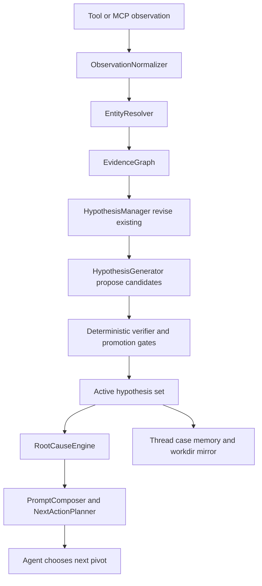

# AISA Vibe SOC Hypothesis Upgrade Plan

## Status, lane, scope

- Status: planning, no code changes in this subtask.
- Product name: AISA. Repository path remains `CABTA/` for compatibility.
- Primary lane: `agent-workflow`.
- Cross-lane dependency: `analysis-core`, because hypothesis promotion must remain grounded in deterministic evidence, analyzer outputs, scoring boundaries, entity graph, contradiction handling, timeline, and chain completeness.
- Plan requirement: mandatory because this work crosses agent runtime, evidence reasoning, root-cause explanation, memory, workdir mirror, UI/API payloads, and tests.

## Scope

This plan upgrades AISA hypotheses from seeded/revised hypothesis tracking into a stronger SOC-style investigative reasoning loop where the agent can propose, open, prioritize, test, and retire hypotheses dynamically while deterministic evidence remains authoritative.

In scope:

- Add a deterministic-first `HypothesisGenerator` candidate layer.
- Extend the `Hypothesis` contract currently in [`hypothesis_manager.py`](../src/agent/hypothesis_manager.py).
- Add promotion gates and audit events before new hypotheses enter active state.
- Expand evidence contracts so every active hypothesis declares required evidence, missing evidence, trigger observations, reason codes, and verification state.
- Make agent/LLM output central as senior analyst assessment, but non-authoritative until deterministic verification passes.
- Integrate dynamic hypothesis generation into [`AgentLoop._refresh_reasoning_outputs()`](../src/agent/agent_loop.py) after observation/entity/evidence updates and before root-cause assessment.
- Preserve existing thread, case, workdir, prompt, and UI compatibility.
- Add tests for generation, dedupe, promotion, contradiction, evidence contract completeness, memory migration, prompt surfacing, and workdir mirroring.

Out of scope:

- Replacing deterministic scoring or verdict ownership in `src/scoring/`.
- Replacing [`AgentLoop`](../src/agent/agent_loop.py), [`ToolRegistry`](../src/agent/tool_registry.py), MCP transport, analyzers, or playbook runtime.
- Introducing a graph database or heavyweight persistence layer.
- Making LLM-generated root cause authoritative without deterministic evidence contracts.
- Dashboard redesign beyond minimal visibility needed for new fields.
- Broad product renaming beyond using AISA in new docs and user-facing text.

## Working note

1. Chosen lane: `agent-workflow`, with `analysis-core` evidence-boundary checks.
2. Main files likely to change: [`hypothesis_manager.py`](../src/agent/hypothesis_manager.py), new [`hypothesis_generator.py`](../src/agent/hypothesis_generator.py), [`agent_loop.py`](../src/agent/agent_loop.py), [`evidence_graph.py`](../src/agent/evidence_graph.py), [`root_cause_engine.py`](../src/agent/root_cause_engine.py), [`next_action_planner.py`](../src/agent/next_action_planner.py), [`prompt_composer.py`](../src/agent/prompt_composer.py), [`thread_sync_service.py`](../src/agent/thread_sync_service.py), [`case_memory_service.py`](../src/agent/case_memory_service.py), [`investigation_workdir.py`](../src/agent/investigation_workdir.py), route/template surfaces only if needed.
3. Plan required: yes.
4. Tests/docs likely affected: [`test_agentic_reasoning.py`](../tests/test_agentic_reasoning.py), [`test_agent_loop_prompt_plumbing.py`](../tests/test_agent_loop_prompt_plumbing.py), [`test_prompt_composer.py`](../tests/test_prompt_composer.py), [`test_agent_chat_reasoning_ui.py`](../tests/test_agent_chat_reasoning_ui.py), [`test_agent_loop_investigation_workdir.py`](../tests/test_agent_loop_investigation_workdir.py), [`test_investigation_workdir_service.py`](../tests/test_investigation_workdir_service.py), [`test_case_memory_service.py`](../tests/test_case_memory_service.py), [`test_thread_sync_service.py`](../tests/test_thread_sync_service.py), [`TEST-MANIFEST.md`](../TEST-MANIFEST.md), and architecture docs if behavior changes.

## Current-state diagnosis

### Existing strengths to preserve

- [`AgentLoop`](../src/agent/agent_loop.py) already creates an investigation plan at session start through [`InvestigationPlanner.build_plan()`](../src/agent/investigation_planner.py), bootstraps structured hypotheses with [`HypothesisManager.bootstrap()`](../src/agent/hypothesis_manager.py), normalizes tool outputs, updates entities and evidence graph, revises hypotheses, assesses root cause, persists metadata, mirrors to workdir, and syncs thread/case memory.
- [`AgentLoop._refresh_reasoning_outputs()`](../src/agent/agent_loop.py) already has the correct high-level seam:
  1. normalize latest tool output through [`ObservationNormalizer.normalize()`](../src/agent/observation_normalizer.py);
  2. update accepted facts and quality summary;
  3. update [`EntityResolver.ingest_observation()`](../src/agent/entity_resolver.py);
  4. update [`EvidenceGraph.ingest_observation()`](../src/agent/evidence_graph.py);
  5. revise hypotheses through [`HypothesisManager.revise()`](../src/agent/hypothesis_manager.py);
  6. build deterministic decision;
  7. run [`RootCauseEngine.assess()`](../src/agent/root_cause_engine.py);
  8. build agentic explanation;
  9. sync graph reasoning;
  10. persist session metadata and workdir artifacts.
- [`HypothesisManager`](../src/agent/hypothesis_manager.py) already tracks `EvidenceRef`, `Hypothesis`, `ObservationAssessment`, evidence scores, contradiction scores, ranking, competition, missing evidence, and recommended pivots.
- [`ObservationNormalizer`](../src/agent/observation_normalizer.py), [`LogObservationNormalizer`](../src/agent/log_observation_normalizer.py), and [`observation_type_inference.py`](../src/agent/observation_type_inference.py) already produce typed observations and fact family schemas.
- [`EntityResolver`](../src/agent/entity_resolver.py) already separates explicit, inferred, and co-observed relations and has guards for sensitive entity pairs.
- [`EvidenceGraph`](../src/agent/evidence_graph.py) already stores observation nodes, entity links, timeline events, supports/contradicts edges, root-cause nodes, and causal support summaries.
- [`RootCauseEngine`](../src/agent/root_cause_engine.py) already enforces stronger support thresholds, typed evidence requirements, explicit relation requirements, contradiction pressure, chain quality, and insufficient-evidence behavior.
- [`PromptComposer`](../src/agent/prompt_composer.py) already gives the model a compact reasoning snapshot and preserves the deterministic-vs-agentic split.
- [`ThreadSyncService`](../src/agent/thread_sync_service.py), [`CaseMemoryService`](../src/agent/case_memory_service.py), and [`InvestigationWorkdirService`](../src/agent/investigation_workdir.py) already have lifecycle-aware memory and non-authoritative workdir mirror boundaries.

### Current hypothesis gap

Current hypotheses are seeded and revised, but they are not dynamically generated from emerging evidence in a first-class way.

Concrete current behavior:

- [`InvestigationPlanner._initial_hypotheses()`](../src/agent/investigation_planner.py) seeds initial hypotheses from goal, lane, observables, and metadata hints.
- [`HypothesisManager._seed_hypotheses()`](../src/agent/hypothesis_manager.py) creates default malicious/benign/specialized hypotheses when bootstrapping.
- [`HypothesisManager.revise()`](../src/agent/hypothesis_manager.py) updates existing hypotheses using observations, entity state, evidence state, and plan data.
- [`NextActionPlanner.reasoning_guided_next_action()`](../src/agent/next_action_planner.py) uses open questions, missing evidence, and plan signals to choose next tool pivots.

Missing behavior:

- No component continuously inspects new typed observations, entity relationships, timeline gaps, contradictions, and LLM analyst suggestions to propose new candidate hypotheses.
- No dedicated candidate staging area with origin, reason codes, trigger observations, and evidence contract checks before promotion.
- No explicit deterministic P0 taxonomy for common SOC chains such as FortiGate beaconing, impossible travel, OAuth consent abuse, or phishing-to-session compromise.
- No promotion gate requiring evidence contract completeness before a candidate becomes active.
- No hypothesis event log explaining when and why a hypothesis was opened, merged, suppressed, promoted, deprioritized, or rejected.
- No max-hypothesis policy that prioritizes high-value SOC pivots while preventing hypothesis explosion.

## Problem statement

AISA already behaves like an evidence-governed investigator, but its active hypotheses are mostly seeded at session start and revised after observations. To achieve stronger “vibe SOC” behavior, the agent must behave more like a senior SOC lead: it should notice new evidence, open new lines of inquiry, pivot, self-test, know when evidence is missing, and refuse to overclaim.

The core problem is to add dynamic hypothesis generation without weakening AISA’s invariant:

- Agent/LLM may strongly assess, suggest, narrate, and coordinate.
- Authoritative verdict/root-cause closure must remain grounded through evidence, provenance, entity graph, contradiction handling, timeline, chain completeness, and deterministic verification.

In short: make the agent the central investigative mind, but make the evidence engine the test suite.

## Target architecture



### Core components

#### `HypothesisGenerator`

New module: [`hypothesis_generator.py`](../src/agent/hypothesis_generator.py)

Responsibilities:

- Generate deterministic-first candidate hypotheses from typed observations, entities, relationships, evidence graph, timeline, and current reasoning state.
- Emit candidates into a staging area, not directly into active root-cause authority.
- Apply P0 deterministic rules first, P1 chain/timeline rules second, and P2 LLM-assisted suggestions last.
- Produce candidate evidence contracts and reason codes.
- Detect candidate duplicates and near-duplicates against active, rejected, and suppressed hypotheses.
- Return promotion decisions and audit events.

#### Agent/LLM assessment as senior analyst output

The model should be allowed to strongly contribute:

- suggest candidate explanations from current context;
- challenge existing hypotheses;
- propose missing evidence;
- propose root-cause narratives;
- select pivots and sequence tools.

But LLM suggestions must enter as `candidate` hypotheses with `origin=llm_assisted` and cannot become authoritative unless deterministic promotion gates pass.

#### Deterministic verifier and evidence contract layer

The verifier is code-level logic that evaluates whether a candidate has enough evidence to become active and whether an active hypothesis can influence root-cause confidence.

It should check:

- trigger observation existence;
- required entity types;
- required relation types and relation strengths;
- required observation families;
- minimum evidence quality;
- contradiction state;
- timeline order or timing constraints;
- chain completeness;
- provenance coverage;
- deterministic tool ownership where verdict-bearing facts are involved.

This can initially live in [`hypothesis_generator.py`](../src/agent/hypothesis_generator.py) as `HypothesisVerifier` or in [`hypothesis_manager.py`](../src/agent/hypothesis_manager.py) if keeping the first slice narrow.

#### Extended `Hypothesis` schema

Extend [`Hypothesis`](../src/agent/hypothesis_manager.py) additively. Required fields:

```json
{
  "id": "hyp-c2-beacon-001",
  "schema_version": "hypothesis/v3",
  "statement": "FortiGate egress telemetry may indicate C2 beaconing from WS-12 to 185.220.101.45.",
  "status": "candidate|open|supported|inconclusive|contradicted|unsupported|deprioritized|suppressed",
  "confidence": 0.42,
  "origin": "deterministic_rule|chain_inference|llm_assisted|analyst_seed|plan_seed|legacy_seed",
  "type": "c2_beaconing|identity_compromise|oauth_consent_abuse|phishing_compromise|malware_callback|benign_noise|generic_incident",
  "attack_path": ["initial_access", "execution", "command_and_control"],
  "topics": ["network_event", "c2", "fortigate", "beacon"],
  "trigger_observation_ids": ["obs:sess:4:0:search_logs:network_event"],
  "required_evidence": [
    {
      "contract_id": "c2_fortigate_beaconing_p0",
      "required_observation_types": ["network_event"],
      "required_entities": ["host", "ip"],
      "required_relations": ["connects_to"],
      "required_relation_strength": "explicit_or_inferred",
      "minimum_quality": 0.72,
      "minimum_timeline_events": 2,
      "contradiction_policy": "block_support_if_business_justification_or_allowlisted_destination"
    }
  ],
  "generation_reason": "FortiGate network telemetry showed accepted recurring outbound traffic to a suspicious destination.",
  "reason_codes": ["P0_C2_FORTIGATE_BEACON", "ENTITY_HOST_DESTINATION_LINK", "TIMELINE_REPEATING_EGRESS"],
  "score_breakdown": {
    "evidence_quality": 0.82,
    "entity_coverage": 0.75,
    "relation_strength": 0.83,
    "timeline_strength": 0.72,
    "contradiction_penalty": 0.0,
    "llm_suggestion_weight": 0.0
  },
  "supporting_evidence_refs": [],
  "contradicting_evidence_refs": [],
  "open_questions": [],
  "audit_trail": [
    {
      "event": "candidate_generated",
      "source": "HypothesisGenerator",
      "reason_codes": ["P0_C2_FORTIGATE_BEACON"],
      "created_at": "2026-04-28T00:00:00Z"
    }
  ],
  "created_at": "2026-04-28T00:00:00Z",
  "updated_at": "2026-04-28T00:00:00Z"
}
```

Backward compatibility rule: older hypothesis records lacking these fields must normalize to safe defaults in [`HypothesisManager._normalize_hypothesis()`](../src/agent/hypothesis_manager.py).

### Hook order inside `AgentLoop._refresh_reasoning_outputs()`

Current hook order should be preserved and extended. Proposed order:

1. Normalize observations via [`ObservationNormalizer.normalize()`](../src/agent/observation_normalizer.py).
2. Merge accepted facts and evidence quality summary.
3. Update entity state via [`EntityResolver.ingest_observation()`](../src/agent/entity_resolver.py).
4. Update evidence graph via [`EvidenceGraph.ingest_observation()`](../src/agent/evidence_graph.py).
5. Revise existing hypotheses via [`HypothesisManager.revise()`](../src/agent/hypothesis_manager.py).
6. Generate candidate hypotheses via new [`HypothesisGenerator.generate()`](../src/agent/hypothesis_generator.py).
7. Verify/dedupe/promote candidates via new promotion gate.
8. Update `state.reasoning_state` with active hypotheses, `candidate_hypotheses`, `suppressed_hypotheses`, and `hypothesis_events`.
9. Recompute unresolved questions from active hypotheses and candidate evidence contracts.
10. Build deterministic decision via [`AgentLoop._build_deterministic_decision_output()`](../src/agent/agent_loop.py).
11. Assess root cause via [`RootCauseEngine.assess()`](../src/agent/root_cause_engine.py), reading extended fields but preserving current support/contradiction/chain checks.
12. Build agentic explanation via [`HypothesisManager.build_agentic_explanation()`](../src/agent/hypothesis_manager.py).
13. Sync graph reasoning via [`EvidenceGraph.sync_reasoning()`](../src/agent/evidence_graph.py).
14. Persist metadata via [`AgentLoop._persist_reasoning_metadata()`](../src/agent/agent_loop.py).
15. Mirror to workdir via [`AgentLoop._mirror_reasoning_to_workdir()`](../src/agent/agent_loop.py).

## Detailed design

### Candidate schema

Candidate hypotheses should be separate from active hypotheses until promotion:

```json
{
  "candidate_id": "cand-001",
  "statement": "Potential OAuth consent abuse led to mailbox access.",
  "origin": "llm_assisted",
  "type": "oauth_consent_abuse",
  "attack_path": ["initial_access", "persistence", "collection"],
  "trigger_observation_ids": ["obs-auth-1", "obs-oauth-1"],
  "evidence_contract": {
    "required_observation_types": ["auth_event", "oauth_consent_event"],
    "required_entities": ["user", "app", "tenant"],
    "required_relations": ["granted_to", "accessed_by"],
    "minimum_quality": 0.7,
    "minimum_explicit_relations": 1
  },
  "verification": {
    "status": "pending|promotable|blocked|duplicate|suppressed",
    "passed_checks": [],
    "failed_checks": [],
    "missing_evidence": []
  },
  "generation_reason": "LLM suggested OAuth abuse, but deterministic consent telemetry is required before activation.",
  "reason_codes": ["P2_LLM_SUGGESTED_OAUTH", "REQUIRES_DETERMINISTIC_CONSENT_EVENT"],
  "created_at": "2026-04-28T00:00:00Z"
}
```

### Promotion gates

A candidate can become an active hypothesis only if all baseline gates pass:

1. Schema gate: required fields present and JSON-serializable.
2. Trigger gate: at least one `trigger_observation_id` points to an existing normalized observation or valid evidence ref.
3. Provenance gate: trigger observations include `source_kind`, `source_paths`, `tool_name`, and `extraction_method`.
4. Entity gate: required entity types exist in `entity_state.entities` or trigger observations.
5. Relation gate: required relation types exist with acceptable `relation_strength`; co-observed only cannot satisfy authoritative chain requirements.
6. Evidence-quality gate: average required observation quality meets threshold.
7. Contradiction gate: no high-quality contradiction blocks activation.
8. Duplication gate: candidate is not a duplicate of an active or recently suppressed hypothesis.
9. Capacity gate: active hypothesis count remains under configured cap.
10. LLM gate: if `origin=llm_assisted`, at least one deterministic trigger observation must independently support the candidate.

Promotion statuses:

- `promoted`: candidate becomes active `open` hypothesis.
- `staged`: kept in `candidate_hypotheses` because evidence may arrive later.
- `blocked`: cannot promote until required evidence appears.
- `duplicate`: merged or suppressed due to similarity.
- `rejected`: contradicted or unsafe overclaim.

### Dedupe strategy

Use deterministic dedupe before any LLM-style semantic comparison:

1. Type and attack path key: `type + sorted(attack_path) + primary entity ids`.
2. Trigger overlap: shared `trigger_observation_ids` or shared top entities.
3. Statement normalization: lowercase, strip punctuation, remove generic phrases.
4. Topic overlap: Jaccard threshold for `topics`.
5. Evidence contract overlap: same contract id or same required evidence shape.
6. Candidate priority: keep the higher evidence-quality candidate, merge reason codes and audit trails.

No vector store is required in the first implementation slice.

### Max hypothesis and priority strategy

Recommended caps:

- Active hypotheses: maximum `7` per session.
- Candidate hypotheses: maximum `12` staged per session.
- Suppressed candidate history: maximum `24`.
- Hypothesis audit events: maximum `100` per session.

Priority ranking should combine:

- current `ranking_score` from [`HypothesisManager._ranking_score()`](../src/agent/hypothesis_manager.py);
- evidence contract completeness;
- trigger observation quality;
- explicit relation score;
- contradiction penalty;
- investigation lane relevance;
- recency of trigger observation;
- P0/P1/P2 tier.

Priority order:

1. P0 deterministic rule candidates with strong contract pass.
2. Existing active hypotheses that gained strong new evidence.
3. P1 chain-based candidates closing a known gap.
4. Analyst-seeded candidates.
5. LLM-assisted candidates that passed deterministic gates.
6. Benign/noise alternatives retained for contradiction and false-positive control.

### Confidence semantics

Confidence must mean explanation confidence, not deterministic verdict confidence.

Use separate values:

- `confidence`: hypothesis explanation confidence.
- `evidence_score`: cumulative supporting evidence strength.
- `contradiction_score`: cumulative contradiction strength.
- `priority`: scheduling/ranking value.
- `score_breakdown`: audit-friendly factors.
- deterministic verdict score remains in `state.deterministic_decision` and analysis-core outputs only.

LLM suggestions must not directly increase confidence. They may set `generation_reason`, `open_questions`, and `candidate priority`, but confidence changes only after deterministic observation assessment.

### Reason codes and event log

Add `reason_codes` to hypotheses and candidates. Examples:

- `P0_C2_FORTIGATE_BEACON`
- `P0_IMPOSSIBLE_TRAVEL_TOKEN_REUSE`
- `P0_MFA_FATIGUE`
- `P0_OAUTH_CONSENT_ABUSE`
- `P0_PHISHING_CREDENTIAL_SESSION_COMPROMISE`
- `P0_MALWARE_EXECUTION_NETWORK_CALLBACK`
- `P1_CHAIN_EMAIL_TO_AUTH`
- `P1_CHAIN_AUTH_TO_PROCESS`
- `P1_CHAIN_PROCESS_TO_NETWORK`
- `P2_LLM_SUGGESTED`
- `PROMOTION_BLOCKED_MISSING_ENTITY`
- `PROMOTION_BLOCKED_CO_OBSERVED_ONLY`
- `PROMOTION_BLOCKED_CONTRADICTION`
- `CANDIDATE_MERGED_DUPLICATE`

Add `hypothesis_events` to `reasoning_state`:

```json
{
  "event_id": "hyp-event-001",
  "event_type": "candidate_generated|candidate_promoted|candidate_blocked|hypothesis_merged|hypothesis_deprioritized|hypothesis_contradicted",
  "hypothesis_id": "hyp-001",
  "candidate_id": "cand-001",
  "reason_codes": ["P0_C2_FORTIGATE_BEACON"],
  "trigger_observation_ids": ["obs-1"],
  "summary": "Promoted C2 beaconing hypothesis after FortiGate egress evidence and destination relation passed gates.",
  "created_at": "2026-04-28T00:00:00Z"
}
```

### Dynamic hypothesis taxonomy and evidence contracts

Initial taxonomy:

| Type | Tier | Required evidence |
| --- | --- | --- |
| `c2_beaconing` | P0 | network event, host/source, destination IP/domain, action/service, cadence or repeated timeline, reputation or suspicious destination context |
| `identity_compromise` | P0 | auth events, user, source IP, session, host, anomaly pattern, contradiction check for known admin/VPN/travel context |
| `mfa_fatigue` | P0 | repeated MFA prompts/failures, user, time window, success after failures or explicit user report |
| `oauth_consent_abuse` | P0 | OAuth consent/grant event, app, user/tenant, risky scopes, subsequent mailbox/API activity |
| `phishing_compromise` | P0 | email delivery, sender/recipient, URL/attachment, credential prompt or session/auth follow-on |
| `malware_callback` | P0 | file/process execution, host/user, process-to-network relation, destination IOC or callback evidence |
| `vulnerability_exploitation` | P1 | vulnerable asset, exposure, exploit event, follow-on process/network or alert chain |
| `benign_or_noise` | P0/P1 false-positive control | clean deterministic verdict, allowlist/business justification, contradiction evidence, lack of chain completion |

### Deterministic P0 rules

P0 rules should live in [`HypothesisGenerator`](../src/agent/hypothesis_generator.py) and must be deterministic-first.

#### P0: C2/FortiGate beaconing

Trigger:

- `network_event` from `search_logs` with Fortinet/FortiGate-like fields or `service`, `policy_id`, `action`, `dest_ip`, `domain`.
- Destination suspicious by IOC enrichment or repeated outbound cadence.

Required:

- source host or source IP;
- destination IP/domain;
- action and service if available;
- `connects_to` relation or equivalent inferred link;
- timeline recurrence or second corroborating observation for supported status.

Blockers:

- allowlisted destination;
- known business service;
- blocked-only noise without host attribution.

#### P0: Impossible travel or token reuse

Trigger:

- two or more `auth_event` observations for same user/session family with implausible geo/source pattern, repeated token/session use, or suspicious source IP.

Required:

- user;
- session or auth event ids;
- source IPs;
- timestamp ordering;
- explicit or inferred `belongs_to` and `authenticated_from` relations.

Blockers:

- known VPN, proxy, admin jump host, or travel policy evidence.

#### P0: MFA fatigue

Trigger:

- repeated failed MFA/push events followed by success or analyst-provided MFA pattern in log facts.

Required:

- user;
- timestamp sequence;
- repeated failure/prompt count;
- success event or user report;
- source IP or app context.

Blockers:

- expected enrollment/reset workflow.

#### P0: OAuth consent abuse

Trigger:

- OAuth grant, new app consent, risky scopes, or mailbox/API access after consent.

Required:

- user;
- app/client id;
- scopes;
- consent event;
- subsequent mailbox/API observation.

Blockers:

- approved enterprise app and expected change record.

#### P0: Phishing to credential or session compromise

Trigger:

- email delivery plus URL/attachment and credential/session follow-on.

Required:

- sender;
- recipient/user;
- URL or attachment;
- auth/session observation after delivery;
- explicit email delivery relation or follow-on relation.

Blockers:

- no delivery, no user impact, known simulation campaign, or clean URL/file verdict.

#### P0: Malware execution to network callback

Trigger:

- file/process execution plus network callback or suspicious destination.

Required:

- file/process;
- host;
- user/session if available;
- process-to-network or process-to-domain relation;
- destination IOC or suspicious reputation;
- timeline order execution before network.

Blockers:

- signed internal tooling, known updater, clean sandbox, or contradiction stronger than support.

### P1 chain-based generation

P1 generation uses entity graph and timeline composition rather than single-event rules.

Examples:

- Email delivery -> URL click -> auth anomaly -> suspicious session.
- Auth anomaly -> process execution -> outbound C2.
- File execution -> registry/persistence -> network callback.
- Vulnerable asset -> exploit alert -> process/network activity.

P1 candidate generation should:

- inspect [`EvidenceGraph.timeline`](../src/agent/evidence_graph.py) and `EntityResolver.relationships`;
- build chain fragments from typed observations;
- require at least two meaningful nodes and one relation;
- mark missing chain links explicitly;
- avoid turning co-observed chains into authoritative root cause.

### P2 LLM-assisted candidate suggestion

P2 runs only after deterministic candidate generation.

LLM role:

- propose new candidate hypotheses from compact evidence context;
- identify blind spots;
- suggest missing evidence and pivots;
- suggest alternative benign explanations.

Safety requirements:

- Persist only structured candidate output, not opaque chain-of-thought.
- Require JSON schema validation.
- Require deterministic trigger observation and evidence contract before promotion.
- If no deterministic gate passes, keep suggestion staged or suppressed with reason code `P2_REQUIRES_DETERMINISTIC_EVIDENCE`.

Minimal initial implementation can omit live LLM candidate generation and still prepare schema/gates for it. If implemented, route it through existing provider/prompt plumbing and treat failures as graceful degradation.

## File-by-file implementation plan

### New [`hypothesis_generator.py`](../src/agent/hypothesis_generator.py)

Add:

- `HypothesisCandidate` dataclass.
- `EvidenceContract` dataclass or dict helper.
- `HypothesisGenerationResult` dataclass containing `candidates`, `promoted`, `suppressed`, `events`, `updated_reasoning_state`.
- `HypothesisGenerator.generate()` taking `goal`, `session_id`, `reasoning_state`, `investigation_plan`, `active_observations`, `entity_state`, `evidence_state`, `deterministic_decision`.
- Deterministic P0 rule functions.
- P1 chain candidate builder.
- Optional P2 input slot for future LLM suggestions.
- `verify_candidate()` and `promote_candidate()` helpers.
- `dedupe_candidates()` helper.

### [`hypothesis_manager.py`](../src/agent/hypothesis_manager.py)

Change additively:

- Extend `Hypothesis` dataclass with `schema_version`, `origin`, `type`, `attack_path`, `trigger_observation_ids`, `required_evidence`, `generation_reason`, `reason_codes`, `score_breakdown`, `audit_trail`.
- Update [`Hypothesis.to_dict()`](../src/agent/hypothesis_manager.py) to round numeric values and preserve new fields.
- Update [`HypothesisManager._normalize_hypothesis()`](../src/agent/hypothesis_manager.py) to default missing fields for old sessions.
- Add `merge_generated_hypotheses()` or equivalent to integrate promoted candidates without duplicating revision logic.
- Update [`HypothesisManager._rank_hypotheses()`](../src/agent/hypothesis_manager.py) to include evidence contract completeness and P0/P1/P2 priority without breaking existing ranking behavior.
- Update [`HypothesisManager._derive_missing_evidence()`](../src/agent/hypothesis_manager.py) to include required evidence gaps from active hypotheses.
- Update [`HypothesisManager.build_agentic_explanation()`](../src/agent/hypothesis_manager.py) to expose new fields under `hypotheses` and `candidate_hypotheses` only as non-authoritative explanation context.

### [`agent_loop.py`](../src/agent/agent_loop.py)

Change narrowly:

- Import `HypothesisGenerator`.
- Instantiate it in [`AgentLoop.__init__()`](../src/agent/agent_loop.py).
- Insert generator call in [`AgentLoop._refresh_reasoning_outputs()`](../src/agent/agent_loop.py) after [`HypothesisManager.revise()`](../src/agent/hypothesis_manager.py) and before deterministic decision/root-cause assessment.
- Persist `candidate_hypotheses`, `suppressed_hypotheses`, `hypothesis_events`, and `hypothesis_generation_summary` in [`AgentLoop._persist_reasoning_metadata()`](../src/agent/agent_loop.py).
- Mirror these into workdir via [`AgentLoop._mirror_reasoning_to_workdir()`](../src/agent/agent_loop.py).
- Do not change final verdict authority or scoring paths.

### [`evidence_graph.py`](../src/agent/evidence_graph.py)

Change additively:

- Add candidate hypothesis nodes for staged candidates, clearly marked as `type=candidate_hypothesis` and `authoritative=false`.
- Add promotion/event edges such as `triggered_by`, `requires`, `blocked_by`, and `merged_into` if useful.
- Add a small helper to summarize evidence contract completeness for root-cause and prompt context.
- Preserve existing `supports`, `contradicts`, `derived_from`, `caused_by`, `linked_to`, and `precedes` semantics.

### [`root_cause_engine.py`](../src/agent/root_cause_engine.py)

Change conservatively:

- Read `required_evidence`, `score_breakdown`, `origin`, `type`, `trigger_observation_ids`, and `reason_codes` if present.
- Treat `origin=llm_assisted` as non-authoritative unless supporting refs pass typed/provenance gates.
- Include contract incompleteness in insufficient-evidence or inconclusive outcomes.
- Keep existing relation, typed evidence, contradiction, timeline, and chain checks as final explanation gates.
- Do not use `generation_reason` alone as support.

### [`next_action_planner.py`](../src/agent/next_action_planner.py)

Change additively:

- Include candidate required evidence gaps in `question_bundle`.
- Prefer tool actions that close the highest-priority candidate evidence contract.
- Add rule-specific pivot decisions:
  - C2/FortiGate -> `search_logs` for recurrence/source host and `investigate_ioc` for destination reputation.
  - Phishing -> `analyze_email`, then log pivots for auth/session.
  - Malware callback -> `analyze_malware`, then log/network pivot.
  - Identity compromise -> `search_logs` for user/session/source IP.
- Preserve existing duplicate-call guard behavior in [`AgentLoop`](../src/agent/agent_loop.py).

### [`prompt_composer.py`](../src/agent/prompt_composer.py)

Change compactly:

- Extend [`PromptComposer.build_reasoning_block()`](../src/agent/prompt_composer.py) to include:
  - active top hypotheses with `origin`, `type`, and reason codes;
  - top staged candidate hypotheses and missing evidence;
  - latest hypothesis events;
  - explicit reminder that LLM may suggest candidates but evidence gates decide promotion.
- Keep prompt compact to avoid context bloat.
- Do not ask the LLM to provide authoritative verdicts.

### [`thread_sync_service.py`](../src/agent/thread_sync_service.py)

Change additively:

- Include `candidate_hypotheses`, `suppressed_hypotheses`, and `hypothesis_events` in working memory snapshots.
- Include only promoted/accepted hypothesis state in accepted memory.
- Preserve lifecycle semantics: working/candidate snapshots are not authoritative case truth.

### [`case_memory_service.py`](../src/agent/case_memory_service.py)

Change additively:

- Record candidate and hypothesis event summaries in reasoning checkpoints.
- Publish only accepted/promoted hypothesis state into authoritative memory.
- Preserve legacy metadata fallback.

### [`investigation_workdir.py`](../src/agent/investigation_workdir.py)

Change additively:

- Keep current `hypotheses.json` compatibility.
- Add optional files:
  - `candidate_hypotheses.json`
  - `hypothesis_events.json`
  - `hypothesis_generation_summary.json`
- Mark all workdir reasoning artifacts as mirror/non-authoritative unless backed by deterministic decision files.
- Preserve resume warning that workdir evidence must be revalidated with fresh AISA tools.

### Web/API/UI surfaces

Only if needed after backend fields exist:

- Update session decoration in [`src/web/routes/agent.py`](../src/web/routes/agent.py) to expose new fields from metadata.
- Update chat route/payload if current session response omits new fields.
- Update [`test_agent_chat_reasoning_ui.py`](../tests/test_agent_chat_reasoning_ui.py) only if the UI should show candidate hypotheses or hypothesis events.
- UI labels must clearly distinguish active supported hypotheses, staged candidates, and deterministic decisions.

## Migration and backward compatibility

- Existing sessions with `reasoning_state.schema_version` 1 or 2 must load successfully.
- Missing new `Hypothesis` fields default to:
  - `origin=legacy_seed`
  - `type=generic_incident`
  - `attack_path=[]`
  - `trigger_observation_ids=[]`
  - `required_evidence=[]`
  - `generation_reason=''`
  - `reason_codes=[]`
  - `score_breakdown={}`
  - `audit_trail=[]`
- Existing `hypotheses.json` workdir files remain valid.
- New workdir files are optional and should not break validation for old workdirs unless `REQUIRED_JSON_FILES` is intentionally updated. Prefer optional files in the first slice to avoid migration churn.
- Existing case memory payloads without candidates remain valid.
- Existing prompt tests should continue to pass with compact added context.
- Old sessions should not retroactively become authoritative because a restored candidate exists. Restored candidates require fresh evidence if they come from workdir or working memory.

## Risk analysis and mitigations

| Risk | Impact | Mitigation |
| --- | --- | --- |
| False positives from aggressive candidate generation | Analysts may see plausible but unsupported chains | Keep candidates staged until deterministic gates pass; show missing evidence and contradiction blockers. |
| Hypothesis explosion | Prompt bloat, UI noise, poor pivots | Enforce caps, dedupe, priority scoring, suppress low-value duplicates, retain only event summaries. |
| LLM hallucination | Unsupported root-cause suggestions | LLM suggestions use `origin=llm_assisted`, cannot promote without deterministic trigger observations and evidence contracts. |
| Stale evidence from workdir/session resume | Old context may be treated as current | Preserve workdir non-authoritative boundary and require fresh AISA tool validation before promotion. |
| Duplicate evidence over-amplification | Confidence inflation | Dedupe evidence refs by observation id, source path, tool, step, and summary; use diminishing-return scoring. |
| Co-observation treated as causality | Wrong root cause | Entity gate requires explicit or strong inferred relations for support; co-observed-only blocks authoritative promotion. |
| Performance overhead | Slow refresh loop | Deterministic rules are local and bounded; cap observations inspected; avoid LLM P2 in P0 slice. |
| Prompt bloat | Weaker model behavior | Summarize only top active hypotheses, top candidates, and top missing evidence. |
| UI confusion | Analyst may think candidate equals conclusion | Labels: deterministic decision, active hypotheses, staged candidates, missing evidence, non-authoritative explanation. |
| Backward compatibility break | Old sessions/workdirs fail | Additive schema, safe defaults, optional new workdir files first. |

## Rollout phases

### P0: Deterministic dynamic hypotheses

Implement:

- [`hypothesis_generator.py`](../src/agent/hypothesis_generator.py) with P0 deterministic rules.
- Extended [`Hypothesis`](../src/agent/hypothesis_manager.py) schema and normalization.
- Candidate staging, promotion gates, dedupe, audit events.
- Hook inside [`AgentLoop._refresh_reasoning_outputs()`](../src/agent/agent_loop.py).
- Workdir and metadata persistence.
- Tests for P0 rules and compatibility.

Acceptance criteria:

- New observations can generate new candidate hypotheses after session start.
- P0 candidates promote only when evidence contracts pass.
- LLM is not required for P0.
- Deterministic verdict output remains unchanged.
- Old reasoning states still load.
- Candidate events are persisted and auditable.

Windows/cmd-compatible commands:

```cmd
cd CABTA && python -m pytest tests/test_agentic_reasoning.py tests/test_agent_loop_prompt_plumbing.py tests/test_prompt_composer.py -q
cd CABTA && python -m pytest tests/test_agent_loop_investigation_workdir.py tests/test_investigation_workdir_service.py -q
```

### P1: Chain-based generation through entity graph and timeline

Implement:

- P1 chain detection for email-to-auth, auth-to-process, process-to-network, vulnerability-to-exploit paths.
- Evidence graph summaries for contract completeness.
- Next-action planner improvements from candidate evidence gaps.
- Root-cause engine contract completeness checks.

Acceptance criteria:

- Multi-step chains can open new hypotheses when new evidence appears.
- Co-observed-only chains remain staged or inconclusive.
- Root cause remains unsupported/inconclusive when chain completeness is weak.
- Next actions prioritize missing chain links.

Windows/cmd-compatible commands:

```cmd
cd CABTA && python -m pytest tests/test_agentic_reasoning.py tests/test_agent.py -q
cd CABTA && python -m pytest tests/test_case_memory_service.py tests/test_thread_sync_service.py -q
```

### P2: LLM-assisted candidate suggestions with deterministic validation

Implement:

- Optional structured LLM candidate suggestion pass.
- Prompt composer compact context for candidate suggestion.
- JSON schema validation for suggestions.
- Hard deterministic promotion gates.
- UI/API visibility for staged LLM suggestions if useful.

Acceptance criteria:

- LLM can propose candidates, but suggestions remain staged unless deterministic gates pass.
- LLM failures degrade silently to deterministic P0/P1 behavior.
- Prompt tests prove model receives candidate context but not verdict authority.
- UI/API labels staged LLM suggestions as non-authoritative.

Windows/cmd-compatible commands:

```cmd
cd CABTA && python -m pytest tests/test_prompt_composer.py tests/test_agent_loop_prompt_plumbing.py -q
cd CABTA && python -m pytest tests/test_agent_chat_reasoning_ui.py tests/test_analyst_workflow_e2e.py -q
```

### Final regression gate

Run after all implementation phases:

```cmd
cd CABTA && python test_setup.py
cd CABTA && python -m pytest -q
```

## Test plan

Add or update tests in [`test_agentic_reasoning.py`](../tests/test_agentic_reasoning.py):

- `test_hypothesis_generator_creates_p0_fortigate_c2_candidate_from_network_event`
- `test_hypothesis_generator_blocks_c2_candidate_without_source_or_destination`
- `test_hypothesis_generator_promotes_candidate_after_evidence_contract_passes`
- `test_hypothesis_generator_keeps_llm_candidate_staged_without_deterministic_trigger`
- `test_hypothesis_generator_dedupes_candidate_against_active_hypothesis`
- `test_hypothesis_generator_caps_active_and_candidate_hypotheses`
- `test_dynamic_hypothesis_generation_adds_audit_events`
- `test_dynamic_hypothesis_missing_required_evidence_updates_open_questions`
- `test_phishing_to_session_candidate_requires_delivery_and_auth_follow_on`
- `test_malware_callback_candidate_requires_execution_before_network_callback`
- `test_impossible_travel_candidate_blocks_on_vpn_contradiction`
- `test_root_cause_engine_does_not_support_llm_origin_without_verified_evidence`
- `test_root_cause_engine_uses_required_evidence_completeness_for_supported_status`

Add or update tests in [`test_agent_loop_prompt_plumbing.py`](../tests/test_agent_loop_prompt_plumbing.py):

- `test_refresh_reasoning_outputs_generates_candidates_after_observation_revision`
- `test_refresh_reasoning_outputs_persists_candidate_hypotheses_and_events`
- `test_refresh_reasoning_outputs_preserves_deterministic_decision_when_candidate_changes`

Add or update tests in [`test_prompt_composer.py`](../tests/test_prompt_composer.py):

- `test_build_reasoning_block_includes_candidate_hypotheses_compactly`
- `test_build_reasoning_block_labels_llm_candidates_non_authoritative`
- `test_build_reasoning_block_includes_top_hypothesis_event`

Add or update tests in [`test_agent_loop_investigation_workdir.py`](../tests/test_agent_loop_investigation_workdir.py) and [`test_investigation_workdir_service.py`](../tests/test_investigation_workdir_service.py):

- `test_workdir_mirrors_candidate_hypotheses_and_hypothesis_events`
- `test_workdir_resume_keeps_candidates_non_authoritative_until_fresh_validation`
- `test_old_workdir_without_candidate_files_still_validates`

Add or update tests in [`test_case_memory_service.py`](../tests/test_case_memory_service.py) and [`test_thread_sync_service.py`](../tests/test_thread_sync_service.py):

- `test_thread_snapshot_includes_working_candidate_hypotheses`
- `test_accepted_memory_excludes_unpromoted_candidates`
- `test_case_memory_records_hypothesis_generation_summary_without_publishing_working_candidates`

Add or update UI/API tests only if exposing fields:

- [`test_agent_chat_reasoning_ui.py`](../tests/test_agent_chat_reasoning_ui.py): assert staged candidates are labeled separately from active hypotheses.
- [`test_analyst_workflow_e2e.py`](../tests/test_analyst_workflow_e2e.py): verify follow-up case reasoning preserves candidate/promoted boundaries.

## Documentation updates needed

Update after implementation:

- [`docs/system-design.md`](../docs/system-design.md): add dynamic hypothesis generation to investigation plane and evidence-governed reasoning model.
- [`docs/agentic-lead-investigator-upgrade-plan.md`](../docs/agentic-lead-investigator-upgrade-plan.md): note that hypotheses now include dynamic generation and promotion gates.
- [`docs/codebase-summary.md`](../docs/codebase-summary.md): add [`hypothesis_generator.py`](../src/agent/hypothesis_generator.py) to agent module map.
- [`TEST-MANIFEST.md`](../TEST-MANIFEST.md): add focused test commands for dynamic hypothesis generation.
- UI help text if candidate hypotheses are surfaced.

## Immediate implementation checklist

- [ ] Add deterministic [`hypothesis_generator.py`](../src/agent/hypothesis_generator.py) with P0 candidate generation and promotion gates.
- [ ] Extend [`Hypothesis`](../src/agent/hypothesis_manager.py) schema additively and normalize old sessions.
- [ ] Hook generation into [`AgentLoop._refresh_reasoning_outputs()`](../src/agent/agent_loop.py) after existing revision and before root-cause assessment.
- [ ] Persist and mirror candidate hypotheses and hypothesis events.
- [ ] Add P0 tests and backward-compatibility tests.
- [ ] Add P1 chain generation after P0 is stable.
- [ ] Add optional P2 LLM-assisted suggestions only after deterministic P0/P1 gates are tested.

## Unresolved questions

- Should the first implementation expose staged candidates in the UI immediately, or keep them backend-only until P0/P1 behavior stabilizes?
- Should `HypothesisGenerator` own both generation and promotion gates, or should promotion live in [`HypothesisManager`](../src/agent/hypothesis_manager.py) after candidate generation?
- Should P2 LLM-assisted suggestions be deferred entirely until P0/P1 deterministic generation is accepted by tests and analyst UX?
