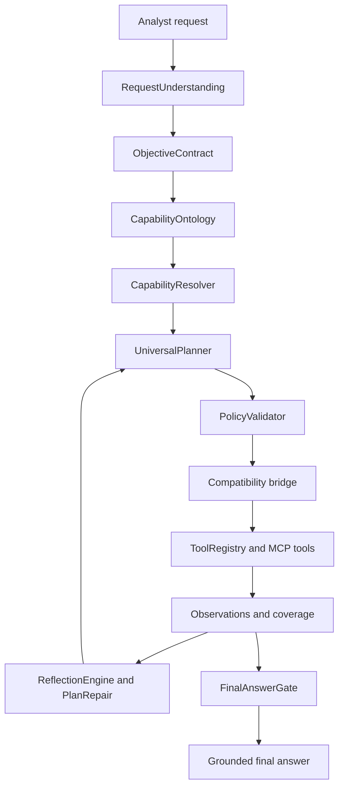

# Kế hoạch triển khai Vibe SOC Universal Orchestration Upgrade

- **Trạng thái:** Phase 5 implemented; focused verification completed
- **Ngày:** 2026-04-28
- **Sản phẩm:** AISA trong [`CABTA/`](CABTA/)
- **Primary lane:** agent-workflow
- **Secondary lanes:** integration-control, web-surface khi chạm chat hoặc MCP runtime
- **Owner/agent notes:** Kế hoạch này dành cho AI/code agent triển khai theo từng lát nhỏ. Chỉ thay đổi code sau khi giữ nguyên bất biến AISA: deterministic analyzer/scoring/evidence vẫn là nguồn thẩm quyền cho verdict; LLM chỉ hiểu yêu cầu, lập kế hoạch, diễn giải, sửa kế hoạch có kiểm soát; trạng thái degraded phải nói thật và không giả lập thành công.

## 1. Problem statement

Các lỗi đã quan sát trong luồng chat/investigation Vibe SOC cho thấy orchestration hiện tại vẫn bị neo theo tên tool thay vì hiểu mục tiêu phân tích:

1. Yêu cầu Splunk/Fortigate bị route qua IOC enrichment: người dùng hỏi về log/SIEM/Fortigate nhưng hệ thống chọn hoặc fallback sang IOC path thay vì năng lực log hunt.
2. Timerange được lập kế hoạch là historical nhưng execution/final state lại báo hoặc dùng `24h`, làm sai phạm vi điều tra và gây câu trả lời không đáng tin.
3. Tool-name-first planning xuất hiện ở nhiều lớp: prompt, investigation planner, next action planner, fallback trong agent loop và registry đều truyền/ưu tiên tên tool cụ thể thay vì objective/capability.
4. Coverage metadata đã tồn tại, nhưng final answer chưa có hard gate bắt buộc: câu trả lời cuối có thể được tạo khi coverage còn thiếu, degraded hoặc claim chưa được ground theo evidence.

Hậu quả: AISA có thể trả lời tự tin sai ngữ cảnh, chọn sai loại evidence, bỏ qua timerange người dùng yêu cầu và kết luận khi coverage chưa đủ. Upgrade cần chuyển từ tool-first sang objective/capability-first nhưng vẫn giữ compatibility với [`ToolRegistry`](CABTA/src/agent/tool_registry.py) và [`AgentLoop`](CABTA/src/agent/agent_loop.py).

## 2. Verified root causes

| Root cause | File/function | Bằng chứng | Rủi ro | Hướng xử lý |
|---|---|---|---|---|
| Investigation plan phát tín hiệu bằng tên tool | [`InvestigationPlanner._next_action_signals()`](CABTA/src/agent/investigation_planner.py:810), [`InvestigationPlanner._normalize_next_action_signals()`](CABTA/src/agent/investigation_planner.py:1022) | Signal shape dùng `tool`, ví dụ `search_logs`, `investigate_ioc`; downstream đọc trực tiếp tên tool. | Planner bị khóa vào tool hiện có, khó chọn đúng capability khi request cần SIEM/log nhưng không có entity IOC rõ. | Thêm ObjectiveContract và CapabilityAction; giữ `next_action_signals` legacy nhưng sinh từ capability mapping. |
| Next action planner hardcode tool | [`NextActionPlanner.reasoning_guided_next_action()`](CABTA/src/agent/next_action_planner.py:45), [`NextActionPlanner._decision_from_plan_signal()`](CABTA/src/agent/next_action_planner.py:333), [`NextActionPlanner._payload_for_signaled_tool()`](CABTA/src/agent/next_action_planner.py:373) | Điều kiện trực tiếp cho `search_logs`, `analyze_email`, `analyze_malware`, `investigate_ioc`, `extract_iocs`. | Sai route khi cần capability khác hoặc provider/MCP thay thế; khó degrade trung thực. | Migrate sang `use_capability`; bridge resolve capability sang tool cụ thể ở execution boundary. |
| Agent loop fallback default IOC | [`AgentLoop._guess_first_tool()`](CABTA/src/agent/agent_loop.py:2810) | Fallback chọn tool đầu tiên từ text; khi không nhận diện đúng log/SIEM sẽ rơi về IOC flow. | Splunk/Fortigate request bị xem như IOC enrichment thay vì log investigation. | Phase 0 chặn default IOC cho log/SIEM/firewall; Phase 3 thay fallback bằng CapabilityResolver. |
| Agent loop default timerange `24h` | [`AgentLoop._build_reasoning_search_request()`](CABTA/src/agent/agent_loop.py:2481) | `timerange=str(plan.get("timerange") or "24h")`. | Yêu cầu historical/all-time bị thu hẹp không rõ ràng. | Preserve requested timerange trong RequestUnderstanding/ObjectiveContract; chỉ default khi không có explicit range và ghi reason. |
| Registry search_logs timerange fallback/precedence | [`ToolRegistry._search_logs()`](CABTA/src/agent/tool_registry.py:1207) | Search_logs nhận query/timerange qua nhiều path; fallback có thể override hoặc normalize về default. | Execution khác kế hoạch, final answer báo phạm vi sai. | Chuẩn hóa precedence: explicit ObjectiveContract > query_plan timerange > params timerange > safe default; ghi `effective_timerange_source`. |
| Prompt tool-first | [`prompt_composer.py`](CABTA/src/agent/prompt_composer.py:32) | System prompt yêu cầu IOC dùng `investigate_ioc` first, file dùng `analyze_malware` first, email dùng `analyze_email` first. | Model học thứ tự tool thay vì objective; dễ bỏ qua log/SIEM capability. | Prompt chuyển sang objective/capability-first, liệt kê tool như adapter cuối cùng. |
| Coverage có nhưng final answer chưa hard gated | [`CoverageEvaluator.evaluate()`](CABTA/src/agent/coverage/coverage_evaluator.py:43), [`AgentLoop` final answer branch](CABTA/src/agent/agent_loop.py:1642), [`prompt_composer.py` summary prompt](CABTA/src/agent/prompt_composer.py:730) | Coverage matrix và retry metadata đã có, nhưng final answer gate không bắt buộc verify claim/coverage/degraded trước khi trả lời. | Kết luận khi thiếu evidence hoặc backend unavailable. | Thêm FinalAnswerGate, ClaimVerifier, AnswerGrounder; chỉ cho final answer nếu claims trace được evidence hoặc được đánh dấu limitation. |

## 3. Target architecture

Mục tiêu là một orchestration stack theo objective/capability:



### Thành phần mới

1. **RequestUnderstanding**: trích xuất intent, domain, entities, time constraints, requested backend, desired output, uncertainty và safety needs từ message.
2. **ObjectiveContract / ObjectiveModel**: contract bất biến cho mục tiêu điều tra, expected evidence, success criteria, timerange policy, approval needs, final answer constraints.
3. **CapabilityOntology / ToolContracts**: catalog capability độc lập tên tool, ánh xạ tool local/MCP vào capability với input/output/evidence contract.
4. **CapabilityResolver**: chọn capability/provider phù hợp theo objective, runtime availability, policy, quality và degradation mode.
5. **UniversalPlanner / CapabilityAction**: lập plan bằng capability action như `collect_log_evidence`, `analyze_email_artifact`, `enrich_observable`, `correlate_evidence`, không hardcode tool.
6. **PolicyValidator**: validate action trước execution: approval, dangerous action, timerange breadth, privacy, missing integration, query policy.
7. **ReflectionEngine / PlanRepair**: sau observation, so sánh expected evidence với coverage, sửa kế hoạch có bounded retry, không lặp tool vô ích.
8. **FinalAnswerGate / ClaimVerifier / AnswerGrounder**: gate bắt buộc trước final answer: claim phải trace evidence hoặc được gắn limitation/degraded; coverage blocking gaps phải được xử lý hoặc nêu rõ.
9. **Compatibility bridge**: adapter chuyển `CapabilityAction` thành legacy decision `{"action":"use_tool","tool":"...","params":...}` để dùng tiếp [`ToolRegistry`](CABTA/src/agent/tool_registry.py) và [`AgentLoop`](CABTA/src/agent/agent_loop.py) trong giai đoạn migrate.

## 4. Dataclass/API sketches

### [`request_understanding.py`](CABTA/src/agent/request_understanding.py)

```python
@dataclass
class RequestUnderstanding:
    raw_text: str
    intent: str
    domain: str
    analyst_objective: str
    entities: list[dict[str, Any]] = field(default_factory=list)
    requested_backends: list[str] = field(default_factory=list)
    timerange: dict[str, Any] = field(default_factory=dict)
    output_preferences: list[str] = field(default_factory=list)
    uncertainty: list[str] = field(default_factory=list)
    safety_flags: list[str] = field(default_factory=list)

class RequestUnderstandingExtractor:
    def extract(self, message: str, context: dict[str, Any] | None = None) -> RequestUnderstanding: ...
```

### [`objective_contract.py`](CABTA/src/agent/objective_contract.py)

```python
@dataclass
class EvidenceRequirement:
    requirement_id: str
    capability: str
    required_facets: list[str]
    min_quality: str = "typed_observation"
    blocking: bool = True

@dataclass
class ObjectiveContract:
    contract_id: str
    objective_type: str
    lane: str
    summary: str
    timerange: dict[str, Any]
    requested_backends: list[str]
    evidence_requirements: list[EvidenceRequirement]
    success_criteria: list[str]
    approval_requirements: list[str] = field(default_factory=list)
    final_answer_requirements: list[str] = field(default_factory=list)
    degraded_allowed: bool = True
    schema_version: str = "objective-contract/v1"

class ObjectiveModelBuilder:
    def build(self, understanding: RequestUnderstanding, runtime: dict[str, Any]) -> ObjectiveContract: ...
```

### [`capability_ontology.py`](CABTA/src/agent/capability_ontology.py)

```python
@dataclass
class ToolContract:
    tool_name: str
    capability: str
    input_schema: dict[str, Any]
    output_facets: list[str]
    evidence_role: str
    supports_timerange: bool = False
    provider: str = "local"
    requires_approval: bool = False

@dataclass
class CapabilityDefinition:
    capability_id: str
    description: str
    domains: list[str]
    required_inputs: list[str]
    output_facets: list[str]
    compatible_tools: list[ToolContract]

class CapabilityOntology:
    def capabilities_for(self, objective: ObjectiveContract) -> list[CapabilityDefinition]: ...
    def register_tool_contract(self, contract: ToolContract) -> None: ...
```

### [`capability_resolver.py`](CABTA/src/agent/capability_resolver.py)

```python
@dataclass
class CapabilityResolution:
    capability: str
    selected_tool: str | None
    provider: str | None
    params_template: dict[str, Any]
    availability: str
    degradation_reason: str = ""
    confidence: float = 0.0

class CapabilityResolver:
    def resolve(self, objective: ObjectiveContract, capability: str, state: AgentState) -> CapabilityResolution: ...
```

### [`universal_planner.py`](CABTA/src/agent/universal_planner.py)

```python
@dataclass
class CapabilityAction:
    action_id: str
    capability: str
    objective_ref: str
    params: dict[str, Any]
    rationale: str
    expected_facets: list[str]
    priority: int = 50
    stop_conditions: list[str] = field(default_factory=list)

@dataclass
class UniversalPlan:
    plan_id: str
    objective: ObjectiveContract
    actions: list[CapabilityAction]
    current_index: int = 0
    status: str = "planned"

class UniversalPlanner:
    def build_plan(self, objective: ObjectiveContract, state: AgentState) -> UniversalPlan: ...
    def next_action(self, plan: UniversalPlan, state: AgentState) -> CapabilityAction | None: ...
```

### [`policy_validator.py`](CABTA/src/agent/policy_validator.py)

```python
@dataclass
class PolicyDecision:
    allowed: bool
    status: str
    reason: str
    approval_required: bool = False
    normalized_params: dict[str, Any] = field(default_factory=dict)

class PolicyValidator:
    def validate(self, action: CapabilityAction, resolution: CapabilityResolution, objective: ObjectiveContract) -> PolicyDecision: ...
```

### [`reflection_engine.py`](CABTA/src/agent/reflection_engine.py)

```python
@dataclass
class ReflectionResult:
    status: str
    covered_facets: list[str]
    missing_facets: list[str]
    repair_actions: list[CapabilityAction]
    degraded_reason: str = ""

class ReflectionEngine:
    def reflect(self, objective: ObjectiveContract, observations: list[dict[str, Any]], coverage: dict[str, Any]) -> ReflectionResult: ...

class PlanRepair:
    def repair(self, plan: UniversalPlan, reflection: ReflectionResult, state: AgentState) -> UniversalPlan: ...
```

### [`final_answer_gate.py`](CABTA/src/agent/final_answer_gate.py)

```python
@dataclass
class ClaimVerification:
    claim: str
    status: str
    evidence_refs: list[dict[str, Any]]
    limitation: str = ""

@dataclass
class FinalAnswerDecision:
    allowed: bool
    status: str
    verified_claims: list[ClaimVerification]
    blocking_reasons: list[str]
    grounded_context: dict[str, Any]

class ClaimVerifier:
    def verify(self, draft_claims: list[str], evidence_state: dict[str, Any], coverage: dict[str, Any]) -> list[ClaimVerification]: ...

class AnswerGrounder:
    def ground(self, answer: str, verifications: list[ClaimVerification]) -> str: ...

class FinalAnswerGate:
    def evaluate(self, objective: ObjectiveContract, state: AgentState, draft_answer: str | None = None) -> FinalAnswerDecision: ...
```

### [`capability_bridge.py`](CABTA/src/agent/capability_bridge.py)

```python
class CapabilityToolBridge:
    def to_legacy_decision(self, action: CapabilityAction, resolution: CapabilityResolution, policy: PolicyDecision) -> dict[str, Any]: ...
    def from_legacy_signal(self, signal: dict[str, Any], objective: ObjectiveContract) -> CapabilityAction: ...
```

## 5. Phased implementation checklist

### Phase 0 - Immediate bug fixes

- [ ] Sửa [`AgentLoop._guess_first_tool()`](CABTA/src/agent/agent_loop.py:2810) để nhận diện Splunk, SIEM, log, Fortigate, firewall, auth event, EventCode, sourcetype trước IOC fallback.
- [ ] Sửa [`AgentLoop._build_reasoning_search_request()`](CABTA/src/agent/agent_loop.py:2481) để không default cứng `24h` khi message/plan có historical/all-time/custom timerange.
- [ ] Sửa [`ToolRegistry._search_logs()`](CABTA/src/agent/tool_registry.py:1207) để timerange precedence rõ ràng và trả về `effective_timerange`, `effective_timerange_source`, `requested_timerange`.
- [ ] Thêm regression tests cho Splunk/Fortigate historical request không gọi `investigate_ioc` và không rơi về `24h`.

### Phase 1 - Additive ObjectiveContract

- [ ] Tạo [`request_understanding.py`](CABTA/src/agent/request_understanding.py) với heuristic extractor deterministic trước, optional LLM enrichment sau.
- [ ] Tạo [`objective_contract.py`](CABTA/src/agent/objective_contract.py) và builder map understanding sang lane/capability/evidence requirements.
- [ ] Gắn ObjectiveContract vào `state.reasoning_state["objective_contract"]` trong [`AgentLoop`](CABTA/src/agent/agent_loop.py).
- [ ] Cập nhật [`InvestigationPlanner.build_plan()`](CABTA/src/agent/investigation_planner.py:47) để include objective contract metadata mà không phá schema cũ.

### Phase 2 - Capability ontology/resolver

- [ ] Tạo [`capability_ontology.py`](CABTA/src/agent/capability_ontology.py) với capability IDs ban đầu: `collect_log_evidence`, `analyze_email_artifact`, `analyze_file_artifact`, `enrich_observable`, `extract_observables`, `correlate_evidence`, `generate_detection`, `retrieve_case_context`, `manage_workflow`.
- [ ] Tạo [`capability_resolver.py`](CABTA/src/agent/capability_resolver.py) để resolve local tools và MCP tools theo runtime availability.
- [ ] Cập nhật [`capability_catalog.py`](CABTA/src/agent/capability_catalog.py) hoặc adapter để tool metadata có contract đầu vào/đầu ra.
- [ ] Expose degraded resolution khi integration thiếu thay vì fake success.

### Phase 3 - Planner migration to `use_capability`

- [ ] Tạo [`universal_planner.py`](CABTA/src/agent/universal_planner.py) và [`capability_bridge.py`](CABTA/src/agent/capability_bridge.py).
- [ ] Cập nhật [`NextActionPlanner.reasoning_guided_next_action()`](CABTA/src/agent/next_action_planner.py:45) để ưu tiên UniversalPlanner nếu feature flag bật.
- [ ] Chuyển `next_action_signals` trong [`InvestigationPlanner._next_action_signals()`](CABTA/src/agent/investigation_planner.py:810) sang capability-first, vẫn emit legacy `tool` qua bridge để backward compatibility.
- [ ] Cập nhật [`prompt_composer.py`](CABTA/src/agent/prompt_composer.py:32) từ tool-first sang objective/capability-first.
- [ ] Đảm bảo legacy execution vẫn là `use_tool` cho [`ToolRegistry`](CABTA/src/agent/tool_registry.py), nhưng reasoning/audit lưu `capability_action`.

### Phase 4 - Reflection/repair and final answer gate

- [ ] Tạo [`reflection_engine.py`](CABTA/src/agent/reflection_engine.py) và [`final_answer_gate.py`](CABTA/src/agent/final_answer_gate.py).
- [ ] Gắn ReflectionEngine sau mỗi observation trong [`AgentLoop`](CABTA/src/agent/agent_loop.py), dùng coverage hiện có từ [`CoverageEvaluator`](CABTA/src/agent/coverage/coverage_evaluator.py).
- [ ] Thêm PlanRepair cho missing facets, backend unavailable, manual required, approval required, wrong field/query.
- [ ] Gắn FinalAnswerGate vào final answer branch của [`AgentLoop`](CABTA/src/agent/agent_loop.py:1642) và summary path trong [`prompt_composer.py`](CABTA/src/agent/prompt_composer.py:730).
- [ ] Nếu gate block, agent phải trả lời interim/degraded hoặc tiếp tục capability action, không kết luận unsupported.

### Phase 5 - Tests/docs/hardening

- [x] Thêm unit tests cho extractor, objective builder, resolver, universal planner, policy validator, final answer gate.
- [x] Thêm integration tests cho chat Splunk/Fortigate, phishing, malware, vague request, IR approval, config question, missing integrations.
- [x] Cập nhật [`CABTA/docs/system-design.md`](CABTA/docs/system-design.md), [`CABTA/docs/codebase-summary.md`](CABTA/docs/codebase-summary.md), [`CABTA/TEST-MANIFEST.md`](CABTA/TEST-MANIFEST.md) nếu behavior/API thay đổi.
- [x] Thêm feature flags và rollback docs.

Phase 5 note: broad scenario regression coverage was added in [`CABTA/tests/test_vibe_soc_universal_orchestration_phase5.py`](CABTA/tests/test_vibe_soc_universal_orchestration_phase5.py), complementing Phase 1-4 tests. The existing rollback/feature-flag section remains the canonical rollback documentation for this upgrade.

## 6. File-by-file change list

### New files

- [`CABTA/src/agent/request_understanding.py`](CABTA/src/agent/request_understanding.py): deterministic request parsing, timerange extraction, domain/entity/backend detection.
- [`CABTA/src/agent/objective_contract.py`](CABTA/src/agent/objective_contract.py): ObjectiveContract, EvidenceRequirement, builder.
- [`CABTA/src/agent/capability_ontology.py`](CABTA/src/agent/capability_ontology.py): capability definitions and tool contracts.
- [`CABTA/src/agent/capability_resolver.py`](CABTA/src/agent/capability_resolver.py): runtime-aware resolver.
- [`CABTA/src/agent/universal_planner.py`](CABTA/src/agent/universal_planner.py): capability-first plan/action model.
- [`CABTA/src/agent/policy_validator.py`](CABTA/src/agent/policy_validator.py): action policy and approval/degraded validation.
- [`CABTA/src/agent/reflection_engine.py`](CABTA/src/agent/reflection_engine.py): coverage/objective reflection.
- [`CABTA/src/agent/final_answer_gate.py`](CABTA/src/agent/final_answer_gate.py): claim verification and grounded answer decision.
- [`CABTA/src/agent/capability_bridge.py`](CABTA/src/agent/capability_bridge.py): `CapabilityAction` to legacy tool decision adapter.
- [`CABTA/tests/test_request_understanding.py`](CABTA/tests/test_request_understanding.py): extractor tests.
- [`CABTA/tests/test_objective_contract.py`](CABTA/tests/test_objective_contract.py): objective model tests.
- [`CABTA/tests/test_capability_resolver.py`](CABTA/tests/test_capability_resolver.py): resolver tests.
- [`CABTA/tests/test_universal_planner.py`](CABTA/tests/test_universal_planner.py): planner tests.
- [`CABTA/tests/test_final_answer_gate.py`](CABTA/tests/test_final_answer_gate.py): final gate tests.
- [`CABTA/tests/test_vibe_soc_universal_orchestration.py`](CABTA/tests/test_vibe_soc_universal_orchestration.py): end-to-end chat/orchestration regressions.

### Existing files to update

- [`CABTA/src/agent/agent_loop.py`](CABTA/src/agent/agent_loop.py): initialize new services, create objective contract, preserve timerange, bridge capability actions, enforce final answer gate.
- [`CABTA/src/agent/investigation_planner.py`](CABTA/src/agent/investigation_planner.py): emit capability signals and objective metadata; legacy tool signals remain additive.
- [`CABTA/src/agent/next_action_planner.py`](CABTA/src/agent/next_action_planner.py): prefer UniversalPlanner under feature flag; reduce hardcoded tool logic to fallback only.
- [`CABTA/src/agent/tool_registry.py`](CABTA/src/agent/tool_registry.py): search_logs timerange precedence; optional tool contract export.
- [`CABTA/src/agent/prompt_composer.py`](CABTA/src/agent/prompt_composer.py): objective/capability-first instructions; final answer grounding requirements.
- [`CABTA/src/agent/capability_catalog.py`](CABTA/src/agent/capability_catalog.py): add capability IDs and tool contract metadata if existing catalog is the correct integration point.
- [`CABTA/src/agent/specialist_router.py`](CABTA/src/agent/specialist_router.py): consume capability signals in addition to legacy `next_action_tools`.
- [`CABTA/src/agent/coverage/lane_contracts.py`](CABTA/src/agent/coverage/lane_contracts.py): add/align coverage facets for log/firewall/SIEM objective contracts.
- [`CABTA/src/agent/log_query_planner.py`](CABTA/src/agent/log_query_planner.py): accept ObjectiveContract timerange/facets without overriding requested range.
- [`CABTA/src/agent/query_planning/investigation_query_planner.py`](CABTA/src/agent/query_planning/investigation_query_planner.py): pass objective facets/timerange into log query planning.
- [`CABTA/src/web/routes/chat.py`](CABTA/src/web/routes/chat.py): only if chat response envelope needs expose orchestration/gate/degraded metadata.
- [`CABTA/templates/agent_chat.html`](CABTA/templates/agent_chat.html): only if UI needs show capability/degraded/final gate state.
- [`CABTA/docs/system-design.md`](CABTA/docs/system-design.md), [`CABTA/docs/codebase-summary.md`](CABTA/docs/codebase-summary.md), [`CABTA/TEST-MANIFEST.md`](CABTA/TEST-MANIFEST.md): update after implementation.

## 7. Test plan

### Exact tests to add/update

- Add [`CABTA/tests/test_request_understanding.py`](CABTA/tests/test_request_understanding.py):
  - Splunk/Fortigate text => domain `log_security`, requested backend `splunk` or `fortigate`, capability `collect_log_evidence`.
  - Historical/all-time/custom ranges parse without default `24h`.
  - IOC-only text still extracts observable and objective `enrich_observable`.
- Add [`CABTA/tests/test_objective_contract.py`](CABTA/tests/test_objective_contract.py):
  - Log objective creates evidence requirements for source, destination, action, recurrence, timestamp, backend.
  - Phishing objective creates header, sender, URL, attachment, authentication requirements.
  - Missing integration allows degraded contract but marks required limitation.
- Add [`CABTA/tests/test_capability_resolver.py`](CABTA/tests/test_capability_resolver.py):
  - `collect_log_evidence` resolves to `search_logs` when available.
  - Missing log backend returns degraded resolution, not IOC fallback.
  - MCP alternative may resolve if local tool unavailable and contract matches.
- Add [`CABTA/tests/test_universal_planner.py`](CABTA/tests/test_universal_planner.py):
  - First action for Fortigate/Splunk is `collect_log_evidence`.
  - Phishing starts with `analyze_email_artifact` when artifact exists, otherwise asks for missing artifact/context.
  - Vague request creates clarification/objective discovery action, not arbitrary IOC tool.
- Add [`CABTA/tests/test_final_answer_gate.py`](CABTA/tests/test_final_answer_gate.py):
  - Blocks final answer with unsupported claims.
  - Allows grounded answer with evidence refs.
  - Allows degraded answer only when limitations are explicit and verdict claims are not overstated.
- Add [`CABTA/tests/test_vibe_soc_universal_orchestration.py`](CABTA/tests/test_vibe_soc_universal_orchestration.py):
  - Regression for Splunk/Fortigate historical request.
  - Timerange consistency from request through search_logs result and final response.
  - Missing Splunk/Fortigate integration returns honest degraded status.
- Update [`CABTA/tests/test_agent_loop_prompt_plumbing.py`](CABTA/tests/test_agent_loop_prompt_plumbing.py): prompt should be capability-first.
- Update [`CABTA/tests/test_agentic_reasoning.py`](CABTA/tests/test_agentic_reasoning.py): final answer gate and capability action audit.
- Update [`CABTA/tests/test_playbook_log_demo.py`](CABTA/tests/test_playbook_log_demo.py): log demo remains covered with ObjectiveContract metadata.
- Update [`CABTA/tests/test_capability_catalog_contracts.py`](CABTA/tests/test_capability_catalog_contracts.py): tool contracts include capability IDs and evidence roles.

### Commands

Run from [`CABTA/`](CABTA/):

```powershell
python -m pytest tests/test_request_understanding.py tests/test_objective_contract.py tests/test_capability_resolver.py tests/test_universal_planner.py tests/test_final_answer_gate.py
python -m pytest tests/test_vibe_soc_universal_orchestration.py tests/test_agent_loop_prompt_plumbing.py tests/test_agentic_reasoning.py tests/test_playbook_log_demo.py tests/test_capability_catalog_contracts.py
python -m pytest tests
```

If repository uses root working directory, run:

```powershell
cd CABTA; python -m pytest tests/test_vibe_soc_universal_orchestration.py
cd CABTA; python -m pytest tests
```

### Acceptance criteria

| Scenario | Expected behavior |
|---|---|
| Splunk/Fortigate historical request | Objective is log/security investigation; first executable action is `collect_log_evidence` bridged to `search_logs`; no IOC enrichment fallback; timerange is historical/custom as requested, not silent `24h`. |
| Phishing artifact | Objective is phishing/email; uses email artifact analyzer when artifact exists; final answer distinguishes deterministic evidence from LLM interpretation. |
| Malware/file artifact | Objective is file analysis; uses malware/file analyzer; never executes malware locally; scoring/verdict remains deterministic. |
| Vague request | Creates clarification/objective discovery or safe context-gathering plan; does not call arbitrary IOC tool. |
| IR approval | PolicyValidator marks approval-required actions; AgentLoop pauses/records WAITING_HUMAN; no fake execution. |
| Config question | Direct/config answer path allowed if no fresh evidence needed; does not invoke investigation tools unnecessarily. |
| Missing integrations | Resolver returns degraded availability; final answer states backend/tool missing and what evidence could not be collected. |
| Coverage gaps | Reflection/FinalAnswerGate blocks unsupported verdict claims or requires explicit limitations. |
| Timerange | `requested_timerange`, `effective_timerange`, and source are consistent in planning, tool params, result metadata, and final answer. |

## 8. Migration and rollback strategy

### Feature flags

Add config flags in the existing runtime config path used by [`AgentLoop`](CABTA/src/agent/agent_loop.py):

- `AISA_UNIVERSAL_ORCHESTRATION_ENABLED`: enables ObjectiveContract, CapabilityResolver, UniversalPlanner.
- `AISA_CAPABILITY_PROMPTS_ENABLED`: enables capability-first prompt text.
- `AISA_FINAL_ANSWER_GATE_ENABLED`: enforces hard final gate.
- `AISA_OBJECTIVE_CONTRACT_AUDIT_ONLY`: builds contracts but does not alter execution.
- `AISA_LEGACY_TOOL_FALLBACK_ENABLED`: permits old hardcoded planner fallback during rollout.

### Rollout

1. Start with audit-only ObjectiveContract while legacy planner still runs.
2. Enable capability prompt and resolver for log/SIEM lane only.
3. Enable UniversalPlanner for selected lanes: log/security first, then email/file/IOC.
4. Enable FinalAnswerGate in warn-only mode, then enforcing mode.
5. Remove reliance on legacy hardcoded tool planning after tests stabilize.

### Rollback

- Disable `AISA_UNIVERSAL_ORCHESTRATION_ENABLED` to return to legacy `NextActionPlanner` while keeping Phase 0 bug fixes.
- Disable `AISA_FINAL_ANSWER_GATE_ENABLED` only if it blocks operational use; keep warn/audit logs for missed gates.
- Keep schema additions additive in `reasoning_state` so old sessions do not break.
- Do not rollback timerange precedence fixes unless tests prove regression, because silent `24h` is a correctness bug.

## 9. Non-goals

- Không thay đổi deterministic scoring/verdict semantics trong analyzers, scoring hoặc reporting.
- Không thay thế [`ToolRegistry`](CABTA/src/agent/tool_registry.py) hoặc MCP runtime bằng engine mới trong một bước.
- Không tạo provider giả để che missing integration.
- Không cho LLM tự quyết verdict khi evidence/scoring chưa đủ.
- Không implement full natural-language query compiler ngoài scope log query planner hiện có.
- Không refactor toàn bộ web UI trừ khi cần expose degraded/final-gate state.

## 10. Safety invariants

- Deterministic AISA analyzers/scoring/evidence paths là authoritative cho verdict và score.
- LLM có thể hiểu yêu cầu, lập kế hoạch, tóm tắt, đề xuất repair, nhưng không âm thầm override deterministic verdict.
- Coverage metadata là orchestration signal, không phải verdict authority.
- Missing backend/MCP/API key phải degraded thật và nêu rõ partial utility.
- Approval-gated hoặc dangerous actions phải pause đúng policy.
- Timerange do analyst yêu cầu phải được preserve hoặc nếu normalize thì phải ghi reason/source.
- Final answer chỉ được chứa claim có evidence refs hoặc limitation rõ ràng.
- Legacy compatibility không được làm mất audit trail của ObjectiveContract và CapabilityAction.

## 11. Implementation order for coding agents

1. **Slice 1 - Timerange and log routing regression:** sửa Phase 0 trong [`agent_loop.py`](CABTA/src/agent/agent_loop.py) và [`tool_registry.py`](CABTA/src/agent/tool_registry.py), thêm regression tests.
2. **Slice 2 - RequestUnderstanding and ObjectiveContract audit-only:** thêm modules mới, lưu contract vào reasoning_state, tests độc lập.
3. **Slice 3 - CapabilityOntology and Resolver:** thêm ontology/resolver/tool contracts, tests availability/degraded.
4. **Slice 4 - UniversalPlanner and bridge:** tạo capability action path, bật sau flag cho log lane, giữ legacy fallback.
5. **Slice 5 - Prompt migration:** cập nhật [`prompt_composer.py`](CABTA/src/agent/prompt_composer.py) sang capability-first, cập nhật prompt plumbing tests.
6. **Slice 6 - Reflection and PlanRepair:** dùng coverage/retry metadata hiện có để repair bounded, tests partial/empty/degraded results.
7. **Slice 7 - FinalAnswerGate:** enforce claim/evidence/coverage/degraded checks, tests grounded/degraded/blocking.
8. **Slice 8 - Web/runtime visibility:** nếu cần, expose orchestration metadata trong chat API/UI qua [`chat.py`](CABTA/src/web/routes/chat.py) và [`agent_chat.html`](CABTA/templates/agent_chat.html).
9. **Slice 9 - Docs and full regression:** update docs/manifests, run focused tests then full suite.

## 12. Done definition

Upgrade được xem là hoàn tất khi:

- Splunk/Fortigate request không còn route qua IOC enrichment.
- Historical/custom timerange không còn bị silent default sang `24h`.
- Planner chính tạo `CapabilityAction` từ ObjectiveContract; legacy tool decision chỉ là bridge.
- Final answer bị hard gate theo evidence/coverage/degraded state.
- Missing integrations được báo trung thực.
- Tests mới và tests liên quan đều pass.
- Docs phản ánh kiến trúc objective/capability-first mới.
