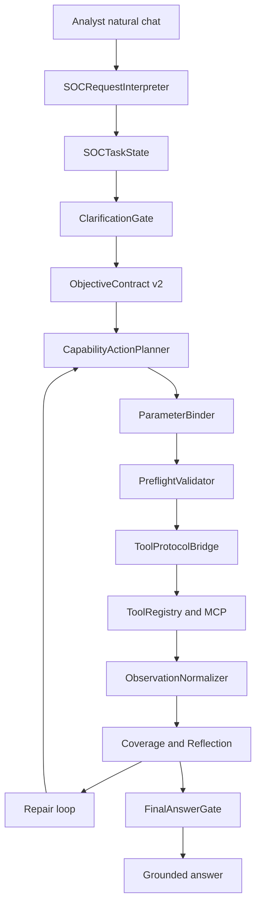

# AISA Vibe SOC Natural-Chat Reliability Upgrade Implementation Plan

## Status, owner, scope, and lanes

- **Status:** planning complete; ready for phased Code-mode implementation.
- **Date:** 2026-04-29.
- **Owner/context:** AISA product work under `CABTA/`. This plan is for Roo Code to implement a natural SOC chat reliability upgrade with minimal ambiguity.
- **Primary lane:** `agent-workflow`.
- **Secondary lanes:** `integration-control` for capability truth, tool/MCP resolution, and degraded states; `web-surface` only for chat progress metadata/API/UI visibility; `analysis-core` only as a protected dependency whose deterministic verdict authority must not be weakened.
- **Plan requirement:** mandatory because the change crosses request understanding, objective contracts, capability routing, typed parameter binding, preflight validation, approvals, tool execution, reflection, final-answer gating, chat route payloads, tests, and docs.
- **LLM availability assumption:** LLM availability is assumed. Do not treat no-LLM fallback as a blocker or primary design path. The target architecture is LLM-inside-protocol: the LLM may interpret, plan, bind, repair, and summarize only through typed contracts and gates. No-LLM fallback is out of scope except graceful error messaging if an unexpected provider exception occurs.
- **Current active audit processes:** two temporary audit terminals are running `python .tmp_soc_chat_audit.py` from `CABTA/`. Code implementation may clean up temporary audit scripts/results after preserving any useful findings, but this plan does not depend on those processes.

## Working note required before coding

1. **Chosen lane:** `agent-workflow` with `integration-control` and optional `web-surface` overlap.
2. **Main files likely to change:**
   - New or expanded agent contracts: `src/agent/soc_task_state.py`, `src/agent/capability_actions.py`, `src/agent/parameter_binder.py`, `src/agent/preflight_validator.py`, optional `src/agent/clarification_gate.py`, optional `src/agent/observation_normalizer.py` if existing normalization is insufficient.
   - Existing agent orchestration: `src/agent/request_understanding.py`, `src/agent/objective_model.py`, `src/agent/chat_intent_router.py`, `src/agent/investigation_planner.py`, `src/agent/next_action_planner.py`, `src/agent/capability_ontology.py`, `src/agent/capability_resolver.py`, `src/agent/tool_registry.py`, `src/agent/agent_loop.py`, `src/agent/final_answer_gate.py`.
   - Optional web visibility: `src/web/routes/chat.py`, `templates/agent_chat.html`.
3. **Plan required:** yes, this file is the implementation plan.
4. **Tests/docs likely affected:** new scenario harness tests plus updates to `TEST-MANIFEST.md`, `docs/system-design.md`, and `docs/codebase-summary.md` after implementation.

## Problem statement grounded in observed failures

AISA already has important objective/capability scaffolding, coverage/retry work, hypothesis work, and final-answer gate pieces. The audit still shows natural chat behavior is unreliable because these pieces are not yet enforced as one canonical protocol from user message to grounded answer.

Observed failures to fix:

1. **Vague hunt:** A request such as “threat hunt for anything suspicious in our environment from the last 24 hours” enters a log lane but produces weak or malformed parameters such as an `ioc` field containing the entire sentence. It needs an LLM-structured hunt objective with a safe broad-hunt plan, prioritized capability actions, and progress transparency.
2. **Splunk failed logons:** “Search Splunk for failed logons followed by success on WS-12 yesterday” is correctly recognized as investigation/log identity in places, but binding still emits `ioc` with the full sentence and can answer directly instead of running evidence collection. It needs backend/timerange/entity extraction, typed query planning, and brute-force-vs-normal evaluation requirements.
3. **Fortigate 30d:** “Check Fortigate historical logs for outbound beaconing from 10.10.5.23 to 185.220.101.45 over the last 30 days” routes to `log.search`, but fallback parameters silently use `timerange: 24h`. It must preserve `last_30_days` or equivalent explicit requested range through task state, action, binder, preflight, tool call, observation, reflection, and final answer.
4. **Phishing inline email/link:** Inline email details are misbound as `file_path` equal to URL text and question suffix. AISA must recognize inline email evidence, create an email analysis or inline-email parse action, bind sender/subject/URL/body fields, and optionally pivot to URL/IOC enrichment without pretending a local email file exists.
5. **Missing malware file:** The chat attempts `analyze_malware` with a Windows path plus natural-language suffix despite the user saying the file was not uploaded. It needs preflight file existence/input availability checks and a clarification/upload request rather than bogus execution.
6. **IOC triage misclassified:** “Triage IOC 185.220.101.45...” is classified as `explain`/direct response with `requires_fresh_evidence=false`, so it may skip IOC investigation. IOC triage with verdict/evidence/pivots requires fresh deterministic enrichment unless a valid current result already exists in context.
7. **IR approval misrouted:** “Contain host, disable user, block IP if evidence supports it; ask for approval” routes first to log search and lacks a first-class approval/action model. It must create response-action intents, require supporting evidence and approval, and avoid executing or implying containment without governance.
8. **Follow-up summary weak:** “What did you find and what should I do next?” is treated as generic clarification and may guess `extract_iocs`; it should bind to the previous `SOCTaskState`, summarize evidence and limitations, and propose next actions from stored task progress.
9. **Progress transparency missing:** The chat surface does not consistently show objective, capability action, bound params, preflight result, tool coverage, repair attempts, approval waits, and final-answer gate state.

## Root-cause hierarchy

1. **No canonical task state:** Current state is scattered across intent output, investigation plan, objective contract, reasoning state, findings, next-action signals, and session metadata. There is no single `SOCTaskState` that preserves analyst intent, entities, artifacts, backends, timerange, required evidence, approvals, observations, gaps, and answer constraints.
2. **Keyword router precedence and intent misclassification:** IOC triage can be classified as explain/direct response; phishing inline URLs can become file paths; follow-up summary can become clarification; response actions can collapse into log pivots. The router needs SOC-specific precedence and LLM-structured interpretation after deterministic hints.
3. **No typed tool invocation contract:** Tool calls are still often formed as `tool + params` by permissive guessers. There is no required typed `CapabilityAction` contract that separates action intent from legacy tool adapter execution.
4. **No robust typed parameter binding:** Entities, inline artifacts, file paths, backend hints, timeranges, and action targets are not consistently bound into typed schemas. Full sentences leak into `ioc`, `file_path`, and query fields.
5. **No preflight/clarification gate:** Missing file, missing inline email body, broad hunt without backend, destructive action approval, unsafe query, and insufficient IOC evidence can pass into execution or final answer instead of pausing for clarification or approval.
6. **Capability/tool mismatch:** Planning can pick a legacy tool before proving the capability is the right match. Missing log capability must not fall back to IOC enrichment; inline email analysis must not be treated as local file analysis; response actions must not be treated as evidence collection.
7. **Timerange/backend constraints are not invariant:** Explicit `yesterday`, `last 30 days`, `historical`, `Fortigate`, and `Splunk` can be lost or overwritten by defaults such as `24h`.
8. **Final answer gate is not the action gate:** Existing final answer controls focus on answer support but do not fully govern proposed response actions, approval waits, or missing preconditions before execution.
9. **Missing scenario harness:** Existing tests cover pieces, but there is no single audit scenario harness that asserts end-to-end natural-chat outcomes for the known failures.

## Target Vibe SOC runtime model

The runtime must become a contract-driven SOC chat protocol:



### Runtime principles

- The LLM is inside the protocol, not outside it. It returns structured interpretation/planning/binding/repair outputs that are schema-validated and policy-gated.
- Deterministic AISA analyzers and scoring remain authoritative for IOC, file, and email verdicts.
- Capability-first planning is mandatory. Tool names are execution adapters at the boundary.
- Every action must have typed params, preflight status, evidence expectations, and progress metadata.
- Final answers must cite covered evidence, disclose degraded/unavailable evidence, and downgrade unsupported claims.
- Response actions must require approval and evidence gates before execution or recommendation as ready-to-execute.

## New and changed files with contracts

### New `src/agent/soc_task_state.py`

Purpose: canonical runtime state for one natural-chat SOC task or follow-up thread.

Required dataclasses or Pydantic-style models:

```python
@dataclass
class SOCTaskState:
    schema_version: str = "soc-task-state/v1"
    task_id: str = ""
    session_id: str = ""
    parent_task_id: str | None = None
    raw_request: str = ""
    normalized_request: str = ""
    conversation_role: str = "new_task"  # new_task, follow_up, clarification_response, approval_response
    lane: str = "generic"
    intent: str = "investigation"
    analyst_objective: str = ""
    entities: list[dict[str, Any]] = field(default_factory=list)
    artifacts: list[dict[str, Any]] = field(default_factory=list)
    requested_backends: list[str] = field(default_factory=list)
    timerange: dict[str, Any] = field(default_factory=dict)
    required_capabilities: list[str] = field(default_factory=list)
    objective_contract: dict[str, Any] = field(default_factory=dict)
    actions: list[dict[str, Any]] = field(default_factory=list)
    pending_clarifications: list[dict[str, Any]] = field(default_factory=list)
    pending_approvals: list[dict[str, Any]] = field(default_factory=list)
    observations: list[dict[str, Any]] = field(default_factory=list)
    coverage: dict[str, Any] = field(default_factory=dict)
    reflection: dict[str, Any] = field(default_factory=dict)
    final_answer_gate: dict[str, Any] = field(default_factory=dict)
    progress_events: list[dict[str, Any]] = field(default_factory=list)
```

Contract rules:

- Must preserve explicit user values: `requested_backends`, `requested_timerange`, entities, artifact references, approval directives, and follow-up link to prior task.
- Must store `source` and `confidence` for every extracted field.
- Must distinguish inline artifact, uploaded file, local path reference, URL, IOC, host, user, and response-action target.
- Must be additive to existing `AgentState.reasoning_state`; do not break old sessions.

### New `src/agent/capability_actions.py`

Purpose: typed capability action model before legacy tool execution.

Required model shape:

```python
@dataclass
class CapabilityAction:
    schema_version: str = "capability-action/v1"
    action_id: str = ""
    task_ref: str = ""
    objective_ref: str = ""
    capability_id: str = ""
    action_type: str = "collect_evidence"  # collect_evidence, analyze_artifact, enrich_ioc, ask_clarification, request_approval, propose_response_action, summarize
    params_schema: str = ""
    bound_params: dict[str, Any] = field(default_factory=dict)
    expected_evidence: list[dict[str, Any]] = field(default_factory=list)
    preconditions: list[dict[str, Any]] = field(default_factory=list)
    approval_policy: dict[str, Any] = field(default_factory=dict)
    rationale: str = ""
    status: str = "planned"
    legacy_tool_hint: str | None = None
```

Initial capabilities:

- `log.search`
- `email.analyze`
- `email.parse.inline`
- `file.analyze.static`
- `ioc.enrich`
- `ioc.extract`
- `case.summarize`
- `correlate.findings`
- `ir.approval.request`
- `ir.host.contain.propose`
- `ir.user.disable.propose`
- `ir.network.block.propose`
- `config.capability.explain`
- `clarification.request`

Contract rules:

- A capability action can be planned without being executable if required inputs are missing.
- Action planning must not silently substitute another capability. Degraded/unavailable is first-class.
- Response-action capabilities may propose only after evidence and approval gates; they must not execute destructive actions through log or IOC tools.

### New `src/agent/parameter_binder.py`

Purpose: bind request/task fields into typed action params and prevent sentence leakage.

Required components:

- `ParameterBindingResult` with `action_id`, `params`, `missing_required`, `invalid_fields`, `field_sources`, `confidence`, `needs_clarification`, `clarification_questions`.
- `ParameterBinder.bind(action, task_state, objective_contract, context)`.
- Schema definitions for each capability:
  - `log.search`: `query_intent`, `entities`, `backend`, `timerange`, `index`, `sourcetype`, `max_results`, `required_facets`.
  - `email.parse.inline`: `sender`, `recipient`, `subject`, `urls`, `body`, `headers`, `attachments`, `raw_email_text`.
  - `email.analyze`: `file_path` or `inline_email_ref`, not arbitrary URL-as-file.
  - `file.analyze.static`: `file_path`, `uploaded_artifact_id`, `hash`, `declared_missing`, `safe_static_only`.
  - `ioc.enrich`: `ioc_value`, `ioc_type`, `context`, `desired_pivots`.
  - `ir.*.propose`: `target`, `target_type`, `evidence_refs`, `approval_required`, `requested_action`.

Binding invariants:

- Never put the full analyst sentence into `ioc`, `file_path`, or `query` unless the schema explicitly accepts natural-language `query_intent`.
- Windows paths must be extracted with stop boundaries before “and tell me” or other natural-language suffixes.
- If user says a file was not uploaded, set `declared_missing=true` and block `file.analyze.static` execution until artifact is provided.
- Inline email details must produce an inline email artifact ref, not a fake `file_path`.
- Timerange source precedence: explicit analyst request > follow-up inherited task > objective default with reason > tool safe default with reason.

### New `src/agent/preflight_validator.py`

Purpose: validate an action after binding and before bridge/execution.

Required components:

- `PreflightDecision` with `allowed`, `status`, `blocking_reasons`, `warnings`, `clarification_required`, `approval_required`, `degraded`, `normalized_params`, `progress_event`.
- `PreflightValidator.validate(action, binding, task_state, tool_registry, capability_resolver)`.

Preflight checks:

- Required params present and typed.
- Tool/capability available or explicitly degraded.
- File path exists or uploaded artifact exists before file analysis.
- Inline email has enough fields for inline parsing; otherwise ask for raw email or headers/body.
- Timerange/backends preserved; reject silent overwrite.
- Broad SIEM queries follow log hunting policy and approval rules.
- Destructive/high-impact IR actions always require approval.
- Final answer cannot be used as a substitute for required evidence collection.

### Possible new `src/agent/clarification_gate.py`

Purpose: turn missing/ambiguous inputs into precise SOC clarifications instead of bogus tool calls.

Required behavior:

- `ClarificationGate.evaluate(task_state, planned_actions)` returns pass/clarify/defer.
- Ask only blocking questions.
- Generate structured clarification payloads and chat text.
- Examples:
  - Missing uploaded malware file: ask user to upload/select file or provide hash for IOC-only triage.
  - Inline phishing missing recipient/body: proceed with available sender/URL triage but state limitations, or ask for raw email if needed for final phishing verdict.
  - Vague broad hunt with no backend: if available runtime has default demo/log backend, proceed with stated default; otherwise ask which backend/environment to search.

### Possible new or expanded `src/agent/observation_normalizer.py`

The repository already has observation normalization. Use existing `ObservationNormalizer` if sufficient; only add a new module if the existing one cannot normalize new protocol observations.

Required additions if needed:

- Normalize every tool/MCP result into `Observation` records with `observation_id`, `task_ref`, `action_ref`, `capability_id`, `tool_name`, `source_kind`, `backend`, `timerange`, `evidence_facets`, `summary`, `raw_ref`, `quality`, `limitations`.
- Preserve typed observations for log, email, file, IOC, and IR approval proposal results.

### Updates to `src/agent/request_understanding.py`

- Introduce or expand `SOCRequestInterpreter` that combines deterministic extraction with LLM structured interpretation.
- Output must feed `SOCTaskState`, not just a loose understanding object.
- Fix precedence:
  - IOC triage with “triage IOC”, “is it malicious”, “what evidence” requires `ioc.enrich` fresh evidence unless current validated evidence exists.
  - Inline phishing details should route to email inline parsing and URL/IOC pivots.
  - File analysis with missing file should route to clarification/preflight block.
  - Response-action requests should create both evidence-gathering and approval/action intents.
  - Follow-up summary should bind to prior task/session evidence.
- Preserve backend/timerange phrases such as Splunk, Fortigate, yesterday, historical, and last 30 days.

### Updates to `src/agent/objective_model.py`

- Upgrade to `ObjectiveContract v2` while preserving v1 compatibility.
- Include `soc_task_ref`, `capabilities_required`, `action_requirements`, `clarification_policy`, `approval_requirements`, `timerange_policy`, `backend_policy`, `final_answer_requirements`, and `progress_requirements`.
- Add lane-specific objective templates for vague hunt, Splunk failed logons, Fortigate beaconing, inline phishing, missing malware file, IOC triage, IR approval, and follow-up summary.

### Updates to `src/agent/chat_intent_router.py`

- Reorder router precedence around SOC tasks:
  1. Approval or destructive-action request.
  2. Follow-up summary or clarification response tied to existing task.
  3. Artifact analysis request.
  4. IOC triage requiring fresh evidence.
  5. Log/SIEM/hunt request.
  6. Capability/config question.
  7. General chat.
- Do not let `explain` suppress fresh evidence for “triage”, “is it malicious”, or “what evidence do we have”.

### Updates to `src/agent/investigation_planner.py`

- Generate objective-contract-v2-compatible evidence requirements and capability action seeds.
- Preserve legacy `next_action_signals` only as compatibility fields derived from capability actions.
- For vague hunt, plan a ranked hunt sequence rather than an IOC action.
- For IR approval, plan evidence collection first and response-action proposals behind gates.

### Updates to `src/agent/next_action_planner.py`

- Prefer `SOCTaskState.actions` and `CapabilityAction` status over legacy guesses.
- Stop using `has_tool_result` as a blanket block when coverage gaps justify bounded retries.
- Produce `ask_clarification` or `request_approval` decisions as first-class outcomes.
- Keep legacy fallback behind a compatibility bridge only after protocol actions fail safely.

### Updates to `src/agent/capability_ontology.py`

- Add descriptors for all capabilities listed above with required inputs, optional inputs, output facets, approval needs, and compatible tools.
- Add `email.parse.inline` as a distinct capability so inline email does not become fake file analysis.
- Add `ir.*.propose` and `ir.approval.request` capabilities as non-destructive governed actions.

### Updates to `src/agent/capability_resolver.py`

- Resolve by capability and runtime availability.
- No unrelated fallback: missing `log.search` must not resolve to `ioc.enrich`; missing `email.parse.inline` must not resolve to `file.analyze.static`.
- Return `available`, `degraded`, `unavailable`, or `clarification_required` with reasons.
- Preserve `legacy_bridge` for `ToolRegistry` execution only.

### Updates to `src/agent/tool_registry.py`

- Export or expose tool input contracts where possible.
- Enforce or record timerange/backend precedence for `search_logs`.
- Ensure `search_logs` accepts structured `query_intent`/query plan params from `ParameterBinder`.
- Keep manual/degraded results honest.

### Updates to `src/agent/agent_loop.py`

- Create or restore `SOCTaskState` at chat turn start.
- Run the protocol in order: interpreter, task state, clarification gate, objective contract v2, action planning, binding, preflight, bridge, execution, observation normalization, reflection/repair, final answer gate.
- Deprecate unsafe guesser paths by placing them behind protocol compatibility flags and tests.
- Store progress events in session metadata and response payloads.
- Ensure follow-up turns bind to prior task state.

### Updates to `src/agent/final_answer_gate.py`

- Expand gate to understand `SOCTaskState`, capability action status, preflight blocks, approvals, coverage, and response-action constraints.
- Do not allow final answer to imply completed analysis when the task is waiting for file upload, clarification, approval, or missing backend.
- Allow grounded degraded answers only when limitations are explicit.

### Updates to `src/web/routes/chat.py`

Only if current chat route does not expose enough metadata:

- Include `task_id`, `objective_summary`, `current_action`, `capability_id`, `preflight_status`, `coverage_status`, `pending_clarifications`, `pending_approvals`, `degraded_capabilities`, `final_answer_gate_status`, and `progress_events` in chat responses.
- Preserve existing API compatibility by adding fields rather than replacing fields.

### Updates to `templates/agent_chat.html`

Only if UI metadata is included:

- Add compact progress chips or panels for objective, active capability, evidence coverage, repair attempt, pending clarification/approval, and final-answer gate.
- Keep labels clear: deterministic evidence, agent interpretation, pending approval, degraded/unavailable.

## Exact phased implementation plan

### Phase 0: Scenario harness and cleanup audit temp guidance

Objective: lock in known failures before changing runtime behavior.

Tasks:

- Add `tests/test_vibe_soc_natural_chat_scenarios.py` as the main regression harness.
- Add fixtures under `tests/fixtures/vibe_soc_chat_scenarios.json` or inline scenario definitions if repo style favors inline tests.
- Preserve scenarios S1-S9 from audit with expected structured outcomes.
- Add test helpers that can inspect interpreter output, `SOCTaskState`, planned `CapabilityAction`, bound params, preflight result, bridge decision, and final answer gate without requiring live LLM calls.
- Mock LLM structured outputs where needed, but assert schema/gate behavior rather than prompt text only.
- Record active temp audit cleanup guidance: after implementation has scenario coverage, remove or ignore `CABTA/.tmp_soc_chat_audit.py`, `.tmp_soc_chat_audit_fast.py`, `.tmp_soc_chat_audit_fast_results.json`, `.tmp_soc_chat_audit_fast_stdout.txt`, `.tmp_soc_chat_config.yaml`, and `.tmp_soc_chat_fast_agent.db` if they are not intended to be committed. Do not terminate user terminals from tests.

Expected tests:

- `test_s1_vague_hunt_creates_structured_hunt_not_ioc_sentence`
- `test_s2_splunk_failed_logons_binds_user_host_timerange_backend`
- `test_s3_fortigate_30d_preserves_timerange_and_backend`
- `test_s4_inline_phishing_email_does_not_bind_url_as_file_path`
- `test_s5_missing_malware_file_blocks_for_upload_or_hash`
- `test_s6_ioc_triage_requires_fresh_ioc_enrichment`
- `test_s7_ir_actions_require_evidence_and_approval`
- `test_s8_seed_task_persists_findings_for_followup`
- `test_s9_followup_summary_uses_prior_task_not_extract_iocs`

Acceptance for Phase 0:

- Tests fail or xfail against current behavior only where implementation is pending.
- Each expected outcome is explicit and maps to one or more later phases.

### Phase 1: `SOCTaskState` and request interpretation precedence fixes

Objective: establish canonical state and correct SOC intent precedence.

Tasks:

- Create `src/agent/soc_task_state.py` with `SOCTaskState`, entity/artifact helpers, `to_dict`, `from_dict`, and compatibility load from `reasoning_state`.
- Update `request_understanding.py` with `SOCRequestInterpreter` or equivalent wrapper around existing extractor.
- Update `chat_intent_router.py` precedence.
- Update `objective_model.py` to build `ObjectiveContract v2` from `SOCTaskState` while continuing to emit v1-compatible fields.
- Integrate audit-only task state creation in `AgentLoop` and store under `state.reasoning_state['soc_task_state']`.
- Make follow-up turns resolve `parent_task_id` or prior session task from existing findings/case memory when available.

Scenario outcomes:

- S1 lane `network_log_hunt` or `broad_threat_hunt`, capability `log.search`, no sentence in `ioc`.
- S2 entities include `user:alice`, `host:WS-12`, backend `splunk`, timerange `yesterday`.
- S3 entities include source and destination IPs, backend `fortigate`, timerange `last_30_days`.
- S4 artifact type `inline_email` with sender, subject, URL.
- S5 artifact type `local_path_reference`, `declared_missing=true`.
- S6 intent `ioc_triage`, `requires_fresh_evidence=true`.
- S7 includes response actions and approval directive.
- S9 conversation role `follow_up` when previous task exists.

### Phase 2: Capability action model and typed parameter binder

Objective: replace unsafe tool guesses with typed capability actions and schemas.

Tasks:

- Create `src/agent/capability_actions.py`.
- Create `src/agent/parameter_binder.py`.
- Extend `capability_ontology.py` with new capabilities and parameter schemas.
- Extend `capability_resolver.py` to resolve and bridge new action objects.
- Update `investigation_planner.py` to emit action seeds.
- Update `next_action_planner.py` to prefer pending `CapabilityAction`.

Binding requirements by scenario:

- S1 `log.search.bound_params.query_intent` may contain broad hunt text, but `ioc` must be empty and required facets must include high-risk leads such as auth anomalies, external network activity, recent alerts, and suspicious IOC pivots if supported by runtime.
- S2 bind `backend=splunk`, `timerange=yesterday`, `entities=[alice, WS-12]`, `query_intent=failed logons followed by success`, required facets `timestamp`, `user`, `host`, `source_ip`, `outcome`, `event_code`.
- S3 bind `backend=fortigate`, `timerange=last_30_days`, entities source and destination IPs, required facets `timestamp`, `src_ip`, `dest_ip`, `action`, `service`, `policy`, `raw_event`.
- S4 bind `email.parse.inline` params with sender, subject, URL; optional `ioc.enrich` for URL/domain.
- S5 bind `file.analyze.static` with `file_path=C:\Users\analyst\Downloads\invoice_update.exe`, `declared_missing=true`, no suffix.
- S6 bind `ioc.enrich` with `ioc_value=185.220.101.45`, `ioc_type=ip`.
- S7 bind proposed IR actions: contain host `WS-12`, disable user `alice`, block IP `185.220.101.45`.
- S9 bind `case.summarize` or `task.summarize` using prior task, no tool extraction.

### Phase 3: Preflight, clarification, and approval gates

Objective: prevent bogus execution and govern response actions.

Tasks:

- Create `src/agent/preflight_validator.py`.
- Create `src/agent/clarification_gate.py` if not folded into preflight.
- Add approval action model integration with existing governance store if available.
- Update `AgentLoop` to run preflight before bridge/execution.
- Add `waiting_for_clarification`, `waiting_for_approval`, and `degraded_capability` progress events.
- Ensure final answer gate can render interim answers for blocked states.

Gate behavior:

- S1 broad hunt can proceed only if a default log backend/demo backend exists; otherwise ask which backend/environment.
- S2 proceeds to log search if Splunk or demo/manual log backend is available; degraded result must say backend not executed.
- S3 rejects timerange overwrite and requires `last_30_days` to survive.
- S4 proceeds with inline email parsing and URL/domain enrichment; asks for raw headers/body only if needed for final verdict.
- S5 blocks file analysis and asks for upload/select file or hash-only IOC triage alternative.
- S7 does not execute containment/disable/block; creates approval requests after evidence support or asks to gather evidence first.
- S9 proceeds to summary only from prior evidence.

### Phase 4: Integrate into `AgentLoop` and deprecate unsafe guesser paths

Objective: make the protocol the default execution path while preserving compatibility bridge.

Tasks:

- Wire services in `AgentLoop.__init__`.
- At each chat turn, restore or create `SOCTaskState`.
- Build `ObjectiveContract v2` and store both v2 and v1-compatible fields.
- Execute pending actions through binder, preflight, resolver, bridge, and existing `ToolRegistry`.
- Gate `_guess_first_tool`, `_guess_tool_params`, direct fallback decisions, and permissive plan-signal tool fields behind compatibility mode.
- Ensure compatibility bridge maps action to legacy `use_tool` only after successful binding/preflight.
- Update tests that currently assert permissive behavior to assert protocol behavior.

Compatibility rules:

- Do not remove existing legacy fields until all scenario and existing phase tests pass.
- Keep `next_action_signals[].tool` for old callers, but derive it from `capability_id` and bridge output.
- Keep old objective contract fields where tests or UI expect them.
- Make protocol metadata additive in session payloads.

### Phase 5: Observation normalization, reflection repair, and final-answer enforcement

Objective: close the loop from tool output to grounded answer.

Tasks:

- Extend existing observation normalization or add capability-aware wrapper.
- Ensure observations include action refs, capability IDs, backend/timerange, facets, limitations, and evidence refs.
- Extend reflection to compare observations against `SOCTaskState` and ObjectiveContract v2 requirements.
- Add repair loop rules:
  - retry log search only for uncovered required facets with changed query/facet target;
  - ask clarification for missing artifact/content;
  - mark degraded when backend unavailable;
  - stop after bounded attempts.
- Extend final-answer gate to evaluate unsupported claims, missing required actions, pending approvals, preflight blocks, and timerange/backend disclosure.

Final-answer requirements:

- S1 answer states searched scope/backend/timerange and top leads or says what cannot be searched.
- S2 answer distinguishes brute force vs normal only from auth evidence; otherwise says evidence insufficient.
- S3 answer states Fortigate and last 30 days coverage; no host-compromise claim without success/endpoint evidence.
- S4 answer states inline email evidence and limitations; recommends safe actions without inventing header verdict if headers missing.
- S5 answer says file was not analyzed because not uploaded; offers upload/hash path.
- S6 answer uses deterministic IOC enrichment evidence and lists immediate pivots.
- S7 answer separates evidence collection, proposed actions, approval status, and not-yet-executed actions.
- S9 answer summarizes prior task findings with evidence refs and next recommended actions.

### Phase 6: Chat/API progress transparency

Objective: make runtime state visible enough for analysts and debugging.

Tasks:

- Update `src/web/routes/chat.py` response envelope if current route does not include protocol metadata.
- Update `templates/agent_chat.html` only if UI display is desired in this slice.
- Show compact states:
  - objective/lane;
  - current capability action;
  - bound inputs;
  - preflight status;
  - tool/backend status;
  - coverage and gaps;
  - repair attempts;
  - pending clarification/approval;
  - final answer gate status.
- Add tests to `tests/test_agent_chat_reasoning_ui.py`, `tests/test_web_api.py`, or a new chat API test file as needed.

UI wording rules:

- Do not imply unavailable integrations succeeded.
- Do not label LLM interpretation as deterministic verdict.
- Do not hide pending approval or missing evidence.

### Phase 7: Regression hardening and docs/test manifest updates

Objective: make the new protocol durable.

Tasks:

- Convert scenario harness tests from xfail to required pass.
- Update `TEST-MANIFEST.md` with focused commands.
- Update `docs/system-design.md` runtime contracts section for `SOCTaskState`, `CapabilityAction`, `ParameterBindingResult`, and `PreflightDecision` if implementation adds them.
- Update `docs/codebase-summary.md` to mention new agent modules.
- Remove or quarantine temp audit scripts/results if not intended for repo history.
- Run focused tests and full suite.

## Test plan with exact files and scenarios

### New tests

Create `tests/test_vibe_soc_natural_chat_scenarios.py`:

1. `test_s1_vague_hunt_creates_structured_hunt_not_ioc_sentence`
   - Input: vague 24h hunt.
   - Expected: lane `broad_threat_hunt` or log hunt; capability `log.search`; no `ioc` param containing full sentence; preflight either allowed with explicit backend or clarification required.
2. `test_s2_splunk_failed_logons_binds_user_host_timerange_backend`
   - Expected: `backend=splunk`, `timerange=yesterday`, entities `alice`, `WS-12`, action `log.search`, no direct final answer before evidence.
3. `test_s3_fortigate_30d_preserves_timerange_and_backend`
   - Expected: `backend=fortigate`, `timerange=last_30_days`, `log.search`, no `24h` overwrite.
4. `test_s4_inline_phishing_email_uses_inline_email_contract`
   - Expected: action `email.parse.inline` or `email.analyze` with inline ref; sender/subject/URL bound; no fake `file_path` from URL.
5. `test_s5_missing_malware_file_preflight_blocks_execution`
   - Expected: file path extracted cleanly, `declared_missing=true`, preflight blocks `file.analyze.static`, clarification asks for upload or hash-only route.
6. `test_s6_ioc_triage_requires_enrichment_not_direct_explain`
   - Expected: intent `ioc_triage`, `requires_fresh_evidence=true`, action `ioc.enrich` bridged to `investigate_ioc`.
7. `test_s7_ir_approval_creates_governed_action_proposals`
   - Expected: evidence action first, IR actions staged with approval required; no destructive execution.
8. `test_s8_seed_task_persists_task_state_for_followup`
   - Expected: IOC task state and evidence summary stored with task id.
9. `test_s9_followup_summary_uses_prior_task_state`
   - Expected: action `case.summarize` or direct grounded summary from prior task; no `extract_iocs` guess.
10. `test_timerange_backend_invariants_survive_binder_preflight_bridge`
    - Expected: explicit timerange/backend remain identical across task, action, params, tool request, observation, and answer metadata.
11. `test_sentence_leakage_guard_blocks_ioc_and_file_path_full_sentence_params`
    - Expected: binder/preflight rejects leaked sentence in typed scalar params.
12. `test_final_answer_gate_blocks_when_required_evidence_or_approval_pending`
    - Expected: provisional answer only.

Create `tests/test_soc_task_state.py`:

- `test_soc_task_state_serializes_and_restores_followup_link`
- `test_soc_task_state_preserves_field_sources_and_confidence`
- `test_soc_task_state_loads_from_legacy_reasoning_state_safely`

Create `tests/test_parameter_binder.py`:

- `test_bind_log_search_splunk_failed_logons`
- `test_bind_fortigate_30d_beaconing_timerange`
- `test_bind_inline_phishing_email_artifact`
- `test_bind_missing_windows_file_path_without_suffix`
- `test_reject_full_sentence_scalar_leakage`

Create `tests/test_preflight_validator.py`:

- `test_preflight_blocks_missing_file_execution`
- `test_preflight_requires_approval_for_ir_actions`
- `test_preflight_preserves_explicit_timerange_over_tool_default`
- `test_preflight_degrades_missing_log_backend_without_ioc_fallback`

Create or update `tests/test_runtime_contract_schemas.py`:

- Add contract-shape assertions for `SOCTaskState`, `CapabilityAction`, `ParameterBindingResult`, and `PreflightDecision`.

### Existing tests to update or extend

- `tests/test_vibe_soc_universal_orchestration_phase12.py`
- `tests/test_vibe_soc_universal_orchestration_phase3.py`
- `tests/test_vibe_soc_universal_orchestration_phase4.py`
- `tests/test_vibe_soc_universal_orchestration_phase5.py`
- `tests/test_query_coverage_retry.py`
- `tests/test_agent.py`
- `tests/test_agentic_reasoning.py`
- `tests/test_agent_loop_prompt_plumbing.py`
- `tests/test_capability_catalog_contracts.py`
- `tests/test_investigation_planner.py`
- `tests/test_agent_chat_reasoning_ui.py` if UI metadata changes
- `tests/test_web_api.py` if chat/API response shape changes

### Focused commands

Run from `CABTA/`:

```cmd
python -m pytest tests/test_soc_task_state.py tests/test_parameter_binder.py tests/test_preflight_validator.py tests/test_vibe_soc_natural_chat_scenarios.py -q
python -m pytest tests/test_runtime_contract_schemas.py tests/test_vibe_soc_universal_orchestration_phase12.py tests/test_vibe_soc_universal_orchestration_phase3.py tests/test_vibe_soc_universal_orchestration_phase4.py tests/test_vibe_soc_universal_orchestration_phase5.py -q
python -m pytest tests/test_query_coverage_retry.py tests/test_agent.py tests/test_agentic_reasoning.py tests/test_agent_loop_prompt_plumbing.py tests/test_capability_catalog_contracts.py tests/test_investigation_planner.py -q
python -m pytest tests/test_web_api.py tests/test_agent_chat_reasoning_ui.py -q
python test_setup.py
python -m pytest -q
```

If running from repo root on Windows `cmd.exe`:

```cmd
cd CABTA && python -m pytest tests/test_vibe_soc_natural_chat_scenarios.py -q
cd CABTA && python -m pytest -q
```

## Acceptance criteria

Implementation is accepted only when all criteria pass:

1. `SOCTaskState` is the canonical natural-chat task state and is persisted additively.
2. All 9 audit scenarios pass through scenario harness with expected state/action/binding/preflight/final-answer behavior.
3. Explicit timerange and backend requests are preserved end-to-end or normalized with recorded source/reason; no silent `24h` overwrite for Fortigate 30d.
4. Typed scalar params do not contain full natural-language requests unless the schema explicitly allows `query_intent`.
5. IOC triage requires deterministic IOC enrichment unless valid current evidence exists.
6. Inline phishing email uses inline email artifact contracts, not fake file paths.
7. Missing malware file blocks execution and asks for upload/hash alternative.
8. Response actions are staged as approval-required proposals and never executed by evidence tools.
9. Follow-up summary uses prior task evidence and does not guess extraction tools.
10. Capability resolution never falls back to unrelated tools for missing capabilities.
11. Final answers cite evidence/coverage or disclose limitations and pending approvals.
12. Chat/API progress metadata is available if Phase 6 is implemented.
13. Existing universal orchestration, query coverage, hypothesis, and web/API tests remain passing or are updated for the new additive protocol.
14. Docs and `TEST-MANIFEST.md` are updated if code adds new runtime contracts or test lanes.

## Non-goals

- Do not implement a no-LLM fallback architecture beyond graceful error messaging for unexpected provider failures.
- Do not replace deterministic analyzers, scoring, or verdict authority with LLM-only decisions.
- Do not rewrite the whole `AgentLoop`; integrate by seams and compatibility bridge.
- Do not add mandatory cloud dependencies or non-local infrastructure.
- Do not execute real destructive IR actions in this upgrade.
- Do not build a full UI redesign; add only compact progress transparency if needed.
- Do not remove legacy fields until scenario tests and compatibility tests pass.
- Do not create fake success for missing Splunk, Fortigate, file, email, or MCP capability.

## Risk management and migration strategy

### Risks

| Risk | Impact | Mitigation |
| --- | --- | --- |
| Protocol adds complexity to `AgentLoop` | Harder debugging | Add small modules, progress events, and contract tests before integration. |
| Existing tests expect legacy tool guesses | Test churn | Keep compatibility bridge and legacy fields; update assertions to new canonical metadata. |
| LLM structured outputs vary | Invalid plans or params | Validate schemas; deterministic hints and binder/preflight enforce safety. |
| Over-clarification blocks useful work | Poor UX | Ask only blocking questions; allow degraded partial analysis with explicit limitations. |
| Action model could imply execution | Safety risk | Response actions are proposals requiring approval and evidence refs. |
| Timerange normalization inconsistency | Incorrect SOC conclusions | Centralize timerange source precedence in task state and preflight. |
| UI exposes too much metadata | Analyst confusion | Use compact labels and distinguish evidence, interpretation, degraded, pending. |

### Migration strategy

1. **Additive first:** add `SOCTaskState`, `CapabilityAction`, binder, and preflight without removing old plan/objective fields.
2. **Audit-only phase:** store task state and planned actions while legacy execution still runs, then compare in tests.
3. **Capability-first execution:** enable protocol execution for the 9 scenarios and core lanes.
4. **Compatibility bridge:** keep old `use_tool` execution via `ToolProtocolBridge` until all tests pass.
5. **Remove permissive aliasing only after tests pass:** sentence-to-IOC, URL-to-file-path, and missing-file execution aliases should be blocked once scenario tests are green.
6. **Feature flags if needed:** use existing config patterns for protocol enforcement, final-answer enforcement, and UI metadata rollout.
7. **Rollback:** disable protocol execution but keep contract creation/audit metadata; do not roll back timerange or preflight safety fixes unless they cause proven regressions.

## Roo Code implementation instructions

### Order of tasks

1. Implement Phase 0 scenario harness first.
2. Implement `SOCTaskState` and request precedence fixes.
3. Implement capability action contracts and parameter binder.
4. Implement preflight/clarification/approval gates.
5. Wire protocol into `AgentLoop` behind compatibility bridge.
6. Extend observation/reflection/final answer enforcement.
7. Add chat/API progress metadata only after backend state is stable.
8. Update docs and `TEST-MANIFEST.md`.
9. Run focused tests, then full suite.

### Guardrails

- Work only under `CABTA/`.
- Preserve AISA deterministic verdict/scoring authority.
- Prefer new small modules over large rewrites.
- Keep result shape changes additive.
- Keep legacy bridge until regression suite passes.
- No generic prompt-only fix is acceptable.
- Do not make no-LLM fallback central to design.
- Do not silently substitute unrelated tools.
- Do not execute or simulate destructive IR actions.
- Do not claim backend coverage, file analysis, phishing verdict, or IOC verdict without evidence.

### What not to change

- Do not alter scoring thresholds or deterministic verdict semantics unless a separate analysis-core plan is created.
- Do not refactor MCP server transport unless capability resolution explicitly requires a small contract export.
- Do not rename AISA or introduce new product names.
- Do not commit temp audit artifacts unless they become intentional fixtures.

### Verification per phase

- Phase 0: scenario tests exist and describe expected outcomes.
- Phase 1: task state and interpretation tests pass.
- Phase 2: binder tests prove typed params and no sentence leakage.
- Phase 3: preflight tests prove missing file, approvals, backend degradation, and timerange preservation.
- Phase 4: scenario tests show protocol actions bridge to correct tools.
- Phase 5: final-answer tests prove unsupported claims and pending approvals are blocked or downgraded.
- Phase 6: web/API tests prove metadata is additive and UI labels are honest.
- Phase 7: focused commands and full suite pass, docs updated.

## Completion definition

This upgrade is complete when Roo Code can run the natural-chat scenario harness and the broader agent/web regression suite with passing results, and AISA reliably converts natural SOC chat into canonical task state, capability-first actions, typed parameters, preflight-gated execution, transparent progress, and grounded final answers without weakening deterministic analysis authority.
