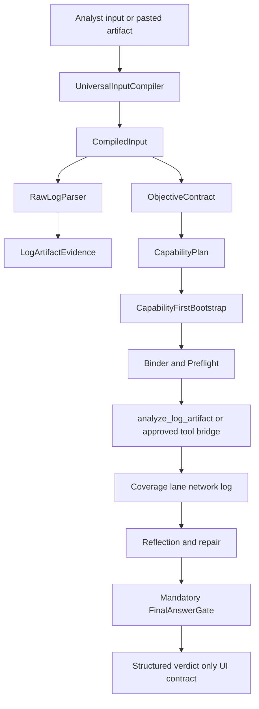

# AISA Vibe SOC Universal Input Compiler Reliability Upgrade Plan

## Status and scope

- **Status:** planning complete; ready for phased Code-mode implementation after approval.
- **Date:** 2026-04-29.
- **Product path:** [`CABTA/`](../).
- **Primary lane:** `agent-workflow`, because the root failure is that user intent is not compiled into a mandatory objective/capability contract before planner and tool selection.
- **Secondary lanes:** `analysis-core`, because raw log artifacts and structured verdict behavior affect evidence contracts and deterministic authority; `web-surface`, because chat responses and UI must expose only structured verdict/progress state and must not display unsupported verdict text.
- **Plan requirement:** mandatory because this crosses request understanding, objective contracts, raw artifact parsing, capability planning, log analysis, coverage, final answer gating, chat API, template rendering, and scenario tests.
- **Protected invariant:** deterministic AISA analyzers, evidence extraction, scoring, and explicit coverage remain authoritative. LLMs may interpret, plan, and summarize inside typed contracts only; they must not silently become verdict authority.

## Why create a new plan instead of updating existing plans

Existing plans already cover adjacent work:

- [`2026-04-28-vibe-soc-universal-orchestration-plan.md`](2026-04-28-vibe-soc-universal-orchestration-plan.md) introduced objective/capability-first orchestration and final answer gating.
- [`2026-04-29-vibe-soc-natural-chat-reliability-plan.md`](2026-04-29-vibe-soc-natural-chat-reliability-plan.md) introduced `SOCTaskState`, typed `CapabilityAction`, binder, preflight, and natural-chat scenarios.
- [`2026-04-29-llm-first-soc-request-interpretation-plan.md`](2026-04-29-llm-first-soc-request-interpretation-plan.md) introduced schema-constrained LLM request interpretation.

This plan is separate because the user’s diagnosis is more specific: the runtime must compile any SOC input, including raw pasted log artifacts, into a mandatory `ObjectiveContract` and `CapabilityPlan` before planner/tool bootstrap, must add `RawLogParser` and `analyze_log_artifact`, must enforce a `network_log` coverage lane, and must make the final UI contract structured-verdict-only. It is a reliability hardening layer over the existing partial protocol rather than a replacement for those plans.

## Current failure chain mapped to current code

| Failure-chain step | Current location | Current behavior or risk | Required correction |
|---|---|---|---|
| Natural input or raw artifact arrives | [`chat.py`](../src/web/routes/chat.py), [`AgentLoop`](../src/agent/agent_loop.py) | Chat sends raw message into investigation with metadata. There is no hard pre-bootstrap compiler contract enforced by the route. | Add `UniversalInputCompiler` as the first canonical step in the agent path and expose compact compiler metadata through chat progress. |
| Heuristic classifier too coarse | [`RequestUnderstandingExtractor._classify()`](../src/agent/request_understanding.py) | Heuristics can detect inline logs, help, IR, follow-up, IOC, log, email, file, but this remains a branchy classifier, not a universal artifact/objective compiler. | Make classification output a `CompiledInput` plus `ObjectiveContract`; use heuristics and optional LLM as inputs, not final planning authority. |
| Keyword-first planner | [`SOCRequestInterpreter`](../src/agent/request_understanding.py), planner paths in [`agent_loop.py`](../src/agent/agent_loop.py) | Existing `SOCTaskState` is useful, but it is still built downstream from classifier output and can be bypassed by compatibility paths. | Make `ObjectiveContract` plus `CapabilityPlan` mandatory before any tool choice or final answer. |
| Tool-first prompt and bootstrap | [`capability_actions.py`](../src/agent/capability_actions.py), [`capability_resolver.py`](../src/agent/capability_resolver.py), [`agent_loop.py`](../src/agent/agent_loop.py) | Capability actions exist, but legacy tool hints and resolver templates can still emit tool-shaped params such as `query` or `ioc` from summaries. | Make bootstrap capability-first: planner emits `CapabilityPlan`, resolver only bridges validated actions, and legacy hints never own routing. |
| Bootstrap lacks log tool support for pasted raw logs | [`capability_ontology.py`](../src/agent/capability_ontology.py) | `log.analyze.inline` exists but has no legacy tool adapter and no dedicated parser/analyzer pipeline. | Add `RawLogParser` and `analyze_log_artifact`; bridge `log.analyze.inline` to the new analyzer, not to email or IOC paths. |
| Coverage goes wrong lane | [`lane_contracts.py`](../src/agent/coverage/lane_contracts.py) | `network_log_hunt` exists and includes raw-log facets, but pasted artifact routing still depends on request heuristics and coverage extraction. | Add explicit `network_log` or canonical `network_log_hunt` coverage lane for raw log artifacts and map parsed facets directly into coverage. |
| Final verdict gate not strict enough | [`final_answer_gate.py`](../src/agent/final_answer_gate.py) | Gate checks evidence and degraded states, but strong verdict logic is generic and not yet mandatory structured verdict output for all evidence-bearing chat. | Make `FinalAnswerGate` mandatory for evidence-bearing claims and require structured verdict status with supported/unsupported/limitation claims. |
| UI displays wrong verdict | [`chat.py`](../src/web/routes/chat.py), [`agent_chat.html`](../templates/agent_chat.html) | Chat exposes `soc_progress`, but answer display may still render free-text verdict-like claims as final. | UI consumes `structured_verdict` and gate status; unsupported text is rendered as provisional/limitation, not final verdict. |

## Target architecture



### New target components

1. `UniversalInputCompiler`
   - New module candidate: [`universal_input_compiler.py`](../src/agent/universal_input_compiler.py).
   - Runs before planner/tool selection.
   - Produces `CompiledInput` with artifact type, objective candidates, entities, timerange, backend hints, safety flags, user constraints, and evidence scope.
   - Uses current deterministic extractors in [`request_understanding.py`](../src/agent/request_understanding.py), optional LLM interpretation from [`llm_request_interpreter.py`](../src/agent/llm_request_interpreter.py), and raw artifact sniffers.
   - Does not choose legacy tools and does not produce verdicts.

2. `ObjectiveContract` integration
   - Extend [`objective_model.py`](../src/agent/objective_model.py) rather than create a parallel contract model.
   - Objective must include `compiled_input_ref`, `artifact_scope`, `evidence_scope`, `forbidden_claims`, `coverage_lane`, and `final_answer_contract`.
   - Explicitly preserve requested backend and timerange; defaults must state source/reason.

3. `RawLogParser`
   - New module candidate: [`raw_log_parser.py`](../src/agent/raw_log_parser.py) or [`log_artifact_parser.py`](../src/agent/log_artifact_parser.py).
   - Parses pasted firewall/Splunk/Zeek/Suricata/syslog-like text, key-value logs, JSON logs, and common raw network/security events.
   - Emits normalized fields: `timestamp`, `src_ip`, `dest_ip`, `dest_port`, `protocol`, `app`, `action`, `host`, `source`, `sourcetype`, `backend`, `certificate`, `raw_event_ref`, and parse limitations.
   - Must be deterministic and testable without LLM.

4. `CapabilityPlan`
   - New or expanded model in [`capability_actions.py`](../src/agent/capability_actions.py) or a new [`capability_plan.py`](../src/agent/capability_plan.py).
   - Represents ordered capability actions before bridge execution.
   - Initial required capabilities for this upgrade: `log.analyze.inline`, `log.search`, `ioc.enrich`, `email.parse.inline`, `file.analyze.static`, `case.summarize`, `ir.*.propose`, and `config.capability.explain`.
   - Must mark `requires_evidence`, `evidence_scope`, `blocking_coverage`, `allowed_tools`, and `forbidden_fallbacks`.

5. `analyze_log_artifact`
   - Add a ToolRegistry adapter and/or agent-local analyzer for pasted raw logs.
   - Candidate files: [`tool_registry.py`](../src/agent/tool_registry.py), [`capability_ontology.py`](../src/agent/capability_ontology.py), and new [`raw_log_parser.py`](../src/agent/raw_log_parser.py).
   - Should return deterministic `LogArtifactAnalysisResult` with parsed fields, normalized evidence refs, coverage facets, hypothesis-safe interpretation, and no malicious/benign verdict unless deterministic policy supports it.

6. `network_log` coverage lane
   - Either add canonical `network_log` as alias or continue `network_log_hunt` with explicit raw-log artifact mode in [`lane_contracts.py`](../src/agent/coverage/lane_contracts.py).
   - Minimum facets: `timestamp`, `source_ip`, `destination_ip`, `destination_port`, `protocol_app`, `action`, `host`, `source_sourcetype`, `backend`, `raw_event`.
   - Missing facets limit claims; they do not imply benign or malicious.

7. Capability-first bootstrap
   - In [`agent_loop.py`](../src/agent/agent_loop.py), bootstrap must follow: compile input, build objective, build capability plan, bind/preflight, resolve/bridge, execute.
   - Legacy guessing such as `_guess_first_tool` and `_guess_tool_params` must become fallback-only after compiler failure and must not run for compiled evidence-bearing inputs.

8. Mandatory `FinalAnswerGate`
   - Extend [`final_answer_gate.py`](../src/agent/final_answer_gate.py) to evaluate `CompiledInput`, `CapabilityPlan`, coverage lane, pending preflight/approval states, and structured verdict.
   - Gate output must be stored under `reasoning_state.final_answer_gate` and `soc_task_state.final_answer_gate` before chat/session completion.

9. Structured verdict-only UI contract
   - Add `structured_verdict` to chat/session responses from [`chat.py`](../src/web/routes/chat.py) and rendering in [`agent_chat.html`](../templates/agent_chat.html).
   - UI should display `status`, `scope`, `supported_claims`, `unsupported_claims`, `limitations`, `coverage`, and `recommended_next_actions`.
   - Free-text response can explain, but UI verdict badges must only use structured gate output.

## Proposed data contracts

### `CompiledInput`

```yaml
schema_version: compiled-input/v1
compiled_input_id: ci_20260429_001
raw_input_ref: chat_message_or_artifact_ref
input_kind: natural_request | raw_log_artifact | inline_email | file_reference | ioc | mixed
artifact_type: splunk_stream_tcp | firewall_log | syslog | email_inline | file_path | observable | unknown
lane: network_log_hunt
objective_hint: Analyze pasted Splunk stream tcp event in network-log scope
entities:
  - type: ip
    value: 192.168.250.100
    role: source_ip
requested_backends:
  - splunk
requested_timerange:
  source: artifact_or_user
  effective: artifact_scope
safety_flags: []
evidence_scope:
  allowed_sources: [pasted_artifact]
  disallowed_claims: [confirmed_compromise, malicious_verdict_without_scoring]
parser:
  parser_id: raw-log-parser/v1
  confidence: 0.88
  limitations: []
```

### `LogArtifactAnalysisResult`

```yaml
schema_version: log-artifact-analysis-result/v1
analysis_id: logart_20260429_001
compiled_input_ref: ci_20260429_001
artifact_type: splunk_stream_tcp
backend: splunk
source: stream:tcp
raw_event_ref: artifact_raw_001
parsed_fields:
  source_ip: 192.168.250.100
  destination_ip: 192.168.250.40
  destination_port: 8089
  protocol_app: tcp_ssl
  host: splunk-02
  certificate: SplunkServerDefaultCert
observations:
  - observation_id: obs_log_001
    quality: typed_observation
    facets: [source_ip, destination_ip, destination_port, protocol_app, host, source_sourcetype, certificate, backend, raw_event]
coverage:
  lane: network_log_hunt
  status: partial
hypotheses:
  - statement: Event may represent Splunk management traffic or service communication depending on environment baseline.
    status: candidate
    support_refs: [obs_log_001]
limitations:
  - No recurrence, allow or deny action, endpoint context, or baseline was provided.
structured_verdict:
  verdict: inconclusive
  authority: deterministic_evidence_gate
  reason: Single log event has insufficient evidence for malicious or benign conclusion.
```

### `CapabilityPlan`

```yaml
schema_version: capability-plan/v1
plan_id: capplan_20260429_001
objective_ref: obj_20260429_001
compiled_input_ref: ci_20260429_001
lane: network_log_hunt
actions:
  - action_id: action_log_artifact_001
    capability_id: log.analyze.inline
    action_type: analyze_artifact
    evidence_scope: pasted_artifact_only
    blocking_coverage: true
    forbidden_fallbacks: [email.parse.inline, ioc.enrich_as_primary, file.analyze.static]
  - action_id: action_ioc_pivots_001
    capability_id: ioc.enrich
    action_type: enrich_ioc
    evidence_scope: optional_pivot
    blocking_coverage: false
```

### `StructuredVerdict`

```yaml
schema_version: structured-verdict/v1
verdict: supported | unsupported | inconclusive | degraded | blocked
scope: pasted_log_artifact | log_search | ioc | email | file | case_followup
allowed_final: true
summary: Single pasted network log event parsed; no compromise verdict supported.
supported_claims:
  - claim: The event contains source IP 192.168.250.100 connecting to destination 192.168.250.40 on port 8089.
    evidence_refs: [obs_log_001]
unsupported_claims:
  - claim: The event is malicious.
    reason: No recurrence, action outcome, baseline, or endpoint evidence was collected.
limitations:
  - Analysis is limited to one pasted raw event.
coverage:
  lane: network_log_hunt
  status: partial
ui_badge: inconclusive
```

## Backward compatibility approach

- Keep existing `SOCTaskState` in [`soc_task_state.py`](../src/agent/soc_task_state.py) as the session carrier and store `compiled_input`, `capability_plan`, `log_artifact_analysis`, and `structured_verdict` additively.
- Keep existing `ObjectiveContract` shape in [`objective_model.py`](../src/agent/objective_model.py); add v2 fields without removing v1 fields used by tests and UI.
- Keep existing `CapabilityAction` in [`capability_actions.py`](../src/agent/capability_actions.py); add `CapabilityPlan` around it or represent the plan as a list of compatible actions.
- Keep `network_log_hunt` as the current canonical lane unless implementation chooses `network_log` as an alias; do not break existing tests that assert `network_log_hunt`.
- Keep legacy tool bridge through [`capability_resolver.py`](../src/agent/capability_resolver.py), but forbid unrelated fallback by capability contract.
- Keep chat API response fields stable; add `compiled_input`, `capability_plan`, and `structured_verdict` under `soc_progress` or top-level additive fields.

## File-by-file implementation phases

### Phase 0: lock current behavior and regression targets

Files:

- [`test_vibe_soc_natural_chat_scenarios.py`](../tests/test_vibe_soc_natural_chat_scenarios.py)
- New [`test_universal_input_compiler.py`](../tests/test_universal_input_compiler.py)
- New [`test_raw_log_parser.py`](../tests/test_raw_log_parser.py)
- New [`test_structured_verdict_contract.py`](../tests/test_structured_verdict_contract.py)

Tasks:

- Add failing/xfail scenarios for the exact failure chain: pasted Splunk stream log must not route as email; raw Fortigate/syslog text must become `network_log_hunt`; unsupported malicious verdict must be blocked; UI verdict badge must be `inconclusive` or `blocked`, not malicious.
- Add scenario for generic natural request plus raw artifact in the same message.
- Add assertions that no full sentence leaks into scalar `ioc`, `file_path`, or log query fields except `query_intent`.

Acceptance:

- Current coverage is documented and regressions are reproducible before changing runtime behavior.

### Phase 1: introduce `UniversalInputCompiler`

Files:

- New [`universal_input_compiler.py`](../src/agent/universal_input_compiler.py)
- Update [`request_understanding.py`](../src/agent/request_understanding.py)
- Update [`soc_task_state.py`](../src/agent/soc_task_state.py)
- Update [`objective_model.py`](../src/agent/objective_model.py)

Tasks:

- Implement `CompiledInput` dataclass and compiler service.
- Use deterministic entity extraction, backend/timerange extraction, raw artifact sniffing, and optional LLM interpretation metadata.
- Convert `CompiledInput` into `SOCTaskState` and `ObjectiveContract` before action planning.
- Add `field_sources.compiler` metadata with parse confidence and limitations.

Acceptance:

- Any new chat task has `compiled_input` in task state before `actions` are planned.
- Raw pasted log artifacts are classified as `raw_log_artifact` and lane `network_log_hunt`.

### Phase 2: implement `RawLogParser`

Files:

- New [`raw_log_parser.py`](../src/agent/raw_log_parser.py)
- Update [`request_understanding.py`](../src/agent/request_understanding.py)
- Update [`coverage/lane_contracts.py`](../src/agent/coverage/lane_contracts.py)

Tasks:

- Parse key-value logs such as `host=`, `source=`, `sourcetype=`, `src_ip=`, `dest_ip=`, `dest_port=`, `protocol=`, `action=`, and certificate fields.
- Parse JSON log objects when pasted.
- Parse common firewall/syslog patterns with best-effort fields and limitations.
- Normalize aliases: `src`, `srcip`, `src_ip` to `source_ip`; `dst`, `dest`, `dest_ip` to `destination_ip`.
- Emit stable raw-event refs instead of duplicating large artifacts everywhere.

Acceptance:

- Pasted Splunk stream TCP sample produces typed fields and no email facets.
- Parser confidence and limitations are visible in task progress.

### Phase 3: add `analyze_log_artifact` capability path

Files:

- Update [`capability_ontology.py`](../src/agent/capability_ontology.py)
- Update [`capability_actions.py`](../src/agent/capability_actions.py)
- Update [`capability_resolver.py`](../src/agent/capability_resolver.py)
- Update [`tool_registry.py`](../src/agent/tool_registry.py)
- New or updated tests in [`test_capability_catalog_contracts.py`](../tests/test_capability_catalog_contracts.py)

Tasks:

- Register `log.analyze.inline` with a compatible adapter `analyze_log_artifact`.
- Implement `analyze_log_artifact` as deterministic local analysis using `RawLogParser` output.
- Return `LogArtifactAnalysisResult` with observations, coverage facets, limitations, hypotheses, and `structured_verdict`.
- Forbid fallback from `log.analyze.inline` to `email.parse.inline`, `ioc.enrich`, or `file.analyze.static` as primary capability.

Acceptance:

- Capability resolver resolves `log.analyze.inline` to `analyze_log_artifact` when available.
- Missing adapter returns degraded/unavailable, not unrelated fallback.

### Phase 4: build and enforce `CapabilityPlan`

Files:

- New [`capability_plan.py`](../src/agent/capability_plan.py) or update [`capability_actions.py`](../src/agent/capability_actions.py)
- Update [`agent_loop.py`](../src/agent/agent_loop.py)
- Update [`parameter_binder.py`](../src/agent/parameter_binder.py)
- Update [`preflight_validator.py`](../src/agent/preflight_validator.py)

Tasks:

- Build a plan from `ObjectiveContract` and `CompiledInput` before action selection.
- Add `forbidden_fallbacks`, `evidence_scope`, and `blocking_coverage` to actions or plan metadata.
- Preflight must reject wrong-lane execution and timerange/backend overwrite.
- Binder must use parsed raw log fields for `log.analyze.inline` and avoid broad `log.search` unless the objective asks to search a backend.

Acceptance:

- For pasted raw log input, first action is `log.analyze.inline`; backend search is optional follow-up, not primary.
- For natural log-hunt requests, first action remains `log.search` with preserved backend/timerange.

### Phase 5: strengthen coverage and reflection for network logs

Files:

- Update [`coverage/lane_contracts.py`](../src/agent/coverage/lane_contracts.py)
- Update [`coverage/coverage_evaluator.py`](../src/agent/coverage/coverage_evaluator.py)
- Update [`reflection_engine.py`](../src/agent/reflection_engine.py)
- Update [`test_query_coverage_retry.py`](../tests/test_query_coverage_retry.py)

Tasks:

- Ensure raw log observations directly cover lane facets.
- Distinguish `covered`, `partial`, `degraded`, `unavailable`, and `not_applicable` for each facet.
- Add repair guidance only for actionable gaps, e.g. ask for surrounding events or backend search scope, not unrelated IOC enrichment.

Acceptance:

- Coverage for raw Splunk log does not include email sender/recipient gaps.
- Final answer constraints include “do not claim compromise from one event without recurrence, action success, or endpoint context.”

### Phase 6: mandatory `FinalAnswerGate` and `StructuredVerdict`

Files:

- Update [`final_answer_gate.py`](../src/agent/final_answer_gate.py)
- Update [`session_response_builder.py`](../src/agent/session_response_builder.py)
- Update [`agent_loop.py`](../src/agent/agent_loop.py)
- New or updated [`test_final_answer_gate.py`](../tests/test_final_answer_gate.py)

Tasks:

- Add `StructuredVerdict` dataclass or dict contract.
- Require final gate for any evidence-bearing `ObjectiveContract`.
- Block/downgrade unsupported verdict words such as malicious, benign, compromised, exploited, and safe when deterministic evidence does not support them.
- Store gate result and structured verdict in session reasoning metadata.

Acceptance:

- A draft answer saying “this log is malicious” for a single pasted event is rewritten or blocked as `inconclusive` with limitations.
- Direct capability/help responses remain allowed without evidence gate verdict semantics.

### Phase 7: structured verdict-only chat API and UI

Files:

- Update [`chat.py`](../src/web/routes/chat.py)
- Update [`agent_chat.html`](../templates/agent_chat.html)
- Update or add [`test_agent_chat_reasoning_ui.py`](../tests/test_agent_chat_reasoning_ui.py)
- Update or add [`test_web_api.py`](../tests/test_web_api.py)

Tasks:

- Add compact `compiled_input`, `capability_plan`, `coverage`, `final_answer_gate`, and `structured_verdict` metadata to chat responses.
- UI verdict badges must use `structured_verdict.ui_badge`, not free-text answer text.
- Render unsupported claims and limitations explicitly.
- Hide raw prompts and sensitive raw artifacts by default; show raw event refs or truncated raw event only when already visible to the user.

Acceptance:

- UI does not display malicious/clean badge unless structured verdict allows it.
- Degraded and blocked states are visible and understandable.

### Phase 8: docs, manifest, rollout flags, and cleanup

Files:

- Update [`system-design.md`](../docs/system-design.md)
- Update [`codebase-summary.md`](../docs/codebase-summary.md)
- Update [`TEST-MANIFEST.md`](../TEST-MANIFEST.md)
- Optional update to [`feature-truth-matrix.md`](../docs/feature-truth-matrix.md)

Tasks:

- Document `UniversalInputCompiler`, `RawLogParser`, `CapabilityPlan`, `LogArtifactAnalysisResult`, and `StructuredVerdict` as runtime contracts.
- Add focused test commands to manifest.
- Add rollout config flags.
- Clean or quarantine temporary audit scripts only after scenario tests cover their useful findings.

Acceptance:

- Docs match implemented behavior and do not imply unavailable integrations succeeded.

## Test plan

### New tests

- [`test_universal_input_compiler.py`](../tests/test_universal_input_compiler.py)
  - `test_compiles_pasted_splunk_stream_tcp_as_raw_log_artifact`
  - `test_compiles_fortigate_raw_log_as_network_log_hunt`
  - `test_compiles_natural_log_hunt_as_log_search_not_ioc`
  - `test_compiler_preserves_requested_backend_and_timerange`
  - `test_compiler_records_evidence_scope_and_forbidden_claims`

- [`test_raw_log_parser.py`](../tests/test_raw_log_parser.py)
  - `test_parse_splunk_key_value_stream_tcp_fields`
  - `test_parse_fortigate_key_value_fields`
  - `test_parse_json_log_event_fields`
  - `test_parser_returns_limitations_for_missing_timestamp_or_action`
  - `test_parser_never_emits_email_facets_for_network_log`

- [`test_log_artifact_analysis.py`](../tests/test_log_artifact_analysis.py)
  - `test_analyze_log_artifact_returns_typed_observation_and_coverage`
  - `test_analyze_log_artifact_structured_verdict_inconclusive_for_single_event`
  - `test_analyze_log_artifact_does_not_call_ioc_as_primary_path`

- [`test_capability_plan.py`](../tests/test_capability_plan.py)
  - `test_raw_log_plan_starts_with_log_analyze_inline`
  - `test_backend_hunt_plan_starts_with_log_search`
  - `test_forbidden_fallbacks_block_wrong_lane`

- [`test_structured_verdict_contract.py`](../tests/test_structured_verdict_contract.py)
  - `test_final_answer_gate_outputs_structured_verdict`
  - `test_ui_badge_derived_from_structured_verdict_not_text`
  - `test_unsupported_claims_are_listed_with_reasons`

### Existing tests to extend

- [`test_vibe_soc_natural_chat_scenarios.py`](../tests/test_vibe_soc_natural_chat_scenarios.py): extend pasted log scenarios and final gate assertions.
- [`test_query_coverage_retry.py`](../tests/test_query_coverage_retry.py): ensure network-log coverage gaps produce bounded repair or limitations only.
- [`test_capability_catalog_contracts.py`](../tests/test_capability_catalog_contracts.py): assert `log.analyze.inline` has adapter and output facets.
- [`test_agent_loop_prompt_plumbing.py`](../tests/test_agent_loop_prompt_plumbing.py): assert bootstrap prompt/context is capability-first and includes compiler contract.
- [`test_agent_chat_reasoning_ui.py`](../tests/test_agent_chat_reasoning_ui.py): assert UI metadata is additive and structured verdict is used.
- [`test_web_api.py`](../tests/test_web_api.py): assert chat payload contains `soc_progress.structured_verdict` and remains backward compatible.

### Focused commands

Run from [`CABTA/`](../):

```cmd
python -m pytest tests/test_universal_input_compiler.py tests/test_raw_log_parser.py tests/test_log_artifact_analysis.py tests/test_capability_plan.py tests/test_structured_verdict_contract.py -q
python -m pytest tests/test_vibe_soc_natural_chat_scenarios.py tests/test_query_coverage_retry.py tests/test_capability_catalog_contracts.py tests/test_final_answer_gate.py -q
python -m pytest tests/test_agent_loop_prompt_plumbing.py tests/test_agent_chat_reasoning_ui.py tests/test_web_api.py -q
python test_setup.py
python -m pytest -q
```

If run from repo root on Windows `cmd.exe`:

```cmd
cd CABTA && python -m pytest tests/test_universal_input_compiler.py tests/test_raw_log_parser.py tests/test_log_artifact_analysis.py -q
cd CABTA && python -m pytest -q
```

## Rollout strategy

### Feature flags

Use existing config patterns and add flags such as:

```yaml
agent:
  universal_input_compiler:
    enabled: true
    mode: audit | enforce
  raw_log_parser:
    enabled: true
  capability_plan:
    enabled: true
    forbid_unrelated_fallbacks: true
  final_answer_gate:
    enforcement: warn | enforce
  structured_verdict_ui:
    enabled: true
```

### Rollout order

1. Add compiler and parser in audit mode while existing execution continues.
2. Enable `log.analyze.inline` for pasted raw log artifacts only.
3. Enforce `CapabilityPlan` for raw log and natural log-hunt lanes.
4. Enable final-answer gate enforcement for network-log lane.
5. Enable structured verdict UI badges.
6. Expand enforcement to IOC, email, file, and incident-response chat flows after scenario tests pass.

### Rollback

- Disable `agent.universal_input_compiler.enabled` to return to current `SOCRequestInterpreter` path while keeping tests and parser code dormant.
- Disable `raw_log_parser.enabled` to avoid new analyzer path; raw logs should degrade honestly instead of falling back to email/IOC.
- Set `final_answer_gate.enforcement=warn` only as temporary operational rollback; keep `structured_verdict` metadata for audit.
- Do not rollback timerange/backend preservation or scalar leakage protections unless tests prove a regression.

## Risk controls

| Risk | Control |
|---|---|
| Compiler becomes another heuristic router | Treat compiler output as a typed contract with confidence, limitations, and validation; optional LLM interpretation remains schema-constrained and non-verdict-bearing. |
| Raw log parser overclaims from one event | Parser emits observations and limitations only; final structured verdict defaults to `inconclusive` unless deterministic policy supports stronger claims. |
| Wrong-lane fallback persists through legacy bridge | `CapabilityPlan.forbidden_fallbacks` and preflight reject unrelated fallback; resolver returns degraded/unavailable instead. |
| UI still displays unsupported verdict text | UI badges and verdict panels read only `StructuredVerdict`; free text is explanatory and gate-controlled. |
| Existing tests break from contract shape changes | Add fields additively under `SOCTaskState`, `reasoning_state`, and `soc_progress`; keep legacy fields until full regression passes. |
| LLM silently becomes verdict authority | LLM can populate interpretation fields only; `FinalAnswerGate`, coverage, parser evidence, deterministic analyzers, and scoring own verdict authority. |
| Sensitive raw artifacts leak in API/UI | Store raw refs and parsed facets; truncate raw event display unless explicitly user-provided and safe to echo. |

## Acceptance criteria

- Any SOC chat input is first represented as `CompiledInput` and then as `ObjectiveContract` before planner/tool selection.
- Pasted raw network/security logs route to `network_log_hunt` and `log.analyze.inline`, not email, file, or IOC as primary lane.
- `RawLogParser` extracts typed evidence and limitations deterministically.
- `CapabilityPlan` is created before resolver/tool bridge and forbids unrelated fallback.
- `analyze_log_artifact` returns typed observations, coverage facets, limitations, and structured verdict.
- Explicit backend and timerange values survive compiler, objective, binder, preflight, execution, coverage, and final answer metadata.
- `FinalAnswerGate` is mandatory for evidence-bearing tasks and blocks/downgrades unsupported final verdict claims.
- Chat API and UI expose structured verdict state and do not derive verdict badges from free text.
- Deterministic evidence remains authoritative; LLM output cannot silently set final artifact/log verdicts.
- Focused tests and broader regression tests pass, with docs and manifest updated.

## Implementation handoff notes

- Work only under [`CABTA/`](../).
- Start in `agent-workflow`, then make the narrow `analysis-core` addition for raw log parser/analyzer, then the `web-surface` structured verdict display.
- Prefer small modules and additive contracts over broad rewrites.
- Keep `AISA` as canonical product name.
- Do not implement destructive response actions.
- Do not fake Splunk/Fortigate/live backend success; use pasted artifact scope or degraded capability state honestly.
